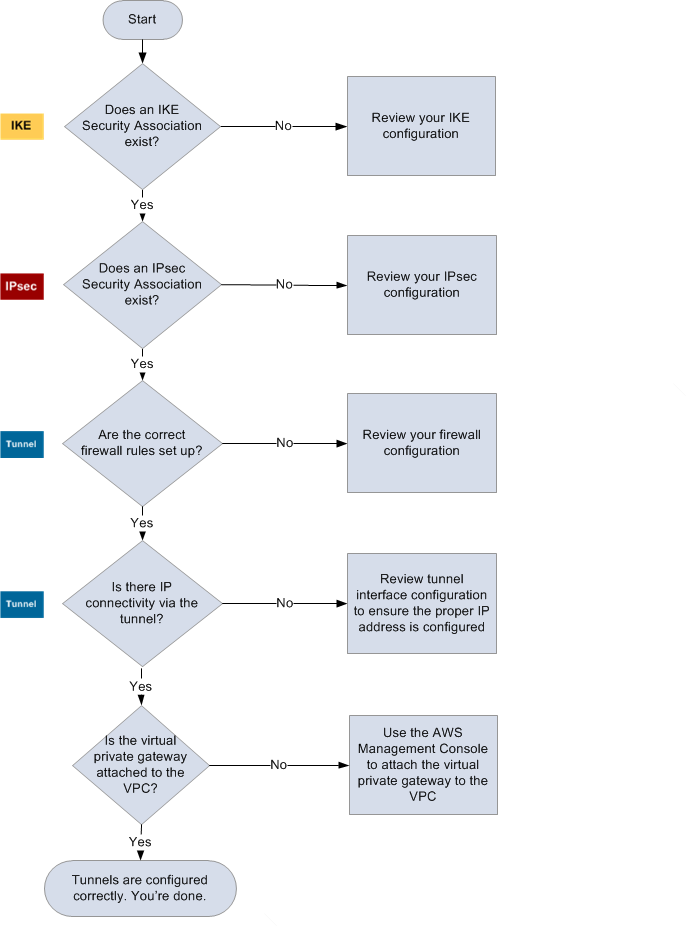

# Troubleshoot AWS Site-to-Site VPN connectivity without Border Gateway

Protocol

The following diagram and table provide general instructions for troubleshooting a
customer gateway device that does not use Border Gateway Protocol (BGP). We also
recommend that you enable the debug features of your device. Consult your gateway device
vendor for details.

|               |                                                                                                                                                                                                                                                                                                                                                                                                                                                                                                                                                                                                                                                                                                                                                                                                           |
| ------------- | --------------------------------------------------------------------------------------------------------------------------------------------------------------------------------------------------------------------------------------------------------------------------------------------------------------------------------------------------------------------------------------------------------------------------------------------------------------------------------------------------------------------------------------------------------------------------------------------------------------------------------------------------------------------------------------------------------------------------------------------------------------------------------------------------------- |
| IKE           | Determine if an IKE security association exists. An IKE security association is required to exchange keys that are used to establish the IPsec security association. If no IKE security association exists, review your IKE configuration settings. You must configure the encryption, authentication, perfect forward secrecy, and mode parameters as listed in the configuration file. If an IKE security association exists, move on to 'IPsec'.                                                                                                                                                                                                                                                                                                                                  |
| IPsec         | Determine if an IPsec security association (SA) exists. An IPsec SA is the tunnel itself. Query your customer gateway device to determine if an IPsec SA is active. Ensure that you configure the encryption, authentication, perfect forward secrecy, and mode parameters as listed in the configuration file. If no IPsec SA exists, review your IPsec configuration. If an IPsec SA exists, move on to 'Tunnel'.                                                                                                                                                                                                                                                                                                                                                                     |
| Tunnel        | Confirm that the required firewall rules are set up (for a list of the rules, see [Firewall rules for an AWS Site-to-Site VPN customer gateway device](FirewallRules.md "FirewallRules.md")). If they are, move forward. Determine if there is IP connectivity through the tunnel. Each side of the tunnel has an IP address as specified in the configuration file. The virtual private gateway address is the address used as the BGP neighbor address. From your customer gateway device, ping this address to determine if IP traffic is being properly encrypted and decrypted. If the ping isn't successful, review your tunnel interface configuration to make sure that the proper IP address is configured. If the ping is successful, move on to 'Static routes'. |
| Static routes | For each tunnel, do the following: • Verify that you have added a static route to your VPC CIDR with the tunnels as the next hop. • Verify that you have added a static route on the Amazon VPC console, to tell the virtual private gateway to route traffic back to your internal networks. If the tunnels are not in this state, review your device configuration. Make sure that both tunnels are in this state, and you're done.                                                                                                                                                                                                                                                                                                                                             |
