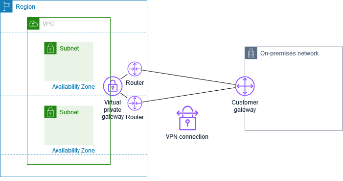

# Tunnel options for your AWS Site-to-Site VPN connection

You use a Site-to-Site VPN connection to connect your remote network to a VPC. Each Site-to-Site VPN connection
has two tunnels, with each tunnel using a unique public IP address. It is important to
configure both tunnels for redundancy. When one tunnel becomes unavailable (for example,
down for maintenance), network traffic is automatically routed to the available tunnel for
that specific Site-to-Site VPN connection.

The following diagram shows the two tunnels of a VPN connection. Each tunnel terminates in a
different Availability Zone to provide increased availability. Traffic from the on-premises
network to AWS uses both tunnels. Traffic from AWS to the on-premises network prefers
one of the tunnels, but can automatically fail over to the other tunnel if there is a
failure on the AWS side.

When you create a Site-to-Site VPN connection, you download a configuration file specific to your
customer gateway device that contains information for configuring the device,
including information for configuring each tunnel. You can optionally specify some
of the tunnel options yourself when you create the Site-to-Site VPN connection. Otherwise, AWS
provides default values.

## Tunnel bandwidth options

You can configure the bandwidth capacity for your VPN tunnels:

- **Standard bandwidth**: Up to 1.25 Gbps per tunnel (default)
- **Large Bandwidth Tunnel (LBT)**: Up to 5 Gbps per tunnel

Large Bandwidth Tunnels are available only for VPN connections attached to Transit Gateway or Cloud WAN. For more information, see [Large Bandwidth Tunnels](#large-bandwidth-tunnels "#large-bandwidth-tunnels").

###### Note

Site-to-Site VPN tunnel endpoints evaluate proposals from your customer gateway starting with the
lowest configured value from the list below, regardless of the proposal order from the
customer gateway. You can use the `modify-vpn-connection-options` command to
restrict the list of options AWS endpoints will accept. For more information, see [modify-vpn-connection-options](../../../cli/latest/reference/ec2/modify-vpn-connection-options.md "../../../cli/latest/reference/ec2/modify-vpn-connection-options.md") in _Amazon EC2 Command Line Reference_.

## Large Bandwidth Tunnels

Large Bandwidth Tunnels allow you to configure Site-to-Site VPN tunnels that support up to 5 Gbps
bandwidth per tunnel, compared to the standard 1.25 Gbps. Large Bandwidth Tunnels are
available for VPN connections attached to Transit Gateway or Cloud WAN. This eliminates or
reduces the need to deploy complex protocols such as ECMP (Equal Cost Multi Path) to achieve
higher bandwidth and ensures a consistent tunnel bandwidth of 5 Gbps per tunnel. Large
Bandwidth Tunnels is designed to be used in the following use cases:

- **Data center connectivity**: Support
  bandwidth-intensive hybrid applications, big data migrations, or disaster
  recovery architectures that require high-capacity connectivity between AWS
  workloads and on-premises data centers.
- **Direct Connect backup**: Provide backup or
  overlay connectivity for high-capacity Direct Connect circuits (10 Gbps+) to
  on-premises data centers or colocation facilities.

### Region availability

Large Bandwidth Tunnels are available in all Regions except the following:

| Unavailable AWS Regions | AWS Region               | Description |
| ----------------------- | ------------------------ | ----------- |
| ap-southeast-4          | Asia Pacific (Melbourne) |
| ca-west-1               | Canada West (Calgary)    |
| eu-central-2            | Europe (Zurich)          |
| il-central-1            | Israel (Tel Aviv)        |
| me-central-1            | Middle East (UAE)        |

### Requirements and limitations

- Available only for VPN connections attached to a transit gateway or to Cloud
  WAN. Not supported for Virtual Private Gateway attachments.
- Both tunnels of a VPN connection must use the same bandwidth configuration (both 1.25 Gbps or both 5 Gbps).
- Accelerated VPN is not supported.
- All other core VPN features such as private IP VPN, routing, and tunnel maintenance work the same with Large Bandwidth Tunnel.
- MTU limit remains 1500 bytes. [Learn More](cgw-best-practice.md "cgw-best-practice.md") on how to adjust MTU and MSS sizes according to the algorithms in use.
- You can't modify an existing tunnel to use Large Bandwidth Tunnels. You'll
  need to first delete the tunnel, and then create a new tunnel and setting the
  tunnel bandwidth to **Large**.
- Customer Gateways (CGWs) only with a fixed IP can be used with Large Bandwidth Tunnels.
- Customer Gateways (CGWs) without an IP address cannot be used with Large Bandwidth Tunnels.
- Large Bandwidth Tunnels do not support changes to the NAT-T port while the tunnel is established.
- Packets requiring fragmentation may experience lower performance.
  [Learn More](vpn-limits.md#vpn-quotas-mtu "vpn-limits.md#vpn-quotas-mtu") .

### Pricing for Large Bandwidth Tunnels

Information about pricing for Large Bandwidth VPN connections can be found on the
[AWS VPN pricing](https://aws.amazon.com/vpn/pricing/#AWS_Site-to-Site_VPN_and_Accelerated_Site-to-Site_VPN_Connection_Pricing "https://aws.amazon.com/vpn/pricing/#AWS_Site-to-Site_VPN_and_Accelerated_Site-to-Site_VPN_Connection_Pricing") page.

### Scaling beyond 5 Gbps

For bandwidth requirements exceeding 5 Gbps per tunnel, you can use ECMP across
multiple VPN connections. For example, you can achieve 20 Gbps bandwidth by deploying
two VPN connections with Large Bandwidth Tunnels and using ECMP across all four
tunnels.
