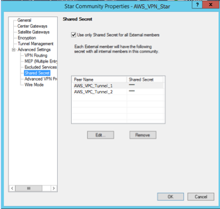

# Configure dynamic routing for an AWS Virtual Private Network customer gateway device

The following are some
example procedures for configuring a customer gateway device using its user interface
(if available).

Check Point
The following are steps for configuring a Check Point Security Gateway
device running R77.10 or above, using the Gaia web portal and Check Point
SmartDashboard. You can also refer to the [Amazon Web Services (AWS) VPN BGP](https://support.checkpoint.com/results/sk/sk108958 "https://support.checkpoint.com/results/sk/sk108958") article on the Check Point
Support Center.

###### To configure the tunnel interface

The first step is to create the VPN tunnels and provide the private
(inside) IP addresses of the customer gateway and virtual private
gateway for each tunnel. To create the first tunnel, use the information
provided under the `IPSec Tunnel #1` section of the
configuration file. To create the second tunnel, use the values provided
in the `IPSec Tunnel #2` section of the configuration file.

1. Connect to your security gateway over SSH. If you're using the
   non-default shell, change to clish by running the following command:
   `clish`
2. Set the customer gateway ASN (the ASN that was provided when the
   customer gateway was created in AWS) by running the following
   command.

```
set as `65000`
```

3. Create the tunnel interface for the first tunnel, using the
   information provided under the `IPSec Tunnel #1` section
   of the configuration file. Provide a unique name for your tunnel,
   such as `AWS_VPC_Tunnel_1`.

```
add vpn tunnel 1 type numbered local `169.254.44.234` remote `169.254.44.233` peer `AWS_VPC_Tunnel_1`
set interface vpnt1 state on
set interface vpnt1 mtu `1436`
```

4. Repeat these commands to create the second tunnel, using the
   information provided under the `IPSec Tunnel #2` section
   of the configuration file. Provide a unique name for your tunnel,
   such as `AWS_VPC_Tunnel_2`.

```
add vpn tunnel 1 type numbered local `169.254.44.38` remote `169.254.44.37` peer `AWS_VPC_Tunnel_2`
set interface vpnt2 state on
set interface vpnt2 mtu `1436`
```

5. Set the virtual private gateway ASN.

```
set bgp external remote-as `7224` on
```

6. Configure the BGP for the first tunnel, using the information
   provided `IPSec Tunnel #1` section of the configuration
   file.

```
set bgp external remote-as `7224` peer `169.254.44.233` on
set bgp external remote-as `7224` peer `169.254.44.233` holdtime 30
set bgp external remote-as `7224` peer `169.254.44.233` keepalive 10
```

7. Configure the BGP for the second tunnel, using the information
   provided `IPSec Tunnel #2` section of the configuration
   file.

```
set bgp external remote-as `7224` peer `169.254.44.37` on
set bgp external remote-as `7224` peer `169.254.44.37` holdtime 30
set bgp external remote-as `7224` peer `169.254.44.37` keepalive 10
```

8. Save the configuration.

```
save config
```

###### To create a BGP policy

Next, create a BGP policy that allows the import of routes that are
advertised by AWS. Then, configure your customer gateway to advertise
its local routes to AWS.

1. In the Gaia WebUI, choose **Advanced Routing**,
   **Inbound Route Filters**. Choose
   **Add**, and select **Add BGP Policy
   (Based on AS)**.
2. For **Add BGP Policy**, select a value between
   512 and 1024 in the first field, and enter the virtual private
   gateway ASN in the second field (for example,
   `7224`).
3. Choose **Save**.

###### To advertise local routes

The following steps are for distributing local interface routes. You
can also redistribute routes from different sources (for example, static
routes, or routes obtained through dynamic routing protocols). For more
information, see the [Gaia Advanced Routing R77 Versions Administration
Guide](https://sc1.checkpoint.com/documents/R77/CP_R77_Gaia_Advanced_Routing_WebAdminGuide/html_frameset.htm "https://sc1.checkpoint.com/documents/R77/CP_R77_Gaia_Advanced_Routing_WebAdminGuide/html_frameset.htm").

1. In the Gaia WebUI, choose **Advanced
   Routing**, **Routing Redistribution**.
   Choose **Add Redistribution From** and then select
   **Interface**.
2. For **To Protocol**, select the virtual private
   gateway ASN (for example, `7224`).
3. For **Interface**, select an internal interface.
   Choose **Save**.

###### To define a new network object

Next, create a network object for each VPN tunnel, specifying the
public (outside) IP addresses for the virtual private gateway. You later
add these network objects as satellite gateways for your VPN community.
You also need to create an empty group to act as a placeholder for the
VPN domain.

1. Open the Check Point SmartDashboard.
2. For **Groups**, open the context menu and choose
   **Groups**, **Simple Group**.
   You can use the same group for each network object.
3. For **Network Objects**, open the context
   (right-click) menu and choose **New**,
   **Interoperable Device**.
4. For **Name**, enter the name that you provided
   for your tunnel in step 1, for example,
   `AWS_VPC_Tunnel_1` or
   `AWS_VPC_Tunnel_2`.
5. For **IPv4 Address**, enter the outside IP
   address of the virtual private gateway provided in the configuration
   file, for example, `54.84.169.196`. Save your settings
   and close the dialog box.

 6. In the left category pane, choose **Topology**. 7. In the **VPN Domain** section, choose
**Manually defined**, and then browse to and
select the empty simple group that you created in step 2. Choose
**OK**. 8. Repeat these steps to create a second network object, using the
information under the `IPSec Tunnel #2` section of the
configuration file. 9. Go to your gateway network object, open your gateway or cluster
object, and choose **Topology**. 10. In the **VPN Domain** section, choose
**Manually defined**, and then browse to and
select the empty simple group that you created in step 2. Choose
**OK**.

###### Note

You can keep any existing VPN domain that you've configured.
However, ensure that the hosts and networks that are used or
served by the new VPN connection are not declared in that VPN
domain, especially if the VPN domain is automatically
derived.

###### Note

If you're using clusters, edit the topology and define the interfaces
as cluster interfaces. Use the IP addresses that are specified in the
configuration file.

###### To create and configure the VPN community, IKE, and IPsec

settings

Next, create a VPN community on your Check Point gateway, to which you
add the network objects (interoperable devices) for each tunnel. You
also configure the Internet Key Exchange (IKE) and IPsec
settings.

1. From your gateway properties, choose **IPSec
   VPN** in the category pane.
2. Choose **Communities**, **New**,
   **Star Community**.
3. Provide a name for your community (for example,
   `AWS_VPN_Star`), and then choose **Center
   Gateways** in the category pane.
4. Choose **Add**, and add your gateway or cluster
   to the list of participant gateways.
5. In the category pane, choose **Satellite
   Gateways**, **Add**, and add the
   interoperable devices that you created earlier
   (`AWS_VPC_Tunnel_1` and
   `AWS_VPC_Tunnel_2`) to the list of participant
   gateways.
6. In the category pane, choose **Encryption**. In
   the **Encryption Method** section, choose
   **IKEv1 for IPv4 and IKEv2 for IPv6**. In the
   **Encryption Suite** section, choose
   **Custom**, **Custom
   Encryption**.

###### Note

You must select the **IKEv1 for IPv4 and IKEv2 for
IPv6** option for IKEv1 functionality. 7. In the dialog box, configure the encryption properties as follows,
and then choose **OK** when you're done:

    * IKE Security Association (Phase 1) Properties:


    	+ **Perform key exchange encryption
    	 with**: AES-128
    	+ **Perform data integrity with**:
    	 SHA-1
    * IPsec Security Association (Phase 2) Properties:


    	+ **Perform IPsec data encryption
    	 with**: AES-128
    	+ **Perform data integrity with**:
    	 SHA-1

8. In the category pane, choose **Tunnel
   Management**. Choose **Set Permanent
   Tunnels**, **On all tunnels in the
   community**. In the **VPN Tunnel
   Sharing** section, choose **One VPN tunnel per
   Gateway pair**.
9. In the category pane, expand **Advanced
   Settings**, and choose **Shared
   Secret**.
10. Select the peer name for the first tunnel, choose
    **Edit**, and then enter the pre-shared key as
    specified in the configuration file in the `IPSec Tunnel
#1` section.
11. Select the peer name for the second tunnel, choose
    **Edit**, and then enter the pre-shared key as
    specified in the configuration file in the `IPSec Tunnel
#2` section.

 12. Still in the **Advanced Settings** category,
choose **Advanced VPN Properties**, configure the
properties as follows, and then choose **OK** when
you're done:

    * IKE (Phase 1):


    	+ **Use Diffie-Hellman group**:
    	 `Group 2 (1024 bit)`
    	+ **Renegotiate IKE security associations
    	 every**
    	`480`
    	**minutes**
    * IPsec (Phase 2):


    	+ Choose **Use Perfect Forward
    	 Secrecy**
    	+ **Use Diffie-Hellman group**:
    	 `Group 2 (1024 bit)`
    	+ **Renegotiate IPsec security associations
    	 every**
    	`3600`
    	**seconds**

###### To create firewall rules

Next, configure a policy with firewall rules and directional match
rules that allow communication between the VPC and the local network.
You then install the policy on your gateway.

1. In the SmartDashboard, choose **Global
   Properties** for your gateway. In the category pane,
   expand **VPN**, and choose
   **Advanced**.
2. Choose **Enable VPN Directional Match in VPN
   Column**, and choose **OK**.
3. In the SmartDashboard, choose **Firewall**, and
   create a policy with the following rules:
   - Allow the VPC subnet to communicate with the local network
     over the required protocols.
   - Allow the local network to communicate with the VPC subnet
     over the required protocols.

4. Open the context menu for the cell in the VPN column, and choose
   **Edit Cell**.
5. In the **VPN Match Conditions** dialog box,
   choose **Match traffic in this direction only**.
   Create the following directional match rules by choosing
   **Add** for each, and then choose
   **OK** when you're done:
   - `internal_clear` > VPN community (The VPN
     star community that you created earlier, for example,
     `AWS_VPN_Star`)
   - VPN community > VPN community
   - VPN community > `internal_clear`

6. In the SmartDashboard, choose **Policy**,
   **Install**.
7. In the dialog box, choose your gateway and choose
   **OK** to install the policy.

###### To modify the tunnel_keepalive_method property

Your Check Point gateway can use Dead Peer Detection (DPD) to identify
when an IKE association is down. To configure DPD for a permanent
tunnel, the permanent tunnel must be configured in the AWS VPN
community.

By default, the `tunnel_keepalive_method` property for a
VPN gateway is set to `tunnel_test`. You must change the
value to `dpd`. Each VPN gateway in the VPN community that
requires DPD monitoring must be configured with the
`tunnel_keepalive_method` property, including any 3rd
party VPN gateway. You cannot configure different monitoring mechanisms
for the same gateway.

You can update the `tunnel_keepalive_method` property using
the GuiDBedit tool.

1. Open the Check Point SmartDashboard, and choose **Security
   Management Server**, **Domain Management
   Server**.
2. Choose **File**, **Database Revision
   Control...** and create a revision snapshot.
3. Close all SmartConsole windows, such as the SmartDashboard,
   SmartView Tracker, and SmartView Monitor.
4. Start the GuiBDedit tool. For more information, see the [Check Point Database Tool](https://support.checkpoint.com/results/sk/sk13009 "https://support.checkpoint.com/results/sk/sk13009") article on the Check Point
   Support Center.
5. Choose **Security Management Server**,
   **Domain Management Server**.
6. In the upper left pane, choose **Table**,
   **Network Objects**,
   **network_objects**.
7. In the upper right pane, select the relevant **Security
   Gateway**, **Cluster** object.
8. Press CTRL+F, or use the **Search** menu to
   search for the following:
   `tunnel_keepalive_method`.
9. In the lower pane, open the context menu for
   `tunnel_keepalive_method`, and select
   **Edit...**. Choose **dpd**,
   **OK**.
10. Repeat steps 7 through 9 for each gateway that's part of the AWS
    VPN Community.
11. Choose **File**, **Save
    All**.
12. Close the GuiDBedit tool.
13. Open the Check Point SmartDashboard, and choose **Security
    Management Server**, **Domain Management
    Server**.
14. Install the policy on the relevant **Security
    Gateway**, **Cluster** object.

For more information, see the [New VPN features in R77.10](https://support.checkpoint.com/results/sk/sk97746 "https://support.checkpoint.com/results/sk/sk97746") article on the Check Point Support
Center.

###### To enable TCP MSS clamping

TCP MSS clamping reduces the maximum segment size of TCP packets to
prevent packet fragmentation.

1. Navigate to the following directory: `C:\Program Files
(x86)\CheckPoint\SmartConsole\R77.10\PROGRAM\`.
2. Open the Check Point Database Tool by running the
   `GuiDBEdit.exe` file.
3. Choose **Table**, **Global
   Properties**, **properties**.
4. For `fw_clamp_tcp_mss`, choose
   **Edit**. Change the value to `true`
   and then choose **OK**.

###### To verify the tunnel status

You can verify the tunnel status by running the following command from
the command line tool in expert mode.

```
vpn tunnelutil
```

In the options that display, choose **1** to verify the
IKE associations and **2** to verify the IPsec
associations.

You can also use the Check Point Smart Tracker Log to verify that packets
over the connection are being encrypted. For example, the following log
indicates that a packet to the VPC was sent over tunnel 1 and was
encrypted.


SonicWALL
You can configure a SonicWALL device using the SonicOS management
interface. For more information about configuring the tunnels, see [Configure static routing for an
AWS Site-to-Site VPN customer gateway device](cgw-static-routing-example-interface.md "cgw-static-routing-example-interface.md").

You cannot configure BGP for the device using the management interface. Instead, use
the command line instructions provided in the example configuration file, under
the section named **BGP**.
