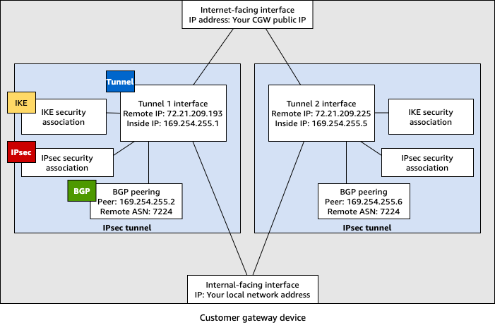

# Downloadable dynamic routing configuration

files for AWS Site-to-Site VPN customer gateway device

To download a sample configuration file with values specific to your Site-to-Site VPN
connection configuration, use the Amazon VPC console, the AWS command line or the Amazon EC2 API. For more
information, see [Step 6: Download the configuration file](SetUpVPNConnections.md#vpn-download-config "SetUpVPNConnections.md#vpn-download-config").

You can also download generic example configuration files for dynamic
routing that do not include values specific to your Site-to-Site VPN connection
configuration: [dynamic-routing-examples.zip](samples/dynamic-routing-examples.md "samples/dynamic-routing-examples.md")

The files use placeholder values for some components. For example, they use:

- Example values for the VPN connection ID, customer gateway ID and virtual
  private gateway ID
- Placeholders for the remote (outside) IP address AWS endpoints
  (`AWS_ENDPOINT_1` and
  `AWS_ENDPOINT_2`)
- A placeholder for the IP address for the internet-routable external interface
  on the customer gateway device
  (`your-cgw-ip-address`)
- A placeholder for the pre-shared key value (pre-shared-key)
- Example values for the tunnel inside IP addresses.
- Example values for MTU setting.

###### Note

MTU settings provided in the sample configuration files are examples only. Please
refer to [Best practices for an AWS Site-to-Site VPN customer gateway device](cgw-best-practice.md "cgw-best-practice.md") for
information on setting the optimal MTU value for your situation.

In addition to providing placeholder values, the files specify the minimum
requirements for a Site-to-Site VPN connection of AES128, SHA1, and Diffie-Hellman group 2 in most
AWS Regions, and AES128, SHA2, and Diffie-Hellman group 14 in the AWS GovCloud
Regions. They also specify pre-shared keys for [authentication](vpn-tunnel-authentication-options.md "vpn-tunnel-authentication-options.md"). You must modify
the example configuration file to take advantage of additional security algorithms,
Diffie-Hellman groups, private certificates, and IPv6 traffic.

The following diagram provides an overview of the different components that are
configured on the customer gateway device. It includes example values for the tunnel
interface IP addresses.

## Cisco devices: additional information

Some Cisco ASAs only support Active/Standby mode. When you use these Cisco ASAs, you
can have only one active tunnel at a time. The other standby tunnel becomes active if
the first tunnel becomes unavailable. With this redundancy, you should always have
connectivity to your VPC through one of the tunnels.

Cisco ASAs from version 9.7.1 and later support Active/Active mode. When you use these
Cisco ASAs, you can have both tunnels active at the same time. With this redundancy, you
should always have connectivity to your VPC through one of the tunnels.

For Cisco devices, you must do the following:

- Configure the outside interface.
- Ensure that the Crypto ISAKMP Policy Sequence number is unique.
- Ensure that the Crypto List Policy Sequence number is unique.
- Ensure that the Crypto IPsec Transform Set and the Crypto ISAKMP Policy
  Sequence are harmonious with any other IPsec tunnels that are configured on the
  device.
- Ensure that the SLA monitoring number is unique.
- Configure all internal routing that moves traffic between the customer gateway
  device and your local network.

## Juniper devices: additional information

The following information applies to the example configuration files for Juniper
J-Series and SRX customer gateway devices.

- The outside interface is referred to as
  `ge-0/0/0.0`.
- The tunnel interface IDs are referred to as `st0.1`
  and `st0.2`.
- Ensure that you identify the security zone for the uplink interface (the
  configuration information uses the default 'untrust' zone).
- Ensure that you identify the security zone for the inside interface (the
  configuration information uses the default 'trust' zone).
