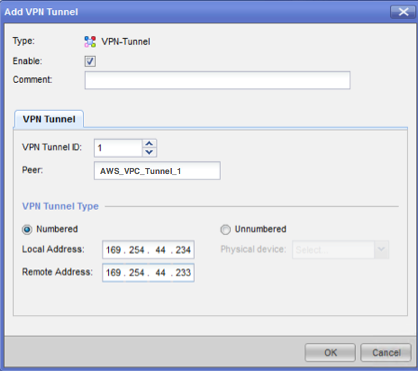
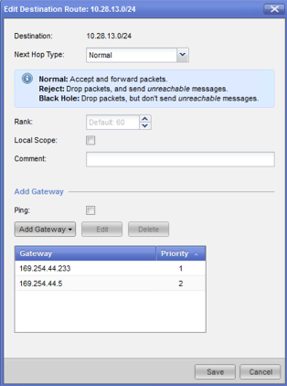
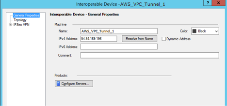
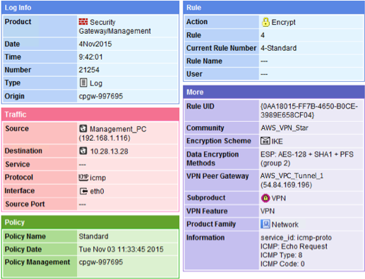

# Configure static routing for an

AWS Site-to-Site VPN customer gateway device

The following are some example procedures for configuring a customer gateway device
using its user interface (if available).

Check Point
The following are steps for configuring your customer gateway device if
your device is a Check Point Security Gateway device running R77.10 or
above, using the Gaia operating system and Check Point SmartDashboard. You
can also refer to the [Check Point Security Gateway IPsec VPN to Amazon Web Services
VPC](https://support.checkpoint.com/results/sk/sk100726 "https://support.checkpoint.com/results/sk/sk100726") article on the Check Point Support Center.

###### To configure the tunnel interface

The first step is to create the VPN tunnels and provide the private
(inside) IP addresses of the customer gateway and virtual private
gateway for each tunnel. To create the first tunnel, use the information
provided under the `IPSec Tunnel #1` section of the
configuration file. To create the second tunnel, use the values provided
in the `IPSec Tunnel #2` section of the configuration file.

1. Open the Gaia portal of your Check Point Security Gateway
   device.
2. Choose **Network Interfaces**,
   **Add**, **VPN
   tunnel**.
3. In the dialog box, configure the settings as follows, and choose
   **OK** when you are done:
   - For **VPN Tunnel ID**, enter any unique
     value, such as 1.
   - For **Peer**, enter a unique name for
     your tunnel, such as `AWS_VPC_Tunnel_1` or
     `AWS_VPC_Tunnel_2`.
   - Ensure that **Numbered** is selected, and
     for **Local Address**, enter the IP address
     specified for `CGW Tunnel IP` in the
     configuration file, for example,
     `169.254.44.234`.
   - For **Remote Address**, enter the IP
     address specified for `VGW Tunnel IP` in the
     configuration file, for example,
     `169.254.44.233`.

 4. Connect to your security gateway over SSH. If you're using the
non-default shell, change to clish by running the following command:
`clish` 5. For tunnel 1, run the following command.

```
set interface vpnt1 mtu 1436
```

For tunnel 2, run the following command.

```
set interface vpnt2 mtu 1436
```

6. Repeat these steps to create a second tunnel, using the
   information under the `IPSec Tunnel #2` section of the
   configuration file.

###### To configure the static routes

In this step, specify the static route to the subnet in the VPC for
each tunnel to enable you to send traffic over the tunnel interfaces.
The second tunnel enables failover in case there is an issue with the
first tunnel. If an issue is detected, the policy-based static route is
removed from the routing table, and the second route is activated. You
must also enable the Check Point gateway to ping the other end of the
tunnel to check if the tunnel is up.

1. In the Gaia portal, choose **IPv4 Static
   Routes**, **Add**.
2. Specify the CIDR of your subnet, for example,
   `10.28.13.0/24`.
3. Choose **Add Gateway**, **IP
   Address**.
4. Enter the IP address specified for `VGW Tunnel IP` in
   the configuration file (for example, `169.254.44.233`),
   and specify a priority of 1.
5. Select **Ping**.
6. Repeat steps 3 and 4 for the second tunnel, using the `VGW
Tunnel IP` value under the `IPSec Tunnel #2`
   section of the configuration file. Specify a priority of 2.

 7. Choose **Save**.

If you're using a cluster, repeat the preceding steps for the other
members of the cluster.

###### To define a new network object

In this step, you create a network object for each VPN tunnel,
specifying the public (outside) IP addresses for the virtual private
gateway. You later add these network objects as satellite gateways for
your VPN community. You also need to create an empty group to act as a
placeholder for the VPN domain.

1. Open the Check Point SmartDashboard.
2. For **Groups**, open the context menu and choose
   **Groups**, **Simple Group**.
   You can use the same group for each network object.
3. For **Network Objects**, open the context
   (right-click) menu and choose **New**,
   **Interoperable Device**.
4. For **Name**, enter the name that you provided
   for your tunnel, for example, `AWS_VPC_Tunnel_1` or
   `AWS_VPC_Tunnel_2`.
5. For **IPv4 Address**, enter the outside IP
   address of the virtual private gateway provided in the configuration
   file, for example, `54.84.169.196`. Save your settings
   and close the dialog box.

 6. In the SmartDashboard, open your gateway properties and in the
category pane, choose **Topology**. 7. To retrieve the interface configuration, choose **Get
Topology**. 8. In the **VPN Domain** section, choose
**Manually defined**, and then browse to and
select the empty simple group that you created in step 2. Choose
**OK**.

###### Note

You can keep any existing VPN domain that you've configured.
However, ensure that the hosts and networks that are used or
served by the new VPN connection are not declared in that VPN
domain, especially if the VPN domain is automatically
derived. 9. Repeat these steps to create a second network object, using the
information under the `IPSec Tunnel #2` section of the
configuration file.

###### Note

If you're using clusters, edit the topology and define the interfaces
as cluster interfaces. Use the IP addresses that are specified in the
configuration file.

###### To create and configure the VPN community, IKE, and IPsec

settings

In this step, you create a VPN community on your Check Point gateway,
to which you add the network objects (interoperable devices) for each
tunnel. You also configure the Internet Key Exchange (IKE) and IPsec
settings.

1. From your gateway properties, choose **IPSec
   VPN** in the category pane.
2. Choose **Communities**, **New**,
   **Star Community**.
3. Provide a name for your community (for example,
   `AWS_VPN_Star`), and then choose **Center
   Gateways** in the category pane.
4. Choose **Add**, and add your gateway or cluster
   to the list of participant gateways.
5. In the category pane, choose **Satellite
   Gateways**, **Add**, and then add the
   interoperable devices that you created earlier
   (`AWS_VPC_Tunnel_1` and
   `AWS_VPC_Tunnel_2`) to the list of participant
   gateways.
6. In the category pane, choose **Encryption**. In
   the **Encryption Method** section, choose
   **IKEv1 only**. In the **Encryption
   Suite** section, choose **Custom**,
   **Custom Encryption**.
7. In the dialog box, configure the encryption properties as follows,
   and choose **OK** when you're done:
   - IKE Security Association (Phase 1) Properties:
     - **Perform key exchange encryption
       with**: AES-128
     - **Perform data integrity with**:
       SHA-1

   - IPsec Security Association (Phase 2) Properties:
     - **Perform IPsec data encryption
       with**: AES-128
     - **Perform data integrity with**:
       SHA-1

8. In the category pane, choose **Tunnel
   Management**. Choose **Set Permanent
   Tunnels**, **On all tunnels in the
   community**. In the **VPN Tunnel
   Sharing** section, choose **One VPN tunnel per
   Gateway pair**.
9. In the category pane, expand **Advanced
   Settings**, and choose **Shared
   Secret**.
10. Select the peer name for the first tunnel, choose
    **Edit**, and then enter the pre-shared key as
    specified in the configuration file in the `IPSec Tunnel
#1` section.
11. Select the peer name for the second tunnel, choose
    **Edit**, and then enter the pre-shared key as
    specified in the configuration file in the `IPSec Tunnel
#2` section.

 12. Still in the **Advanced Settings** category,
choose **Advanced VPN Properties**, configure the
properties as follows, and then choose **OK** when
you're done:

    * IKE (Phase 1):


    	+ **Use Diffie-Hellman group**:
    	 `Group 2`
    	+ **Renegotiate IKE security associations
    	 every**
    	`480`
    	**minutes**
    * IPsec (Phase 2):


    	+ Choose **Use Perfect Forward
    	 Secrecy**
    	+ **Use Diffie-Hellman group**:
    	 `Group 2`
    	+ **Renegotiate IPsec security associations
    	 every**
    	`3600`
    	**seconds**

###### To create firewall rules

In this step, you configure a policy with firewall rules and
directional match rules that allow communication between the VPC and the
local network. You then install the policy on your gateway.

1. In the SmartDashboard, choose **Global
   Properties** for your gateway. In the category pane,
   expand **VPN**, and choose
   **Advanced**.
2. Choose **Enable VPN Directional Match in VPN
   Column**, and save your changes.
3. In the SmartDashboard, choose **Firewall**, and
   create a policy with the following rules:
   - Allow the VPC subnet to communicate with the local network
     over the required protocols.
   - Allow the local network to communicate with the VPC subnet
     over the required protocols.

4. Open the context menu for the cell in the VPN column, and choose
   **Edit Cell**.
5. In the **VPN Match Conditions** dialog box,
   choose **Match traffic in this direction only**.
   Create the following directional match rules by choosing
   **Add** for each, and choose
   **OK** when you're done:
   - `internal_clear` > VPN community (The VPN
     star community that you created earlier, for example,
     `AWS_VPN_Star`)
   - VPN community > VPN community
   - VPN community > `internal_clear`

6. In the SmartDashboard, choose **Policy**,
   **Install**.
7. In the dialog box, choose your gateway and choose
   **OK** to install the policy.

###### To modify the tunnel_keepalive_method property

Your Check Point gateway can use Dead Peer Detection (DPD) to identify
when an IKE association is down. To configure DPD for a permanent
tunnel, the permanent tunnel must be configured in the AWS VPN
community (refer to Step 8).

By default, the `tunnel_keepalive_method` property for a
VPN gateway is set to `tunnel_test`. You must change the
value to `dpd`. Each VPN gateway in the VPN community that
requires DPD monitoring must be configured with the
`tunnel_keepalive_method` property, including any 3rd
party VPN gateway. You cannot configure different monitoring mechanisms
for the same gateway.

You can update the `tunnel_keepalive_method` property using
the GuiDBedit tool.

1. Open the Check Point SmartDashboard, and choose **Security
   Management Server**, **Domain Management
   Server**.
2. Choose **File**, **Database Revision
   Control...** and create a revision snapshot.
3. Close all SmartConsole windows, such as the SmartDashboard,
   SmartView Tracker, and SmartView Monitor.
4. Start the GuiBDedit tool. For more information, see the [Check Point Database Tool](https://support.checkpoint.com/results/sk/sk13009 "https://support.checkpoint.com/results/sk/sk13009") article on the Check Point
   Support Center.
5. Choose **Security Management Server**,
   **Domain Management Server**.
6. In the upper left pane, choose **Table**,
   **Network Objects**,
   **network_objects**.
7. In the upper right pane, select the relevant **Security
   Gateway**, **Cluster** object.
8. Press CTRL+F, or use the **Search** menu to
   search for the following:
   `tunnel_keepalive_method`.
9. In the lower pane, open the context menu for
   `tunnel_keepalive_method`, and choose
   **Edit...**. Choose **dpd**
   and then choose **OK**.
10. Repeat steps 7 through 9 for each gateway that's part of the AWS
    VPN Community.
11. Choose **File**, **Save
    All**.
12. Close the GuiDBedit tool.
13. Open the Check Point SmartDashboard, and choose **Security
    Management Server**, **Domain Management
    Server**.
14. Install the policy on the relevant **Security
    Gateway**, **Cluster** object.

For more information, see the [New VPN features in R77.10](https://support.checkpoint.com/results/sk/sk97746 "https://support.checkpoint.com/results/sk/sk97746") article on the Check Point Support
Center.

###### To enable TCP MSS clamping

TCP MSS clamping reduces the maximum segment size of TCP packets to
prevent packet fragmentation.

1. Navigate to the following directory: `C:\Program Files
(x86)\CheckPoint\SmartConsole\R77.10\PROGRAM\`.
2. Open the Check Point Database Tool by running the
   `GuiDBEdit.exe` file.
3. Choose **Table**, **Global
   Properties**, **properties**.
4. For `fw_clamp_tcp_mss`, choose
   **Edit**. Change the value to `true`
   and choose **OK**.

###### To verify the tunnel status

You can verify the tunnel status by running the following command from
the command line tool in expert mode.

```
vpn tunnelutil
```

In the options that display, choose **1** to verify the
IKE associations and **2** to verify the IPsec
associations.

You can also use the Check Point Smart Tracker Log to verify that packets
over the connection are being encrypted. For example, the following log
indicates that a packet to the VPC was sent over tunnel 1 and was
encrypted.



SonicWALL
The following procedure demonstrates how to configure the VPN tunnels on
the SonicWALL device using the SonicOS management interface.

###### To configure the tunnels

1. Open the SonicWALL SonicOS management interface.
2. In the left pane, choose **VPN**,
   **Settings**. Under **VPN
   Policies**, choose **Add...**.
3. In the VPN policy window on the **General** tab,
   complete the following information:
   - **Policy Type**: Choose **Tunnel
     Interface**.
   - **Authentication Method**: Choose
     **IKE using Preshared Secret**.
   - **Name**: Enter a name for the VPN
     policy. We recommend that you use the name of the VPN ID, as
     provided in the configuration file.
   - **IPsec Primary Gateway Name or
     Address**: Enter the IP address of the virtual
     private gateway as provided in the configuration file (for
     example, `72.21.209.193`).
   - **IPsec Secondary Gateway Name or
     Address**: Leave the default value.
   - **Shared Secret**: Enter the pre-shared
     key as provided in the configuration file, and enter it
     again in **Confirm Shared Secret**.
   - **Local IKE ID**: Enter the IPv4 address
     of the customer gateway (the SonicWALL device).
   - **Peer IKE ID**: Enter the IPv4 address
     of the virtual private gateway.

4. On the **Network** tab, complete the following
   information:
   - Under **Local Networks**, choose
     **Any address**. We recommend this
     option to prevent connectivity issues from your local
     network.
   - Under **Remote Networks**, choose
     **Choose a destination network from
     list**. Create an address object with the CIDR
     of your VPC in AWS.

5. On the **Proposals** tab, complete the following
   information:
   - Under **IKE (Phase 1) Proposal**, do the
     following:
     - **Exchange**: Choose
       **Main Mode**.
     - **DH Group**: Enter a value for
       the Diffie-Hellman group (for example,
       `2`).
     - **Encryption**: Choose
       **AES-128** or
       **AES-256**.
     - **Authentication**: Choose
       **SHA1** or
       **SHA256**.
     - **Life Time**: Enter
       `28800`.

   - Under **IKE (Phase 2) Proposal**, do the
     following:
     - **Protocol**: Choose
       **ESP**.
     - **Encryption**: Choose
       **AES-128** or
       **AES-256**.
     - **Authentication**: Choose
       **SHA1** or
       **SHA256**.
     - Select the **Enable Perfect Forward
       Secrecy** check box, and choose the
       Diffie-Hellman group.
     - **Life Time**: Enter
       `3600`.

###### Important

If you created your virtual private gateway before October
2015, you must specify Diffie-Hellman group 2, AES-128, and SHA1
for both phases. 6. On the **Advanced** tab, complete the following
information:

    * Select **Enable Keep Alive**.
    * Select **Enable Phase2 Dead Peer
     Detection** and enter the following:


    	+ For **Dead Peer Detection
    	 Interval**, enter `60` (this
    	 is the minimum that the SonicWALL device
    	 accepts).
    	+ For **Failure Trigger Level**,
    	 enter `3`.
    * For **VPN Policy bound to**, select
     **Interface X1**. This is the interface
     that's typically designated for public IP addresses.

7. Choose **OK**. On the
   **Settings** page, the
   **Enable** check box for the tunnel should be
   selected by default. A green dot indicates that the tunnel is
   up.
