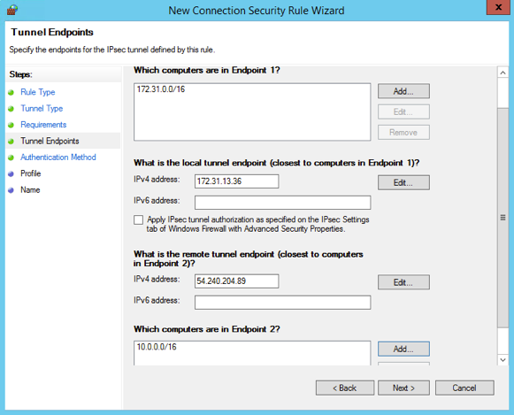

# Configure Windows Server as an AWS Site-to-Site VPN customer gateway device

You can configure a server running Windows Server as a customer gateway device for your
VPC. Use the following process whether you are running Windows Server on an EC2 instance in
a VPC, or on your own server. The following procedures apply to Windows Server 2012 R2 and
later.

###### Contents

- [Configuring your Windows
  instance](#cgw-device-windows-server-configure-instance "#cgw-device-windows-server-configure-instance")
- [Step 1: Create a VPN connection and configure your VPC](#cgw-device-windows-server-vpn "#cgw-device-windows-server-vpn")
- [Step 2: Download the configuration
  file for the VPN connection](#cgw-device-windows-server-config "#cgw-device-windows-server-config")
- [Step 3: Configure the Windows
  Server](#cgw-device-windows-server-configure "#cgw-device-windows-server-configure")
- [Step 4: Set up the VPN
  tunnel](#cgw-device-windows-server-setup-tunnel "#cgw-device-windows-server-setup-tunnel")
- [Step 5: Enable dead
  gateway detection](#cgw-device-windows-server-gateway-detection "#cgw-device-windows-server-gateway-detection")
- [Step 6: Test the VPN
  connection](#cgw-device-windows-server-test-connection "#cgw-device-windows-server-test-connection")

## Configuring your Windows

instance

If you are configuring Windows Server on an EC2 instance that you launched from a
Windows AMI, do the following:

- Disable source/destination checking for the instance:
  1.  Open the Amazon EC2 console at
      [https://console.aws.amazon.com/ec2/](https://console.aws.amazon.com/ec2/ "https://console.aws.amazon.com/ec2/").
  2.  Select your Windows instance, and choose **Actions**,
      **Networking**, **Change source/destination
      check**. Choose **Stop**, and then choose
      **Save**.

- Update your adapter settings so that you can route traffic from other
  instances:
  1.  Connect to your Windows instance. For more information, see [Connecting to your Windows instance](../../../AWSEC2/latest/UserGuide/connecting_to_windows_instance.md "../../../AWSEC2/latest/UserGuide/connecting_to_windows_instance.md").
  2.  Open the Control Panel, and start the Device Manager.
  3.  Expand the **Network adapters** node.
  4.  Select the network adapter (depending on the instance type, this might
      be Amazon Elastic Network Adapter or Intel 82599 Virtual Function), and
      choose **Action**,
      **Properties**.
  5.  On the **Advanced** tab, disable the **IPv4
      Checksum Offload**, **TCP Checksum Offload
      (IPv4)**, and **UDP Checksum Offload
      (IPv4)** properties, and then choose
      **OK**.

- Allocate an Elastic IP address to your account and associate it with the
  instance. For more information, see [Elastic IP addresses](../../../AWSEC2/latest/UserGuide/elastic-ip-addresses-eip.md "../../../AWSEC2/latest/UserGuide/elastic-ip-addresses-eip.md") in the _Amazon EC2 User Guide_.
  Take note of this address — you need it when you create the customer gateway.
- Ensure that the instance's security group rules allow outbound IPsec traffic.
  By default, a security group allows all outbound traffic. However, if the
  security group's outbound rules have been modified from their original state,
  you must create the following outbound custom protocol rules for IPsec traffic:
  IP protocol 50, IP protocol 51, and UDP 500.

Take note of the CIDR range of the network in which your Windows instance is located,
for example, `172.31.0.0/16`.

## Step 1: Create a VPN connection and configure your VPC

To create a VPN connection from your VPC, do the following:

1. Create a virtual private gateway and attach it to your VPC. For more
   information, see [Create a virtual private gateway](SetUpVPNConnections.md#vpn-create-vpg "SetUpVPNConnections.md#vpn-create-vpg").
2. Create a VPN connection and new customer gateway. For the customer gateway,
   specify the public IP address of your Windows Server. For the VPN connection,
   choose static routing, and then enter the CIDR range for your network in which
   the Windows Server is located, for example, `172.31.0.0/16`. For more
   information, see [Step 5: Create a VPN connection](SetUpVPNConnections.md#vpn-create-vpn-connection "SetUpVPNConnections.md#vpn-create-vpn-connection").

After you create the VPN connection, configure the VPC to enable communication over
the VPN connection.

###### To configure your VPC

- Create a private subnet in your VPC (if you don't have one already) for
  launching instances to communicate with the Windows Server. For more
  information, see [Creating a subnet in your VPC](../../../vpc/latest/userguide/create-vpc.md#AddaSubnet "../../../vpc/latest/userguide/create-vpc.md#AddaSubnet").

###### Note

A private subnet is a subnet that does not have a route to an internet
gateway. The routing for this subnet is described in the next item.

- Update your route tables for the VPN connection:
  - Add a route to your private subnet's route table with the virtual
    private gateway as the target, and the Windows Server's network (CIDR
    range) as the destination. For more information, see [Adding
    and removing routes from a route table](../../../vpc/latest/userguide/WorkWithRouteTables.md#AddRemoveRoutes "../../../vpc/latest/userguide/WorkWithRouteTables.md#AddRemoveRoutes") in the
    _Amazon VPC User Guide_.
  - Enable route propagation for the virtual private gateway. For more
    information, see [(Virtual private gateway) Enable route propagation in your
    route table](SetUpVPNConnections.md#vpn-configure-routing "SetUpVPNConnections.md#vpn-configure-routing").

- Create a security group for your instances that allows communication between
  your VPC and network:
  - Add rules that allow inbound RDP or SSH access from your network. This
    enables you to connect to instances in your VPC from your network. For
    example, to allow computers in your network to access Linux instances in
    your VPC, create an inbound rule with a type of SSH, and the source set
    to the CIDR range of your network (for example,
    `172.31.0.0/16`). For more information, see [Security groups for your
    VPC](../../../vpc/latest/userguide/vpc-security-groups.md "../../../vpc/latest/userguide/vpc-security-groups.md") in the _Amazon VPC User Guide_.
  - Add a rule that allows inbound ICMP access from your network. This
    enables you to test your VPN connection by pinging an instance in your
    VPC from your Windows Server.

## Step 2: Download the configuration

file for the VPN connection

You can use the Amazon VPC console to download a Windows Server configuration file for your
VPN connection.

###### To download the configuration file

1. Open the Amazon VPC console at
   [https://console.aws.amazon.com/vpc/](https://console.aws.amazon.com/vpc/ "https://console.aws.amazon.com/vpc/").
2. In the navigation pane, choose **Site-to-Site VPN Connections**.
3. Select your VPN connection and choose **Download
   Configuration**.
4. Select **Microsoft** as the vendor, **Windows
   Server** as the platform, and **2012 R2** as the
   software. Choose **Download**. You can open the file or save
   it.

The configuration file contains a section of information similar to the following
example. You see this information presented twice, one time for each tunnel.

```
vgw-1a2b3c4d Tunnel1
--------------------------------------------------------------------
Local Tunnel Endpoint:       203.0.113.1
Remote Tunnel Endpoint:      203.83.222.237
Endpoint 1:                  [Your_Static_Route_IP_Prefix]
Endpoint 2:                  [Your_VPC_CIDR_Block]
Preshared key:               xCjNLsLoCmKsakwcdoR9yX6GsEXAMPLE
```

`Local Tunnel Endpoint`

The IP address that you specified for the customer gateway when you
created the VPN connection.

`Remote Tunnel Endpoint`

One of two IP addresses for the virtual private gateway that terminates
the VPN connection on the AWS side of the connection.

`Endpoint 1`

The IP prefix that you specified as a static route when you created the
VPN connection. These are the IP addresses in your network that are allowed
to use the VPN connection to access your VPC.

`Endpoint 2`

The IP address range (CIDR block) of the VPC that is attached to the
virtual private gateway (for example 10.0.0.0/16).

`Preshared key`

The pre-shared key that is used to establish the IPsec VPN connection
between `Local Tunnel Endpoint` and `Remote Tunnel
 Endpoint`.

We suggest that you configure both tunnels as part of the VPN connection. Each tunnel
connects to a separate Site-to-Site VPN Concentrator on the Amazon side of the VPN connection.
Although only one tunnel at a time is up, the second tunnel automatically establishes
itself if the first tunnel goes down. Having redundant tunnels ensure continuous
availability in the case of a device failure. Because only one tunnel is available at a
time, the Amazon VPC console indicates that one tunnel is down. This is expected behavior, so
there's no action required from you.

With two tunnels configured, if a device failure occurs within AWS, your VPN
connection automatically fails over to the second tunnel of the virtual private gateway
within a matter of minutes. When you configure your customer gateway device, it's
important that you configure both tunnels.

###### Note

From time to time, AWS performs routine maintenance on the virtual private
gateway. This maintenance might disable one of the two tunnels of your VPN
connection for a brief period of time. Your VPN connection automatically fails over
to the second tunnel while we perform this maintenance.

Additional information regarding the Internet Key Exchange (IKE) and IPsec Security
Associations (SA) is presented in the downloaded configuration file.

```
MainModeSecMethods:        DHGroup2-AES128-SHA1
MainModeKeyLifetime:       480min,0sess
QuickModeSecMethods:       ESP:SHA1-AES128+60min+100000kb
QuickModePFS:              DHGroup2
```

`MainModeSecMethods`

The encryption and authentication algorithms for the IKE SA. These are the
suggested settings for the VPN connection, and are the default settings for
Windows Server IPsec VPN connections.

`MainModeKeyLifetime`

The IKE SA key lifetime.  This is the suggested setting for the VPN
connection, and is the default setting for Windows Server IPsec VPN
connections.

`QuickModeSecMethods`

The encryption and authentication algorithms for the IPsec SA. These are
the suggested settings for the VPN connection, and are the default settings
for Windows Server IPsec VPN connections.

`QuickModePFS`

We suggest that you use master key perfect forward secrecy (PFS) for your
IPsec sessions.

## Step 3: Configure the Windows

Server

Before you set up the VPN tunnel, you must install and configure Routing and Remote
Access Services on Windows Server. That allows remote users to access resources on your
network.

###### To install Routing and Remote Access Services

1. Log on to your Windows Server.
2. Go to the **Start** menu, and choose **Server
   Manager**.
3. Install Routing and Remote Access Services:
   1. From the **Manage** menu, choose **Add Roles
      and Features**.
   2. On the **Before You Begin** page, verify that your
      server meets the prerequisites, and then choose
      **Next**.
   3. Choose **Role-based or feature-based installation**,
      and then choose **Next**.
   4. Choose **Select a server from the server pool**,
      select your Windows Server, and then choose
      **Next**.
   5. Select **Network Policy and Access Services** in the
      list. In the dialog box that displays, choose **Add
      Features** to confirm the features that are required for
      this role.
   6. In the same list, choose **Remote Access**,
      **Next**.
   7. On the **Select features** page, choose
      **Next**.
   8. On the **Network Policy and Access Services** page,
      choose **Next**.
   9. On the **Remote Access** page, choose
      **Next**. On the next page, select
      **DirectAccess and VPN (RAS)**. In the dialog box
      that displays, choose **Add Features** to confirm the
      features that are required for this role service. In the same list,
      select **Routing**, and then choose
      **Next**.
   10. On the **Web Server Role (IIS)** page, choose
       **Next**. Leave the default selection, and choose
       **Next**.
   11. Choose **Install**. When the installation completes,
       choose **Close**.

###### To configure and enable Routing and Remote Access Server

1. On the dashboard, choose **Notifications** (the flag icon).
   There should be a task to complete the post-deployment configuration. Choose the
   **Open the Getting Started Wizard** link.
2. Choose **Deploy VPN only**.
3. In the **Routing and Remote Access** dialog box, choose the
   server name, choose **Action**, and then select
   **Configure and Enable Routing and Remote Access**.
4. In the **Routing and Remote Access Server Setup Wizard**, on
   the first page, choose **Next**.
5. On the **Configuration** page, choose **Custom
   Configuration**, **Next**.
6. Choose **LAN routing**, **Next**,
   **Finish**.
7. When prompted by the **Routing and Remote Access** dialog
   box, choose **Start service**.

## Step 4: Set up the VPN

tunnel

You can configure the VPN tunnel by running the netsh scripts included in the
downloaded configuration file, or by using the Windows Server user interface.

###### Important

We suggest that you use master key perfect forward secrecy (PFS) for your IPsec
sessions. If you choose to run the netsh script, it includes a parameter to enable
PFS (`qmpfs=dhgroup2`). You cannot enable PFS using the Windows user
interface — you must enable it using the command line.

###### Options

- [Option 1: Run the netsh
  script](#cgw-device-windows-server-run-netsh "#cgw-device-windows-server-run-netsh")
- [Option 2: Use the Windows Server user
  interface](#cgw-device-windows-server-ui "#cgw-device-windows-server-ui")

### Option 1: Run the netsh

script

Copy the netsh script from the downloaded configuration file and replace the
variables. The following is an example script.

```
netsh advfirewall consec add rule Name="vgw-1a2b3c4d Tunnel 1" ^
Enable=Yes Profile=any Type=Static Mode=Tunnel ^
LocalTunnelEndpoint=`Windows_Server_Private_IP_address` ^
RemoteTunnelEndpoint=203.83.222.236 Endpoint1=`Your_Static_Route_IP_Prefix` ^
Endpoint2=`Your_VPC_CIDR_Block` Protocol=Any Action=RequireInClearOut ^
Auth1=ComputerPSK Auth1PSK=xCjNLsLoCmKsakwcdoR9yX6GsEXAMPLE ^
QMSecMethods=ESP:SHA1-AES128+60min+100000kb ^
ExemptIPsecProtectedConnections=No ApplyAuthz=No QMPFS=dhgroup2
```

**Name**: You can replace the suggested name (`vgw-1a2b3c4d Tunnel 1)` with a name of your choice.

**LocalTunnelEndpoint**: Enter the private IP address of the
Windows Server on your network.

**Endpoint1**: The CIDR block of your network on which the
Windows Server resides, for example, `172.31.0.0/16`. Surround this value
with double quotes (").

**Endpoint2**: The CIDR block of your VPC or a subnet in your
VPC, for example, `10.0.0.0/16`. Surround this value with double quotes
(").

Run the updated script in a command prompt window on your Windows Server. (The ^
enables you to cut and paste wrapped text at the command line.) To set up the second
VPN tunnel for this VPN connection, repeat the process using the second netsh script
in the configuration file.

When you are done, go to [Configure the Windows
firewall](#cgw-device-windows-server-firewall "#cgw-device-windows-server-firewall").

For more information about the netsh parameters, see [Netsh AdvFirewall Consec Commands](<https://learn.microsoft.com/en-us/previous-versions/windows/it-pro/windows-server-2008-R2-and-2008/dd736198(v=ws.10)?redirectedfrom=MSDN#BKMK_2_set> "https://learn.microsoft.com/en-us/previous-versions/windows/it-pro/windows-server-2008-R2-and-2008/dd736198(v=ws.10)?redirectedfrom=MSDN#BKMK_2_set") in the _Microsoft TechNet
Library_.

### Option 2: Use the Windows Server user

interface

You can also use the Windows Server user interface to set up the VPN tunnel.

###### Important

You can't enable master key perfect forward secrecy (PFS) using the Windows
Server user interface. You must enable PFS using the command line, as described
in [Enable master key perfect
forward secrecy](#cgw-device-windows-server-enable-pfs "#cgw-device-windows-server-enable-pfs").

###### Tasks

- [Configure a security
  rule for a VPN tunnel](#cgw-device-windows-server-security-rule "#cgw-device-windows-server-security-rule")
- [Confirm the tunnel
  configuration](#cgw-device-windows-server-confirm-tunnel "#cgw-device-windows-server-confirm-tunnel")
- [Enable master key perfect
  forward secrecy](#cgw-device-windows-server-enable-pfs "#cgw-device-windows-server-enable-pfs")
- [Configure the Windows
  firewall](#cgw-device-windows-server-firewall "#cgw-device-windows-server-firewall")

#### Configure a security

rule for a VPN tunnel

In this section, you configure a security rule on your Windows Server to
create a VPN tunnel.

###### To configure a security rule for a VPN tunnel

1. Open Server Manager, choose **Tools**, and then
   select **Windows Defender Firewall with Advanced
   Security**.
2. Select **Connection Security Rules**, choose
   **Action**, and then **New
   Rule**.
3. In the **New Connection Security Rule** wizard, on
   the **Rule Type** page, choose
   **Tunnel**, and then choose
   **Next**.
4. On the **Tunnel Type** page, under **What
   type of tunnel would you like to create**, choose
   **Custom configuration**. Under **Would you
   like to exempt IPsec-protected connections from this
   tunnel**, leave the default value checked (**No.
   Send all network traffic that matches this connection security rule
   through the tunnel**), and then choose
   **Next**.
5. On the **Requirements** page, choose
   **Require authentication for inbound connections. Do not
   establish tunnels for outbound connections**, and then
   choose **Next**.
6. On the **Tunnel Endpoints** page, under
   **Which computers are in Endpoint 1**, choose
   **Add**. Enter the CIDR range of your network
   (behind your Windows Server customer gateway device; for example,
   `172.31.0.0/16`), and then choose
   **OK**. The range can include the IP address of your
   customer gateway device.
7. Under **What is the local tunnel endpoint (closest to computer
   in Endpoint 1)**, choose **Edit**. In the
   **IPv4 address** field, enter the private IP
   address of your Windows Server, and then choose
   **OK**.
8. Under **What is the remote tunnel endpoint (closest to
   computers in Endpoint 2)**, choose
   **Edit**. In the **IPv4 address**
   field, enter the IP address of the virtual private gateway for Tunnel 1
   from the configuration file (see `Remote Tunnel Endpoint`),
   and then choose **OK**.

###### Important

If you are repeating this procedure for Tunnel 2, be sure to
select the endpoint for Tunnel 2. 9. Under **Which computers are in Endpoint 2**, choose
**Add**. In the **This IP address or subnet
field**, enter the CIDR block of your VPC, and then choose
**OK**.

###### Important

You must scroll in the dialog box until you locate **Which
computers are in Endpoint 2**. Do not choose
**Next** until you have completed this step, or
you won't be able to connect to your server.

 10. Confirm that all of the settings you've specified are correct and then
choose **Next**. 11. On the **Authentication Method** page, select
**Advanced** and choose
**Customize**. 12. Under **First authentication methods**, choose
**Add**. 13. Select **Preshared key**, enter the pre-shared key
value from the configuration file and then choose
**OK**.

###### Important

If you are repeating this procedure for Tunnel 2, be sure to
select the pre-shared key for Tunnel 2. 14. Ensure that **First authentication is optional** is
not selected, and choose **OK**. 15. Choose **Next**. 16. On the **Profile** page, select all three check
boxes: **Domain**, **Private**, and
**Public**. Choose
**Next**. 17. On the **Name** page, enter a name for your
connection rule; for example, `VPN to Tunnel 1`, and then
choose **Finish**.

Repeat the preceding procedure, specifying the data for Tunnel 2 from your
configuration file.

After you've finished, you’ll have two tunnels configured for your VPN
connection.

#### Confirm the tunnel

configuration

###### To confirm the tunnel configuration

1. Open Server Manager, choose **Tools**, select
   **Windows Firewall with Advanced Security**, and
   then select **Connection Security Rules**.
2. Verify the following for both tunnels:
   - **Enabled** is `Yes`
   - **Endpoint 1** is the CIDR block for your
     network
   - **Endpoint 2** is the CIDR block of your
     VPC
   - **Authentication mode** is `Require
inbound and clear outbound`
   - **Authentication method** is
     `Custom`
   - **Endpoint 1 port** is
     `Any`
   - **Endpoint 2 port** is
     `Any`
   - **Protocol** is `Any`

3. Select the first rule and choose
   **Properties**.
4. On the **Authentication** tab, under
   **Method**, choose **Customize**.
   Verify that **First authentication methods** contains
   the correct pre-shared key from your configuration file for the tunnel,
   and then choose **OK**.
5. On the **Advanced** tab, verify that
   **Domain**, **Private**, and
   **Public** are all selected.
6. Under **IPsec tunneling**, choose
   **Customize**. Verify the following IPsec tunneling
   settings, and then choose **OK** and
   **OK** again to close the dialog box.
   - **Use IPsec tunneling** is selected.
   - **Local tunnel endpoint (closest to Endpoint 1)** contains the IP address of your Windows
     Server. If your customer gateway device is an EC2 instance, this
     is the instance's private IP address.
   - **Remote tunnel endpoint (closest to Endpoint 2)** contains the IP address of the virtual private
     gateway for this tunnel.

7. Open the properties for your second tunnel. Repeat steps 4 to 7 for
   this tunnel.

#### Enable master key perfect

forward secrecy

You can enable master key perfect forward secrecy by using the command line.
You cannot enable this feature using the user interface.

###### To enable master key perfect forward secrecy

1. In your Windows Server, open a new command prompt window.
2. Enter the following command, replacing `rule_name` with the
   name that you gave the first connection rule.

```
netsh advfirewall consec set rule name="`rule_name`" new QMPFS=dhgroup2 QMSecMethods=ESP:SHA1-AES128+60min+100000kb
```

3. Repeat step 2 for the second tunnel, this time replacing
   `rule_name` with the name that you gave the second
   connection rule.

#### Configure the Windows

firewall

After setting up your security rules on your server, configure some basic
IPsec settings to work with the virtual private gateway.

###### To configure the Windows firewall

1.  Open Server Manager, choose **Tools**, select
    **Windows Defender Firewall with Advanced
    Security**, and then choose
    **Properties**.
2.  On the **IPsec Settings** tab, under **IPsec
    exemptions**, verify that **Exempt ICMP from
    IPsec** is **No (default)**. Verify that
    **IPsec tunnel authorization** is
    **None**.
3.  Under **IPsec defaults**, choose
    **Customize**.
4.  Under **Key exchange (Main Mode)**, select
    **Advanced** and then choose
    **Customize**.
5.  In **Customize Advanced Key Exchange Settings**,
    under **Security methods**, verify that the following
    default values are used for the first entry:

        * Integrity: SHA-1
        * Encryption: AES-CBC 128
        * Key exchange algorithm: Diffie-Hellman Group 2
        * Under **Key lifetimes**, verify that
         **Minutes** is `480` and
         **Sessions** is `0`.

    These settings correspond to these entries in the configuration
    file.

```
MainModeSecMethods: DHGroup2-AES128-SHA1,DHGroup2-3DES-SHA1
MainModeKeyLifetime: 480min,0sec
```

6.  Under **Key exchange options**, select **Use
    Diffie-Hellman for enhanced security**, and then choose
    **OK**.
7.  Under **Data protection (Quick Mode)**, select
    **Advanced**, and then choose
    **Customize**.
8.  Select **Require encryption for all connection security rules
    that use these settings**.
9.  Under **Data integrity and encryption**, leave the
    default values:

        * Protocol: ESP
        * Integrity: SHA-1
        * Encryption: AES-CBC 128
        * Lifetime: 60 minutes

    These values correspond to the following entry from the configuration
    file.

```
QuickModeSecMethods:
ESP:SHA1-AES128+60min+100000kb
```

10. Choose **OK** to return to the **Customize
    IPsec Settings** dialog box and choose
    **OK** again to save the configuration.

## Step 5: Enable dead

gateway detection

Next, configure TCP to detect when a gateway becomes unavailable. You can do this by
modifying this registry key:
`HKLM\SYSTEM\CurrentControlSet\Services\Tcpip\Parameters`. Do not perform
this step until you’ve completed the preceding sections. After you change the registry
key, you must reboot the server.

###### To enable dead gateway detection

1. From your Windows Server, launch the command prompt or a PowerShell session,
   and enter **regedit** to start Registry Editor.
2. Expand **HKEY_LOCAL_MACHINE**, expand
   **SYSTEM**, expand **CurrentControlSet**,
   expand **Services**, expand **Tcpip**, and
   then expand **Parameters**.
3. From the **Edit** menu, select **New** and
   select **DWORD (32-bit) Value**.
4. Enter the name **EnableDeadGWDetect**.
5. Select **EnableDeadGWDetect** and choose
   **Edit**, **Modify**.
6. In **Value data**, enter **1**, and then
   choose **OK**.
7. Close the Registry Editor and reboot the server.

For more information, see [EnableDeadGWDetect](<https://learn.microsoft.com/en-us/previous-versions/windows/it-pro/windows-2000-server/cc960464(v=technet.10)?redirectedfrom=MSDN> "https://learn.microsoft.com/en-us/previous-versions/windows/it-pro/windows-2000-server/cc960464(v=technet.10)?redirectedfrom=MSDN") in the _Microsoft TechNet
Library_.

## Step 6: Test the VPN

connection

To test that the VPN connection is working correctly, launch an instance into your
VPC, and ensure that it does not have an internet connection. After you've launched the
instance, ping its private IP address from your Windows Server. The VPN tunnel comes up
when traffic is generated from the customer gateway device. Therefore, the ping command
also initiates the VPN connection.

For steps to test the VPN connection, see [Test an AWS Site-to-Site VPN connection](HowToTestEndToEnd_Linux.md "HowToTestEndToEnd_Linux.md").

If the `ping` command fails, check the following information:

- Ensure that you have configured your security group rules to allow ICMP to the
  instance in your VPC. If your Windows Server is an EC2 instance, ensure that its
  security group's outbound rules allow IPsec traffic. For more information, see
  [Configuring your Windows
  instance](#cgw-device-windows-server-configure-instance "#cgw-device-windows-server-configure-instance").
- Ensure that the operating system on the instance you are pinging is configured
  to respond to ICMP. We recommend that you use one of the Amazon Linux AMIs.
- If the instance you are pinging is a Windows instance, connect to the instance
  and enable inbound ICMPv4 on the Windows firewall.
- Ensure that you have configured the route tables correctly for your VPC or
  your subnet. For more information, see [Step 1: Create a VPN connection and configure your VPC](#cgw-device-windows-server-vpn "#cgw-device-windows-server-vpn").
- If your customer gateway device is an EC2 instance, ensure that you've
  disabled source/destination checking for the instance. For more information, see
  [Configuring your Windows
  instance](#cgw-device-windows-server-configure-instance "#cgw-device-windows-server-configure-instance").

In the Amazon VPC console, on the **VPN Connections** page, select your
VPN connection. The first tunnel is in the UP state. The second tunnel should be
configured, but it isn't used unless the first tunnel goes down. It may take a few
moments to establish the encrypted tunnels.
