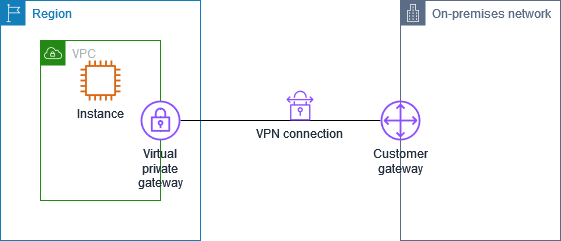
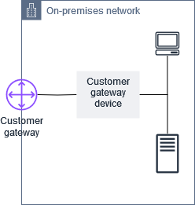

# How AWS Site-to-Site VPN works

A Site-to-Site VPN connection consists of the following components:

- A [virtual private gateway](#VPNGateway "#VPNGateway") or a
  [transit gateway](#Transit-Gateway "#Transit-Gateway")
- A [customer gateway device](#CustomerGatewayDevice "#CustomerGatewayDevice")
- A [customer gateway](#CustomerGateway "#CustomerGateway")
  The VPN connection offers two VPN tunnels between a virtual private gateway or transit gateway
  on the AWS side, and a customer gateway on the on-premises side.

For more information about Site-to-Site VPN quotas, see [AWS Site-to-Site VPN quotas](vpn-limits.md "vpn-limits.md").

## Virtual private gateway

A _virtual private gateway_ is the VPN concentrator on the
Amazon side of the Site-to-Site VPN connection. You create a virtual private gateway and attach it
to a virtual private cloud (VPC) with resources that must access the Site-to-Site VPN
connection.

The following diagram shows a VPN connection between a VPC and your on-premises
network using a virtual private gateway.



When you create a virtual private gateway, you can specify the private Autonomous
System Number (ASN) for the Amazon side of the gateway. If you don't specify an ASN,
the virtual private gateway is created with the default ASN (64512). You cannot
change the ASN after you've created the virtual private gateway. To check the ASN
for your virtual private gateway, view its details in the **Virtual private
gateways** page in the Amazon VPC console, or use the [describe-vpn-gateways](../../../cli/latest/reference/ec2/describe-vpn-gateways.md "../../../cli/latest/reference/ec2/describe-vpn-gateways.md")
AWS CLI command.

###### Note

Virtual private gateways do not support IPv6 for Site-to-Site VPN connections. If you
need IPv6 support, use a transit gateway or Cloud WAN for your VPN
connection.

## Transit gateway

A transit gateway is a transit hub that you can use to interconnect your VPCs and your
on-premises networks. For more information, see [Amazon VPC Transit Gateways](../../../vpc/latest/tgw.md "../../../vpc/latest/tgw.md"). You can create a Site-to-Site VPN
connection as an attachment on a transit gateway.

The following diagram shows a VPN connection between multiple VPCs and your
on-premises network using a transit gateway. The transit gateway has three VPC
attachments and a VPN attachment.


Your Site-to-Site VPN connection on a transit gateway can support IPv4 or IPv6 traffic inside the VPN tunnels (inner IP addresses).
Additionally, transit gateways support IPv6 addresses for the outer tunnel IP addresses. For more information, see [IPv4 and IPv6 traffic in AWS Site-to-Site VPN](ipv4-ipv6.md "ipv4-ipv6.md").

You can modify the target gateway of a Site-to-Site VPN connection from a virtual private
gateway to a transit gateway. For more information, see [Modify the target gateway of an AWS Site-to-Site VPN connection](modify-vpn-target.md "modify-vpn-target.md").

## Customer gateway device

A _customer gateway device_ is a physical device or software
application on your side of the Site-to-Site VPN connection. You configure the device to work
with the Site-to-Site VPN connection. For more information, see [AWS Site-to-Site VPN customer gateway devices](your-cgw.md "your-cgw.md").

By default, your customer gateway device must bring up the tunnels for your Site-to-Site VPN
connection by generating traffic and initiating the Internet Key Exchange (IKE)
negotiation process. You can configure your Site-to-Site VPN connection to specify that AWS
must initiate the IKE negotiation process instead. For more information, see [AWS Site-to-Site VPN tunnel initiation options](initiate-vpn-tunnels.md "initiate-vpn-tunnels.md").

If you're using IPv6 for the outer tunnel IP addresses, your customer gateway device must support IPv6 addressing
and be able to establish IPsec tunnels with IPv6 endpoints.

## Customer gateway

A _customer gateway_ is a resource that you create in AWS
that represents the customer gateway device in your on-premises network. When you
create a customer gateway, you provide information about your device to AWS. For
more information, see [Customer gateway options for your AWS Site-to-Site VPN connection](cgw-options.md "cgw-options.md").



To use Amazon VPC with a Site-to-Site VPN connection, you or your network administrator must also
configure the customer gateway device or application in your remote network. When
you create the Site-to-Site VPN connection, we provide you with the required configuration
information and your network administrator typically performs this configuration.
For information about the customer gateway requirements and configuration, see [AWS Site-to-Site VPN customer gateway devices](your-cgw.md "your-cgw.md").

### IPv6 customer gateway

When creating a customer gateway for use with IPv6 outer tunnel IPs, you specify an IPv6 address instead of an IPv4 address.
You can create an IPv6 customer gateway using the AWS Management Console or the AWS CLI.

To create an IPv6 customer gateway using the AWS CLI, use the following command:

```
aws ec2 create-customer-gateway --Ipv6-address 2001:0db8:85a3:0000:0000:8a2e:0370:7334 --bgp-asn 65051 --type ipsec.1 --region us-west-1
```

The IPv6 address must be a valid, internet-routable IPv6 address for your customer gateway device.

## IPv6 VPN connections

Site-to-Site VPN VPN connections support the following IPv6 configurations:

- _IPv4 outer tunnel with IPv4 inner packets_ - The basic IPv4 VPN capability supported on Virtual Private Gateway (VGW), Transit Gateway (TGW), and Cloud WAN.
- _IPv4 outer tunnel with IPv6 inner packets_ - Allows IPv6 applications/transport within the VPN tunnel. Supported on TGW and Cloud WAN (not supported on VGW).
- _IPv6 outer tunnel with IPv6 inner packets_ - Allows full IPv6 migration with IPv6 addresses for both outer tunnel IPs and inner packet IPs. Supported on TGW and Cloud WAN.
- _IPv6 outer tunnel with IPv4 inner packets_ - Allows IPv6 outer tunnel addressing while supporting legacy IPv4 applications within the tunnel. Supported on TGW and Cloud WAN.

To create a VPN connection with IPv6 outer tunnel IPs, you specify
`OutsideIPAddressType=Ipv6` when creating the VPN connection. AWS
automatically configures the outside tunnel IPv6 addresses for the AWS side of the VPN
tunnels.

Example CLI command to create a VPN connection with IPv6 outer tunnel IPs and IPv6 inner tunnel IPs:

```
aws ec2 create-vpn-connection --type ipsec.1 --transit-gateway-id tgw-12312312312312312 --customer-gateway-id cgw-001122334455aabbc --options OutsideIPAddressType=Ipv6,TunnelInsideIpVersion=ipv6,TunnelOptions=[{StartupAction=start},{StartupAction=start}]
```

You can view the IPv6 addresses assigned to your VPN connection using the `describe-vpn-connection` CLI command.
