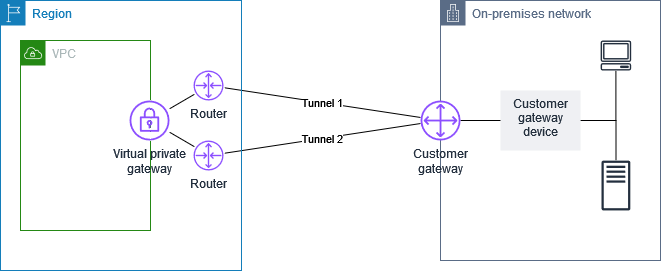

# AWS Site-to-Site VPN customer gateway devices

A _customer gateway device_ is a physical or software appliance that
you own or manage in your on-premises network (on your side of a Site-to-Site VPN connection). You or
your network administrator must configure the device to work with the Site-to-Site VPN connection.

The following diagram shows your network, the customer gateway device, and the VPN
connection that goes to the virtual private gateway that is attached to your VPC. The two
lines between the customer gateway and virtual private gateway represent the tunnels
for the VPN connection. If there's a device failure within AWS, your VPN connection
automatically fails over to the second tunnel so that your access isn't interrupted. From
time to time, AWS also performs routine maintenance on the VPN connection, which might
briefly disable one of the two tunnels of your VPN connection. For more information, see
[AWS Site-to-Site VPN tunnel endpoint replacements](endpoint-replacements.md "endpoint-replacements.md"). When you
configure your customer gateway device, it's therefore important that you configure it
to use both tunnels.

For the steps to set up a VPN connection, see [Get started with AWS Site-to-Site VPN](SetUpVPNConnections.md "SetUpVPNConnections.md"). During this process, you create a customer
gateway resource in AWS, which provides information to AWS about your device, for
example, its public-facing IP address. For more information, see [Customer gateway options for your AWS Site-to-Site VPN connection](cgw-options.md "cgw-options.md"). The customer gateway resource in AWS does not configure
or create the customer gateway device. You must configure the device yourself.

You can also find software VPN appliances on the [AWS Marketplace](https://aws.amazon.com/marketplace/search/results/ref=brs_navgno_search_box?searchTerms=vpn "https://aws.amazon.com/marketplace/search/results/ref=brs_navgno_search_box?searchTerms=vpn").
