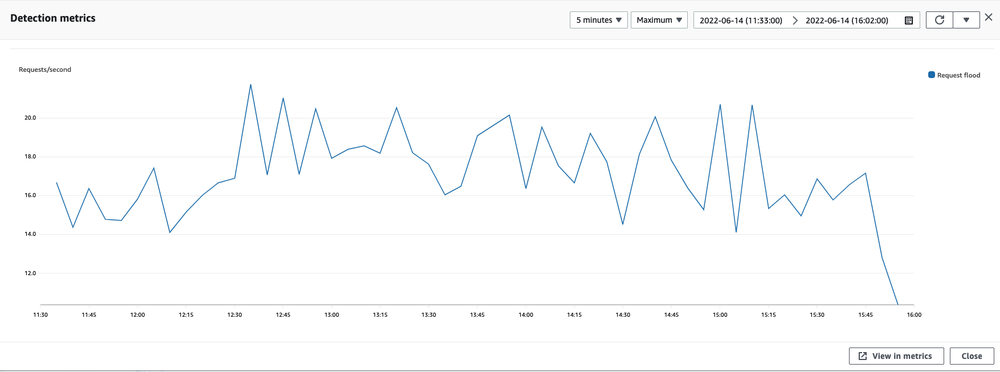
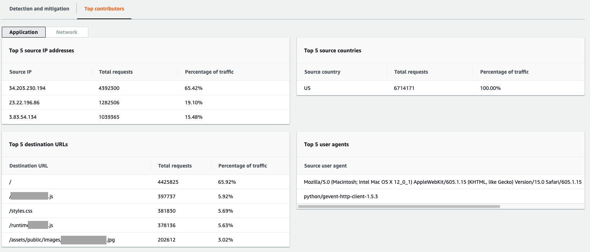

**Introducing a new console experience for AWS WAF**

You can now use the updated experience to access AWS WAF functionality anywhere in the console.
For more details, see [Working with the console](working-with-console.md "working-with-console.md").

# Viewing application layer (layer 7) event details in Shield Advanced

You can see details about an application layer event's detection, mitigation, and top contributors
in the bottom section of the console page for the event. This section can include a
mix of legitimate and potentially unwanted traffic, and may represent both traffic
that was passed to your protected resource and traffic that was blocked by Shield Advanced
mitigations.

The mitigation details are for any rules in the web ACL that's associated with the resource,
including rules that are deployed specifically in response to an attack and rate-based rules that are defined in the web ACL. If
you enable automatic application layer DDoS mitigation for an application, the mitigation metrics include metrics for those additional rules. For information
about these application layer protections, see
[Protecting the application layer (layer 7) with AWS Shield Advanced and AWS WAF](ddos-app-layer-protections.md "ddos-app-layer-protections.md").

## Detection and mitigation

For an application layer (layer 7) event, the **Detection and
mitigation** tab shows detection metrics that are based on
information obtained from the AWS WAF logs. Mitigation metrics are based on
AWS WAF rules in the associated web ACL that are configured to block the
unwanted traffic.

For Amazon CloudFront distributions, you can configure Shield Advanced to apply automatic
mitigations for you. With any application layer resources, you can choose to
define your own mitigating rules in your web ACL and you can request help
from the Shield Response Team (SRT). For information about these options, see
[Responding to DDoS events in AWS](ddos-responding.md "ddos-responding.md").

The following screenshot shows an example of the detection metrics for an application
layer event that subsided after a number of hours.

Event traffic that subsides before a mitigating rule takes effect isn't
represented in mitigation metrics. This can result in a difference between
the web request traffic shown in the detection graphs and the allow and block
metrics shown in the mitigation graphs.

## Top contributors

The **Top contributors** tab for application layer events displays the
top 5 contributors that Shield has identified for the event, based on the AWS WAF logs that it has retrieved. Shield
categorizes the top contributors information by dimensions such as source IP,
source country, and destination URL.

###### Note

For the most accurate information about the traffic that's
contributing to an application layer event, use the AWS WAF logs.

Use the Shield application layer top contributors information only to get a
general idea of the nature of an attack, and do not base your security
decisions on it. For application layer events, the AWS WAF logs are the best
source of information for understanding the contributors to an attack and
for devising your mitigation strategies.

The Shield top contributors information doesn't always completely reflect
the data in the AWS WAF logs. When it ingests the logs, Shield prioritizes
reducing the impact to system performance over retrieving the complete set
of data from the logs. This can result in a loss of granularity in the data
that's available to Shield for analysis. In most cases, the majority of the
information is available, but it's possible for the top contributor data to
be skewed to some degree for any attack.

The following screenshot shows an example **Top contributors** tab for an
application layer event.

Contributor information is based on requests for both legitimate and potentially unwanted
traffic. Larger volume events and events where the request sources aren't highly
distributed are more likely to have identifiable top contributors. A
significantly distributed attack could have any number of sources, making it
hard to identify top contributors to the attack. If Shield Advanced doesn't identify
significant contributors for a specific category, it displays the data as
unavailable.
