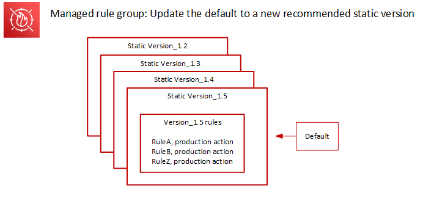

**Introducing a new console experience for AWS WAF**

You can now use the updated experience to access AWS WAF functionality anywhere in the console.
For more details, see [Working with the updated console experience](working-with-console.md "working-with-console.md").

# Default version

deployments for AWS Managed Rules

When AWS determines that a new static version provides improved protections for the rule
group compared to the current default, AWS updates the default version to
the new static version. AWS might release multiple static versions before
promoting one to the rule group's default version.

The following diagram shows the state of the example rule group versions after AWS moves
the default version setting to the new static version.

Before deploying this change to the default version, AWS provides notifications so that
you can test and prepare for the upcoming changes. If you use the default
version, you can take no action and remain on it through the update. If
instead you want to delay switching to the new version, before the planned
start of the default version deployment, you can explicitly configure your
rule group to use the static version that the default is set to.

###### Timing and notifications

AWS updates the default version when it recommends a
different static version for the rule group than the one that's
currently in use.

- **SNS** – AWS sends an SNS
  notification at least one week prior to the targeted deployment day
  and then another on the deployment day, at the start of the
  deployment. Each notification includes the rule group name, the
  static version that the default version is
  being updated to, the deployment date, and the scheduled timing of the
  deployment for each AWS Region where the update is being performed.
- **Change log** – AWS doesn't
  update the change log or other parts of this guide for this type of
  deployment.
