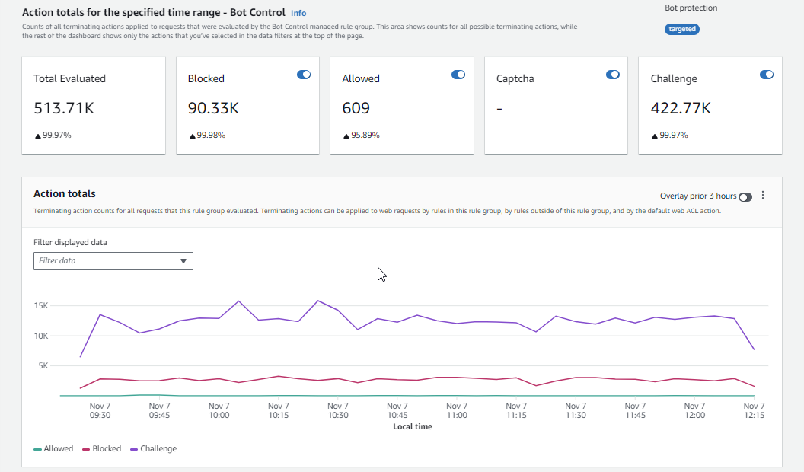
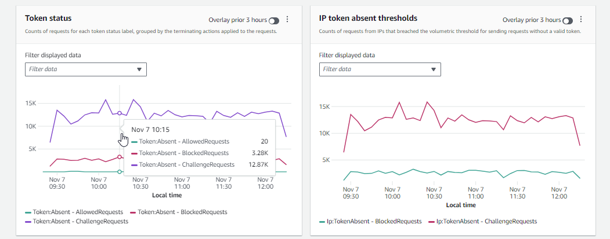

**Introducing a new console experience for AWS WAF**

You can now use the updated experience to access AWS WAF functionality anywhere in the console.
For more details, see [Working with the console](working-with-console.md "working-with-console.md").

# Examples of the traffic overview dashboards for protection packs (web ACLs)

This section shows example screens of the traffic overview dashboards for protection packs (web ACLs).

###### Note

If you're already using AWS WAF to protect your application resources, you can see the
dashboards for any of your protection packs (web ACLs) at its page in the AWS WAF console. For
information, see [Viewing the dashboards for a protection pack (web ACL)](web-acl-dashboards-accessing.md "web-acl-dashboards-accessing.md").

###### Example screen: Data filters and **All traffic** dashboard action counts

The following screenshot depicts the traffic overview for a protection pack (web ACL) with the
**All traffic** tab selected. The data filters are set to the defaults:
all terminating actions for the last three hours.

Inside the all traffic dashboard are the action totals for the various terminating actions. Each pane lists the request count and shows an up/down arrow indicating the change since the prior three hours time range.

###### Example screen: **Bot Control** dashboard action counts

The following screenshot depicts action counts for the Bot Control dashboard. This shows the same totals panes for the time range, but the counts are only for requests that the Bot Control rule group evaluated. Farther down, in the **Action totals** pane, you can see the action counts throughout the specified three-hour time range. For this time range, the CAPTCHA action wasn't applied to any of the requests that the rule group evaluated.

###### Example screen: **Bot Control** dashboard token status summary graphs

The following screenshot depicts two of the summary graphics available in the Bot Control dashboard. The **Token status** pane shows counts for the various token status labels, paired with the rule action that was applied to the request. The **IP token absent thresholds** pane shows data for requests from IPs that were sending too many requests without a token.

Hovering over any area in the graph brings up the available information details. In the **Token status** pane in this screenshot, the mouse is hovering over a point in time, without being on any graph line, so the console displays the data for all lines at that point in time.

This section shows just a few of the traffic summaries that are provided in the protection pack (web ACL) traffic overview dashboards.
To see the dashboards for any of your protection packs (web ACLs), open the protection pack (web ACL)'s page in the console. For information
about how to do this, see the guidance at [Viewing the dashboards for a protection pack (web ACL)](web-acl-dashboards-accessing.md "web-acl-dashboards-accessing.md").
