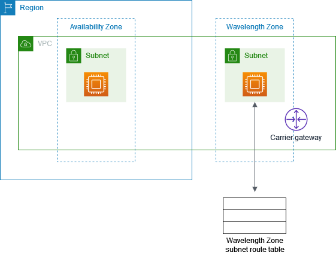

# Get started with AWS Wavelength

The following diagram shows the resources that you need to configure to get started using
AWS Wavelength.

- A VPC in your Region
- A carrier gateway
- A public subnet in an Availability Zone in your Region
- An instance in the public subnet
- An instance in the Wavelength Zone subnet with a Carrier IP address



###### Tasks

- [Step 1: Opt in to Wavelength Zones](#enable-zone-group "#enable-zone-group")
- [Step 2: Configure your network](#configure-network "#configure-network")
- [Step 3: Launch an instance in your Availability Zone public
  subnet](#instance "#instance")
- [Step 4: Launch an instance in the Wavelength zone](#wavelength-instance "#wavelength-instance")
- [Step 5: Test the connectivity](#test-connecitivity "#test-connecitivity")

## Step 1: Opt in to Wavelength Zones

Before you specify a Wavelength Zone for a resource or service, you must opt in to the
zone.

###### Prerequisites

- Some AWS resources are not available in all Regions. Make sure that you can
  create the resources that you need in the desired Region or Wavelength Zone
  before launching an instance in a specific Wavelength Zone.
- Before you begin, review [Quotas and considerations for Wavelength Zones](wavelength-quotas.md "wavelength-quotas.md"), which includes information
  about available Wavelength Zones, service differences, and Service Quotas. You should also speak
  with your mobile operator about mobile service plans and any additional requirements.

###### To opt in to Wavelength Zone using the console

1. Open the Amazon EC2 console at
   [https://console.aws.amazon.com/ec2/](https://console.aws.amazon.com/ec2/ "https://console.aws.amazon.com/ec2/").
2. From the Region selector in the navigation bar, select the Region for the Wavelength
   Zone.
3. On the navigation pane, choose **EC2 Dashboard**.
4. In the upper-right corner of the page, choose **Account attributes**,
   **Zones**.
5. Under **Wavelength Zones**, choose
   **Manage**.
6. Choose **Enabled**.
7. Choose **Update zone group**.

###### To enable Wavelength Zones using the AWS CLI

Alternatively, use the AWS CLI to enable Wavelength Zones. To do so, use the [modify-availability-zone-group](../../../cli/latest/reference/ec2/modify-availability-zone-group.md "../../../cli/latest/reference/ec2/modify-availability-zone-group.md") command.

## Step 2: Configure your network

After you opt in to the Wavelength Zone, create a VPC, a carrier gateway, and a public
subnet in the Availability Zone.

###### Tasks

- [Create a VPC](#create-vpc "#create-vpc")
- [Create a carrier gateway and a subnet associated with
  the Wavelength Zone](#create-cgw "#create-cgw")
- [Create a public subnet in an Availability Zone](#create-public-subnet "#create-public-subnet")

### Create a VPC

Create a VPC to extend to your Wavelength Zone.

###### To create a VPC using the console

1. Open the Amazon VPC console at
   [https://console.aws.amazon.com/vpc/](https://console.aws.amazon.com/vpc/ "https://console.aws.amazon.com/vpc/").
2. Choose **Create VPC**.
3. For **Resources to create**, choose **VPC
   only**.
4. For **Name tag**, optionally provide a name for your VPC. Doing so
   creates the tag `Name`=_value_.
5. For **IPv4 CIDR block**, specify an IPv4 CIDR block for the VPC.
   We recommend that you specify a CIDR block from the private (non-publicly routable) IP
   address ranges as specified in [RFC 1918](http://www.faqs.org/rfcs/rfc1918.html "http://www.faqs.org/rfcs/rfc1918.html"); for example, `10.0.0.0/16`, or
   `192.168.0.0/16`.

###### Note

You can specify a range of publicly routable IPv4 addresses. However, we
currently do not support direct access to the internet from publicly routable CIDR
blocks in a VPC. Windows instances cannot boot correctly if launched into a VPC
with ranges from `224.0.0.0` to `255.255.255.255` (Class D
and Class E IP address ranges). 6. Choose **Create VPC**.

### Create a carrier gateway and a subnet associated with

the Wavelength Zone

After you create a VPC, create a carrier gateway, and then select the subnets that route
traffic to the carrier gateway.

When you choose to automatically route traffic from subnets to the carrier gateway, we
create the following resources:

- A carrier gateway
- A subnet. You can optionally assign all carrier gateway tags except the `Name`
  tag to the subnet.
- A network ACL with the following resources:
  - A subnet association with the subnet in the Wavelength Zone
  - Default inbound and outbound rules for your traffic.

- A route table with the following resources:
  - A route for local traffic
  - A route that routes non-local traffic to the carrier gateway
  - An association with the subnet

###### To create a carrier gateway

1. Open the Amazon VPC console at
   [https://console.aws.amazon.com/vpc/](https://console.aws.amazon.com/vpc/ "https://console.aws.amazon.com/vpc/").
2. In the navigation pane, choose **Carrier gateways**, and then
   choose **Create carrier gateway**.
3. (Optional) For **Name**, enter a name for the carrier
   gateway.
4. For **VPC**, choose the VPC.
5. Choose **Route subnet traffic to carrier gateway**, and under
   **Subnets to route** do the following:
   1. Under **Existing subnets in Wavelength Zone**, select the box
      for each Wavelength subnet to route to the carrier gateway.
   2. To create a subnet in the Wavelength Zone, choose **Add new
      subnet**, enter the required information, and then choose **Add
      new subnet**.

6. (Optional) To add a tag to the carrier gateway, choose **Add tag**,
   and then enter the tag key and tag value.
7. Choose **Create carrier gateway**.

### Create a public subnet in an Availability Zone

Create a subnet in an Availability Zone in the Region.

###### To add a subnet

1. Open the Amazon VPC console at
   [https://console.aws.amazon.com/vpc/](https://console.aws.amazon.com/vpc/ "https://console.aws.amazon.com/vpc/").
2. In the navigation pane, choose **Subnets**.
3. Choose **Create subnet**.
4. For **VPC**, choose the VPC.
5. For **Subnet name**, provide a name for the subnet. Doing so
   creates the tag `Name`=_value_.
6. For **Availability Zone**, chose an Availability Zone, or
   choose **No Preference** to have AWS choose one for you.
7. For **IPv4 CIDR block**, specify an IPv4 address range
   for your subnet, using CIDR notation.
8. Choose **Create subnet**.

## Step 3: Launch an instance in your Availability Zone public

subnet

Launch an EC2 instance in the subnet that you created in the Availability Zone. You
will use this instance to test the connectivity from the Region to the Wavelength Zone.

You can launch EC2 instances in the public subnet that you created. For information about
how to launch an instance using the Amazon EC2 console, see [Launch an EC2 instance using the console](../../../AWSEC2/latest/UserGuide/ec2-launch-instance-wizard.md "../../../AWSEC2/latest/UserGuide/ec2-launch-instance-wizard.md") in the _Amazon EC2 User Guide_.

## Step 4: Launch an instance in the Wavelength zone

After you complete the networking configuration, launch an instance, and then allocate a
Carrier IP address for the instance.

###### Options

- [Option 1: Auto assign a Carrier IP address](#wavelength-launch-instances "#wavelength-launch-instances")
- [Option 2: Allocate and associate a Carrier IP address from the network
  border group](#wavelength-allocate-carrier-ip "#wavelength-allocate-carrier-ip")

### Option 1: Auto assign a Carrier IP address

AWS recommends that you use the AWS CLI because you can automatically allocate and associate
the Carrier IP address with the network interface.

Use the [run-instances](../../../cli/latest/reference/ec2/run-instances.md "../../../cli/latest/reference/ec2/run-instances.md")
command as follows to launch an instance in the Wavelength Zone subnet.

```
aws ec2 run-instances --region `us-east-1` --network-interfaces "DeviceIndex=0,AssociateCarrierIpAddress=true,SubnetId=`subnet-036aa298f4EXAMPLE`" --image-id `ami-04125ecea1EXAMPLE` --instance-type `t3.medium`
```

- `DeviceIndex` – Specify 0 to indicate the primary network interface (eth0).
- `SubnetId` – Specify the ID of the subnet in the Wavelength Zone.
- `AssociateCarrierIpAddress` – Set this value to `true`
  to assign a Carrier IP address to the network interface.

### Option 2: Allocate and associate a Carrier IP address from the network

border group

You can launch EC2 instances in the subnet that you created when you added the carrier
gateway. For more information, see [Create a carrier gateway and a subnet associated with
the Wavelength Zone](#create-cgw "#create-cgw"). Security groups control
inbound and outbound traffic for instances in a subnet, just as they do for instances in an
Availability Zone subnet. To connect to an EC2 instance in a subnet, specify a key pair when
you launch the instance, just as you do for instances in an Availability Zone subnet. For
information about how to launch an instance using the Amazon EC2 console, see [Launch an EC2 instance using the console](../../../AWSEC2/latest/UserGuide/ec2-launch-instance-wizard.md "../../../AWSEC2/latest/UserGuide/ec2-launch-instance-wizard.md") in the _Amazon EC2 User Guide_.

###### To allocate and associate a Carrier IP address

1. Use the [allocate-address](../../../cli/latest/reference/ec2/allocate-address.md "../../../cli/latest/reference/ec2/allocate-address.md")
   command as follows to allocate a Carrier IP address.

```
aws ec2 allocate-address --region `us-east-1` --domain vpc --network-border-group `us-east-1-wl1-bos-wlz-1`
```

The following is example output.

```
{
    "AllocationId": "eipalloc-05807b62acEXAMPLE",
    "PublicIpv4Pool": "amazon",
    "NetworkBorderGroup": "us-east-1-wl1-bos-wlz-1",
    "Domain": "vpc",
    "CarrierIp": "155.146.10.111"

}
```

2. Use the [associate-address](../../../cli/latest/reference/ec2/associate-address.md "../../../cli/latest/reference/ec2/associate-address.md")
   command as follows to associate the Carrier IP address with the EC2 instance.

```
aws ec2 associate-address --allocation-id `eipalloc-05807b62acEXAMPLE` --network-interface-id `eni-1a2b3c4d`
```

The following is example output.

```
{
    "AssociationId": "eipassoc-02463d08ceEXAMPLE",
}
```

## Step 5: Test the connectivity

Before you test the connectivity, do the following:

- Review [Networking considerations](wavelength-quotas.md#networking-considerations "wavelength-quotas.md#networking-considerations")
- Configure the instance security group to allow ICMP traffic.

Test the connectivity from the instance in the Region to the Wavelength Zone instance.
Depending on your operating system, use SSH or RDP to connect to the Carrier IP address
of your Wavelength Zone instance. You can use a secure bastion host.

Run the ping command to the Wavelength Zone instance. In the following example, the IP
address of the subnet in the Wavelength Zone is 10.0.3.112.

```
ping 10.0.3.112
Pinging 10.0.3.112
Reply from 10.0.3.112:  bytes=32 time=<1ms TTL=128
Reply from 10.0.3.112:  bytes=32 time=<1ms TTL=128
Reply from 10.0.3.112:  bytes=32 time=<1ms TTL=128

Ping statistics for 10.0.3.112
Packets:  Sent = 3,  Received = 3,  Lost = 0 (0% lost)

Approximate round trip time in milliseconds
Minimum = 0ms,  Maximum = 0ms,  Average = 0ms
```

Test the connectivity from the instance in the Wavelength Zone instance to the carrier
network. Depending on your operating system, use SSH or RDP to connect to the
Carrier IP address of your Wavelength Zone instance. You can use a secure bastion host.

You need a device on the carrier network in order to test the connectivity from the
Wavelength Zone to the carrier network.

Run the **ping** command to an address in the carrier network.
In the following example, the carrier network IP address is 198.51.100.130.

```
ping 198.51.100.130
Pinging 198.51.100.130
Reply from 198.51.100.130:  bytes=32 time=<1ms TTL=128
Reply from 198.51.100.130:  bytes=32 time=<1ms TTL=128
Reply from 198.51.100.130:  bytes=32 time=<1ms TTL=128

Ping statistics for 198.51.100.130
Packets:  Sent = 3,  Received = 3,  Lost = 0 (0% lost)

Approximate round trip time in milliseconds
Minimum = 0ms,  Maximum = 0ms,  Average = 0ms
```
