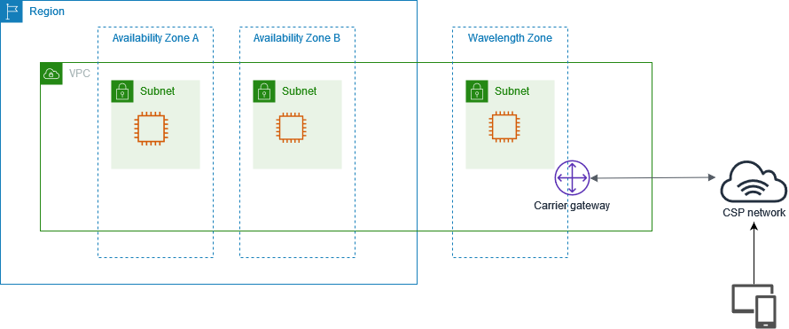
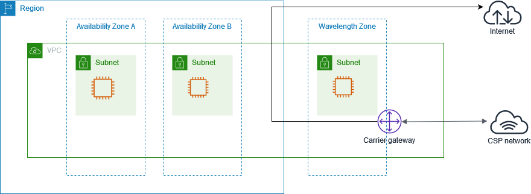

# How AWS Wavelength works

The following diagram demonstrates how you can create a subnet that uses resources in a
communications service provider (CSP) network at a specific location. For resources that
must be deployed to the Wavelength Zone, first opt in to the Wavelength Zone, and then create
resources in the Wavelength Zone.

###### Contents

- [VPCs](#wavelength-vpc "#wavelength-vpc")
- [Subnets](#wavelength-subnets "#wavelength-subnets")
- [Carrier gateways](#wavelength-carrier-gateway "#wavelength-carrier-gateway")
- [Carrier IP address](#provider-owned-ip "#provider-owned-ip")
- [Routing](#wavelength-routing-overview "#wavelength-routing-overview")
- [DNS](#dns "#dns")
- [Maximum transmission unit](#mtu "#mtu")

## VPCs

After you create a VPC in a Region, create a subnet in a Wavelength Zone that is
associated with the VPC. In addition to the Wavelength Zone, you can create resources in all
of the Availability Zones and Local Zones that are associated with the VPC.

You have control over the VPC networking components, such as IP address assignment,
subnets, and route table creation.

VPCs that contain a subnet in a Wavelength Zone can connect to a carrier gateway. A
carrier gateway allows you to connect to the following resources:

- 4G/LTE and 5G devices on the telecommunication carrier network
- Internet access including fixed wireless access for select Wavelength Zone partners. For more information,
  see [Multi-access AWS Wavelength](multi-access.md "multi-access.md").
- Outbound traffic to public internet resources

## Subnets

Any subnet that you create in a Wavelength Zone inherits the main VPC route table, which
includes the local route. The local route enables connectivity between the subnets in
the VPC, including the subnets that are in the Wavelength Zone.

AWS recommends that you configure custom route tables for your subnets in Wavelength
Zones. The destinations are the same destinations as a subnet in an Availability Zone or
Local Zone, with the addition of a carrier gateway. For more information, see [Routing](#wavelength-routing-overview "#wavelength-routing-overview").

## Carrier gateways

A carrier gateway serves two purposes. It allows inbound traffic from a carrier
network in a specific location, and it allows outbound traffic to the carrier network
and internet. There is no inbound connection configuration from the internet to a Wavelength
Zone through the carrier gateway.

A carrier gateway supports IPv4 traffic.

Carrier gateways are only available for VPCs that contain subnets in a Wavelength Zone.
The carrier gateway provides connectivity between your Wavelength Zone and the
telecommunication carrier, and devices on the telecommunication carrier network. The carrier gateway performs
NAT of the Wavelength instances' IP addresses to the Carrier IP addresses from a pool that
is assigned to the network border group. The carrier gateway NAT function is similar to
how an internet gateway functions in a Region.

## Carrier IP address

A _Carrier IP address_ is the address that you assign
to a network interface, which resides in a subnet in a Wavelength Zone (for example an EC2
instance). The carrier gateway uses the address for traffic from the interface to the
internet or to mobile devices. The carrier gateway uses NAT to translate the address,
and then sends the traffic to the destination. Traffic from the telecommunication carrier network
routes through the carrier gateway.

You allocate a Carrier IP address from a network border group, which is a unique set
of Availability Zones, Local Zones, or Wavelength Zones from which AWS advertises IP
addresses, for example, `us-east-1-wl1-bos-wlz-1`.

## Routing

You can set the carrier gateway as a destination in a route table for the following
resources:

- VPCs that contain subnets in a Wavelength Zone
- Subnets in Wavelength Zones

Create a custom route table for the subnets in the Wavelength Zones so that the default
route goes to the carrier gateway, which then sends traffic to the internet and
telecommunication carrier network.

### Example: Carrier gateway routing to the public

internet

Consider a scenario with the following configuration:

- A VPC with Availability Zones and a Wavelength Zone
- A subnet in the Wavelength Zone
- An EC2 instance in the subnet in the Wavelength Zone
- A Carrier IP address for the network interface associated with the EC2
  instance
- An IP address association that maps the private IP address of the EC2
  instance to the Carrier IP address

You need the following entries in the Wavelength subnet route table.

| Destination | Target               | Notes                                                                                         |
| ----------- | -------------------- | --------------------------------------------------------------------------------------------- |
| `VPC CIDR`  | Local                | This route allows for intra-VPC connectivity, including subnets in the Availability Zones. |
| 0.0.0.0/0   | `carrier-gateway-id` | The Carrier IP address provides internet connectivity through the carrier gateway.         |

#### Carrier gateway access to the public

internet

The carrier gateway provides access to the internet from your Wavelength subnets.
For information about protocol considerations, see [Networking considerations](wavelength-quotas.md#networking-considerations "wavelength-quotas.md#networking-considerations").

Traffic initiated from the EC2 instance for the internet uses the 0.0.0.0/0
route to route traffic to the carrier gateway. The carrier gateway maps the EC2
instance IP address to the Carrier IP address, and then sends the traffic to the
telecommunication carrier.

## DNS

EC2 instances use EC2 DNS to resolve domain names to IP addresses. Route 53 supports DNS
features, such as domain registration, and DNS routing. Both public and private hosted
Wavelength Zones are supported for routing traffic to specific domains. Route 53 resolvers are
hosted in the Region.

You can also use your own DNS services to resolve domain names.

## Maximum transmission unit

Generally, the maximum transmission unit (MTU) is as follows:

- 9001 bytes between EC2 instances in the same Wavelength Zone.
- 1500 bytes between carrier gateway and a Wavelength Zone.
- 1500 bytes between an EC2 instance in a Wavelength Zone and an EC2
  instance in the Region when the traffic uses a public IP address.
- 1300 bytes between an EC2 instance in a Wavelength Zone and an EC2
  instance in the Region when the traffic uses a private IP address.
