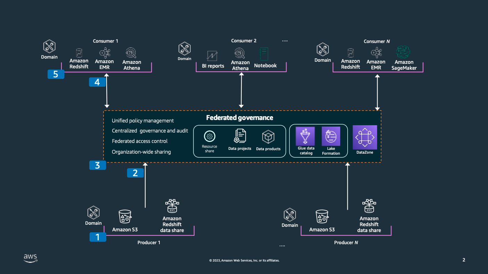

# Reference architecture

_Data mesh reference architecture_

Each consumer, producer, and central governance layer are their own separate data domain and typically reside in their own separate AWS account. Information is shared between domains.

1. Data producers are source systems that generate data, which is shared throughout the organization. Data producers can be an application, data stream, data lake, or data warehouse – essentially a domain that either generates or updates data. The business owners that are responsible for the data producers must have their data attributes classified for consumers to inherit the classification so data processing and data access to that data meets the organization’s or industry’s data governance policy.
2. Metadata relating to producer data must be shared with the central federated data catalog. Data owner information, data quality information, data location and any other metadata must be shared with the central data catalog at the earliest possible opportunity.
3. The federated governance layer is a centralized data governance domain that supports data cataloging, asset discoverability, permission management, and a central log for audit history.
4. Data governance rules such as data classifications, access permissions and metadata is shared with the consumer system. This is typically shared using an API connection but can also be shared as a manual extract.
5. Data consumers are systems that consume information typically for analytical or data science type workloads. Information is either copied from or accessed directly from the producer domains through the federated governance environment. Access permissions are then inherited and propagated into the respective system to ensure the right people have access to the right data.

For more details, see [Design a data mesh architecture using AWS Lake Formation and AWS Glue](https://aws.amazon.com/blogs/big-data/design-a-data-mesh-architecture-using-aws-lake-formation-and-aws-glue/ "https://aws.amazon.com/blogs/big-data/design-a-data-mesh-architecture-using-aws-lake-formation-and-aws-glue/") and [What is a Data Mesh?](https://aws.amazon.com/what-is/data-mesh/ "https://aws.amazon.com/what-is/data-mesh/")
