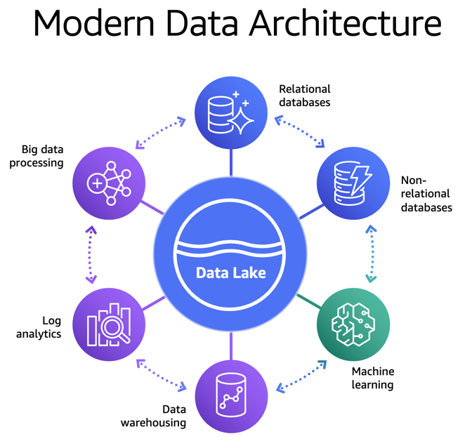

# Modern data architecture

Organizations have been building data lakes to analyze massive
amounts of data for deeper insights into their data. To do this,
they bring data from multiple silos into their data lake, and then
run analytics and AI/ML directly on it. It is also common for
these organizations to have data stored in specialized data
stores, such as a NoSQL database, a search service, or a data
warehouse, to support different use cases. To analyze all of the
data that is spread across the data lake and other data stores
efficiently, businesses often move data in and out of the data lake
and between these data stores. This data movement can get complex
and messy as the data grows in these data stores.

To address this, businesses need a data architecture that allows
building scalable, cost-effective data lakes. The architecture can
also support simplified governance and data movement between
various data stores. We refer to this as a _modern data
architecture_. Modern data architecture integrates a
data lake, a data warehouse, and other purpose-built data stores
while enabling unified governance and seamless data movement.

As shown in the following diagram, with a modern data
architecture, organizations can store their data in a data lake
and use purpose-built data stores that work with the data lake.
This approach allows access to all of the data to make better
decisions with agility.

_Figure 1: Modern data architecture_

There are three different patterns for data movement. They can be described as follows:

**Inside-out data movement:** A subset of data in a data lake is sometimes moved to a data store, such as an Amazon OpenSearch Service cluster or an Amazon Neptune cluster. This pattern supports specialized analytics, such as search analytics, building knowledge graphs, or both. For example, enterprises send information from structured sources (such as relational databases), unstructured sources (such as metadata, media, or spreadsheets) and other assets to a data lake. From there, it is moved to Amazon Neptune to build a knowledge graph. We refer to this kind of data movement as inside-out.

**Outside-in data movement:** Organizations use data stores that best fit their applications and later move that data into a data lake for analytics. For example, to maintain game state, player data, session history, and leader boards, a gaming company might choose Amazon DynamoDB as the data store. This data can later be exported to a data lake for additional analytics to improve the gaming experience for their players. We refer to this kind of data movement as outside-in.

**Around the perimeter:** In addition to the two preceding patterns, there are scenarios where the data is moved from one specialized data store to another. For example, enterprises might copy customer profile data from their relational database to a NoSQL database to support their reporting dashboards. We refer to this kind of data movement as around the perimeter.
