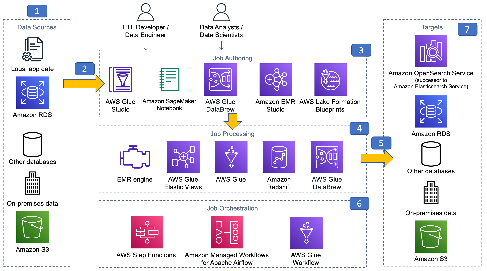

# Reference architecture

_Figure 3: Batch data processing reference architecture_

1. Batch data processing systems typically require a persistent data store for source
   data. When developing batch data processing applications on AWS, you can use data from
   various sources, including your on-premises data stores, Amazon RDS, Amazon S3, DynamoDB, and any other
   databases that are accessible in the cloud.
2. Data processing jobs need access to a variety of data stores to read data. You can
   use AWS Glue connectors from the AWS Marketplace to connect to a variety of data stores, such
   as Google BigQuery, and SAP HANA. You also can connect to SaaS application providers, such
   as Salesforce, ServiceNow, and Google Analytics, using AWS Glue DataBrew and Amazon AppFlow. In addition,
   you can always rely on the custom JDBC capability in Apache Spark and connect to any
   JDBC-compliant data store from Amazon EMR or AWS Glue jobs.
3. Choosing the right authoring tool for the job simplifies job development and improves
   agility.
   1. You can use AWS Glue Studio or Glue interactive sessions when authoring jobs for
      the AWS Glue Spark runtime engine.
   2. Use AWS Glue blueprints when you create a self-service parametrized job for
      analysts and control what data the analyst is allowed to access.
   3. Use Amazon EMR notebooks for interactive job development and scheduling notebook jobs
      against Amazon EMR.
   4. Use Amazon SageMaker AI notebook when working within SageMaker AI development and pre-processing
      data using Spark on EMR.
   5. Use AWS Glue DataBrew from the AWS Management Console or from a Jupyter notebook for no-code
      development experience.
   6. Use Lake Formation blueprints to quickly create batch data ingestion jobs to rapidly build
      a data lake in AWS.

4. Choosing the right processing engine for your batch jobs allows you to be flexible
   with managing costs and lowering operational overhead. Amazon EMR, AWS Glue (Streaming) ETL
   and Amazon Redshift offer the ability to scale seamlessly based on your job runtime metrics using
   managed scaling, automatic scaling, and concurrency scaling features for read and write,
   respectively. Amazon EMR and Amazon Redshift offer both server-based and serverless architectures
   while the other services depicted in the reference architecture are fully serverless.
   Amazon EMR (server-based) allows you to use Spot Instances for suitable workloads that can
   further save your costs. A good strategy is to complement these processing engines to meet
   the business objectives of the SLA, functionality, and lower TCO by choosing the right
   engine for the right job.
5. Batch processing jobs usually require writing processed data to a target persistent
   store. This store can reside anywhere between AWS, on-premises environments, or other
   cloud providers. You can use the rich connector interface AWS Glue offers to write data
   to various target platforms, such as Amazon S3, Snowflake, and Amazon OpenSearch Service. You can also use the
   native Spark JDBC connector feature and write data to any supported JDBC target.
6. All batch jobs require a workflow that can handle dependency checks to ensure no
   downstream impacts and have a bookmarking capability that allows them to resume where they
   left off in the event of a failure or at the next run of the job. When using AWS Glue as
   your batch job processing engine, you can use the native workflow capability to help you
   create a workflow with a built-in state machine to track the state of your job across the
   entire workflow. AWS Glue jobs also support a bookmarking capability that keeps track of
   what it has processed and what will be processed during next run. Similarly, AWS Lake Formation
   blueprints support a bookmarking capability when processing incremental data. With Amazon EMR
   Studio, you can schedule notebook jobs. When using any of the analytic processing engines,
   you can build job workflows using an external scheduler, such as AWS Step Functions or Amazon
   Managed Workflows for Apache Airflow (Amazon MWAA) that allows you to interoperate between
   any service including external dependencies.
7. Batch processing jobs write data output to a target data store, which can be anywhere
   in the AWS Cloud, on premises, or at another cloud provider. You can use the AWS
   AWS Glue Data Catalog to crawl the supported target databases to simplify writing to your target
   database.
