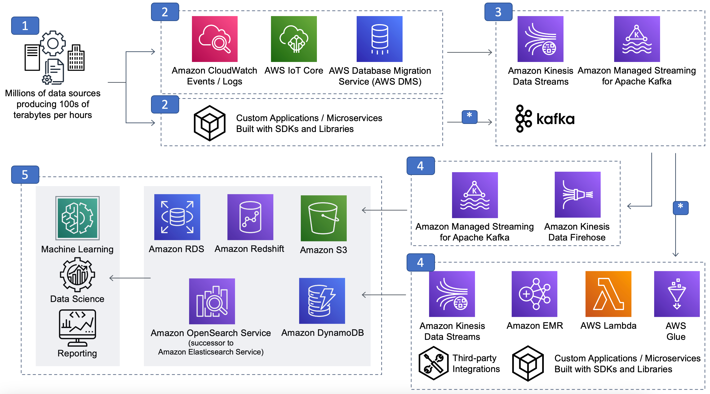

# Reference architecture

_Figure 4: Streaming data analytics reference architecture_

The preceding streaming reference architecture diagram is segmented into the previously
described components of streaming scenarios:

- Data sources
- Stream ingestion and producers
- Stream storage
- Stream processing and consumers
- Downstream destinations
  All, or portions, of this reference architecture can be used for workloads such as
  application modernization with microservices, streaming ETL, ingest, real-time inventory,
  recommendations, or fraud detection.

In this section, we will identify each layer of components shown in the preceding diagram
with specific examples. The examples are not intended to be an exhaustive list, but rather an
attempt to describe some of the more popular options.

The subsequent Configuration notes section provides recommendations and considerations
when implementing streaming data scenarios.

We will review the five core components of streaming architecture first, and then discuss
these specialized flows.

1. **Data sources**: The number of potential data sources is in
   the millions. Examples include application logs, mobile apps and applications with REST
   APIs, IoT sensors, existing application databases (RDBMS, NoSQL) and metering records.
2. **Stream ingestion and producers**: Multiple data sources
   generate data continually that might amount to terabytes of data per day. Toolkits,
   libraries, and SDKs can be used to develop custom stream producers to streaming storage.
   In contrast to custom developed producers, examples of pre-built producers include Kinesis
   Agent, Change Data Capture (CDC) solutions, and Kafka Connect Source connectors.
3. **Streaming storage**: Kinesis Data Streams, Amazon MSK, and
   self-managed Apache Kafka are all examples of stream storage options for ingesting,
   processing, and storing large streams of data records and events. Streaming storage
   implementations are modeled on the idea of a distributed, immutable commit log. Events are
   stored for a configurable duration (hours to days to months, or even permanently in some
   cases). While stored, events are available to any client.
4. **Stream processing and consumers**: Real-time data streams
   can be processed sequentially and incrementally on a record-by-record basis over sliding
   time windows using a variety of services. Or, put another way, this can be where
   particular domain-specific logic resides and is computed.
   With Managed Service for Apache Flink for Apache Flink or Managed Service for Apache Flink Studio, you can process and analyze streaming data
   using standard SQL in a serverless way. The service allows you to quickly author and run SQL
   queries against streaming sources to perform time series analytics, feed real-time dashboards,
   and create real-time metrics.

If you work in an Amazon EMR environment, you can process streaming data using multiple
options— Apache Flink or Spark Structured Streaming.

Finally, there are options for AWS Lambda, third-party integrations, and build-your-own
custom applications using AWS SDKs, libraries, and open-source libraries and connectors for
consuming from Kinesis Data Streams, Amazon MSK, and Apache Kafka.

1. **Downstream destinations:** Data can be persisted to durable
   storage to serve a variety of use cases including ad hoc analytics and search, machine
   learning, alerts, data science experiments, and additional custom actions.
   A special note on the data flow lanes noted with asterisk (\*). There are two examples that
   both involve bidirectional flow of data to and from layer #3 streaming storage.

The first example is the bidirectional flow of in-stream ETL between stream processor (#4)
that uses one or more raw event sources from stream storage (#3) and performs, filtering,
aggregations, joins, etc., and writes results back to streaming storage to a refined (that is,
curated, hydrated) result stream or topic (#3) where it can be used by a different stream
processor or downstream consumer.

The second bidirectional flow example is the ubiquitous application modernization
microservice design (#2) that often use a streaming storage layer (#3) for decoupled
microservice interaction.

The key takeaway here is for us to not presume that the streaming event flows exclusively
from left-to-right over time in the reference architecture diagram.

## Configuration notes

As explored so far, we know streaming data architects have options for implementing
particular components in their stack, for example, different options for streaming storage,
streaming ingest, and streaming producers. While it’s impractical to provide in-depth
recommendations for each layer’s options in this whitepaper, there are some high-level
concepts to consider as guide posts, which we will present next.

For more in-depth analysis of a particular layer in your design, consider exploring the
provided links within the following guidelines.

## Streaming application guidelines

**Determine business requirements first.** It’s always a best
practice and practical to focus on your workload’s particular needs first, rather than
starting with a feature-by-feature comparison between the technical options. For example, we
often see organizations prioritizing Technical Feature A vs. Technical Feature B before
determining their workload’s requirements. This is the wrong order. Determine your
workload’s requirements first because AWS has a wide variety of purpose-built options at
each streaming architecture layer to best match your requirements.

**Technical comparisons second.** After business requirements
have been clearly established, the next step is to match your business requirements with the
technical options that offer the best chance for success. For example, if your team has few
technical operators, serverless might be a good option.

Other technical questions about your workload might be whether you require a large
number of independent stream processors and consuming applications, that is, one vs. many
stream processors and consumers. What kind of manual or automatic scaling options are
available to match business requirement throughput, latency, SLA, RPO, and RTO objectives?
Is there a desire to use open source-based solutions? What are the security options and how
well do they integrate into existing security postures? Is one path easier or more
straightforward to migrate to versus another, for example, self-managed Apache Kafka to
Amazon MSK.

To learn more about your options for various layers in the reference architecture
stack, refer to the following:

- **Streaming ingest and producers** — Can be
  workload-dependent and use AWS service integrations, such as AWS IoT Core, CloudWatch Logs and
  Events, AWS Data Migration Service (AWS DMS), and third-party integrations (Refer to
  [Writing
  Data to Amazon Kinesis Data Streams in Amazon Kinesis](../../../streams/latest/dev/building-producers.md "../../../streams/latest/dev/building-producers.md") in the _Amazon Kinesis Data Streams Developer
  Guide_).
- **Streaming storage** — Kinesis Data Streams, Firehose, Amazon MSK,
  and Apache Kafka (Refer to [Best Practices in Amazon
  Managed](../../../msk/latest/developerguide/bestpractices.md "../../../msk/latest/developerguide/bestpractices.md") in _the Amazon Managed Streaming for Apache Kafka Developer Guide_).
- **Stream processing and consumers** — Managed Service for Apache Flink for Apache
  Flink, Firehose, AWS Lambda, open source and proprietary SDKs (Refer to [Advanced Topics
  for Amazon Kinesis Data Streams Consumers in Amazon Kinesis Data Streams Developer Guide](../../../streams/latest/dev/advanced-consumers.md "../../../streams/latest/dev/advanced-consumers.md") and [Best
  Practices for Managed Service for Apache Flink for Apache Flink in the Amazon Managed Service for Apache Flink Developer Guide](../../../kinesisanalytics/latest/java/best-practices.md "../../../kinesisanalytics/latest/java/best-practices.md")).

For more information, refer to the [Build Modern Data Streaming Architectures on AWS](../../../whitepapers/latest/build-modern-data-streaming-analytics-architectures/build-modern-data-streaming-analytics-architectures.md "../../../whitepapers/latest/build-modern-data-streaming-analytics-architectures/build-modern-data-streaming-analytics-architectures.md") whitepaper.

**Remember separation of concerns.** Separation of concerns is
the application design principle that promotes segmenting an application into distinct,
particular area of concerns. For example, your application might require that stream
processors and consumers are performing an aggregation computation in addition to recording
the computation results to a downstream destination. While it can be tempting to clump both
of these concerns into one stream processors or consumers, it is recommended to consider
separation instead. It’s often better in the segment isolate into multiple stream processors
or consumers for operation monitoring, performance tuning isolation, and reducing the
downtime blast radius.

## Development

**Existing or desired skills match.** Realizing value from
streaming architectures can be difficult and often a new endeavor for various roles within
organizations. Increase your chances of success by aligning your team’s existing skillsets,
or desired skillsets, wherever possible. For example, is your team familiar with Java or do
they prefer a different language, such as Python or Go? Does your team prefer a graphical
user interface for writing and deploying code? Work backwards from your existing skill
resources and preferences to appropriate options for each component.

**Build vs. buy (Write your own or use off-the-shelf).**
Consider whether an integration between components already exists or if you must write your
own. Or perhaps both options are available. Many teams new to streaming incorrectly assume
that everything must be written from scratch. Instead, consider services such as Kafka
Connect Connectors for inbound and outbound traffic, AWS Lambda, and Firehose.

## Performance

**Aggregate records before sending to stream storage for increased
throughput.** When using Kinesis, Amazon MSK, or Kafka, ensure that the messages are
accumulated on the producer side before sending to stream storage. This is also referred to
as batching records to increase throughput, but at the cost of increased latency.

**When working with Kinesis Data Streams, use Kinesis Client Library (KCL) to
de-aggregate records.** KCL takes care of many of the complex tasks associated
with distributed computing, such as load balancing across multiple instances, responding to
instance failures, checkpointing processed records, and reacting to re-sharding.

**Initial planning and adjustment of shards and partitions.**
The most common mechanism to scale stream storage for stream processors and consumers is
through the number of configured shards (Kinesis Data Streams) or partitions (Apache Kafka,
Amazon MSK) for a particular stream. This is a common element across Kinesis Data Streams, Amazon MSK,
and Apache Kafka, but options for scaling out (and in) the number of shards or partitions
vary.

- Amazon Kinesis Data Streams Developer Guide: [Resharding a
  Stream](../../../streams/latest/dev/kinesis-using-sdk-java-resharding.md "../../../streams/latest/dev/kinesis-using-sdk-java-resharding.md")
- Apache Kafka Documentation - Operations: [Expanding
  your cluster](https://kafka.apache.org/documentation/#basic_ops_cluster_expansion "https://kafka.apache.org/documentation/#basic_ops_cluster_expansion") (also applicable to Amazon MSK)
- Amazon Managed Streaming for Apache Kafka Developer Guide: [Using LinkedIn's Cruise Control
  for](../../../msk/latest/developerguide/cruise-control.md "../../../msk/latest/developerguide/cruise-control.md")
  [Apache
  Kafka with Amazon MSK](../../../msk/latest/developerguide/cruise-control.md "../../../msk/latest/developerguide/cruise-control.md") (for partition rebalancing)

**Use Spot Instances and automatic scaling to process streaming data
cost effectively.** You can also process the data using AWS Lambda with Kinesis,
Amazon MSK, or both, and Kinesis record aggregation and de-aggregation modules for AWS Lambda.
Various AWS services offer automatic scaling options to keep costs lower than provisioning
for peak volumes.

## Operations

**Monitor Kinesis Data Streams and Amazon MSK metrics using
Amazon CloudWatch\***.\* You can get basic stream and topic level metrics
in addition to shard and partition level metrics. Amazon MSK also provides an [Open Monitoring
with Prometheus](../../../msk/latest/developerguide/open-monitoring.md "../../../msk/latest/developerguide/open-monitoring.md") option.

- Amazon Kinesis Data Streams Developer Guide: [Monitoring Amazon Kinesis Data Streams](../../../streams/latest/dev/monitoring.md "../../../streams/latest/dev/monitoring.md")
- Amazon Managed Streaming for Apache Kafka Developer Guide: [Monitoring an Amazon MSK Cluster](../../../msk/latest/developerguide/monitoring.md "../../../msk/latest/developerguide/monitoring.md")

  **Plan for the unexpected / No single point of failure.**
Some components in your streaming architecture will offer different options for durability
in case of a failure. For example, Kinesis Data Streams replicates to three different
Availability Zones. With Apache Kafka and Amazon MSK, producers can be configured to require
acknowledgement for partition leader as well as a configurable number of in-sync replica
followers before considering the write successful. In these examples, you are able to plan
for possible disruptions in your AWS environment, for example, if an Availability Zone
goes offline, without possible downtime of your producing and consuming layers.

## Security

### Authentication and

authorization.

- Amazon Managed Streaming for Apache Kafka Developer Guide: [Authentication and Authorization
  for Apache Kafka APIs](../../../msk/latest/developerguide/kafka_apis_iam.md "../../../msk/latest/developerguide/kafka_apis_iam.md")
- Amazon Kinesis Data Streams Developer Guide: [Controlling Access to Amazon Kinesis Data Streams
  Resources Using IAM](../../../streams/latest/dev/controlling-access.md "../../../streams/latest/dev/controlling-access.md")

**Encryption in transit and encryption at rest.** Streaming
data actively moves from one layer to another, such as from a streaming data producer to
stream storage over the internet or through a private network.

Protecting data in transit, enterprises can and often choose to use encrypted
connections (HTTPS, SSL, TLS) to protect the contents of data in transit. Many AWS
streaming services offer protection of data at rest through encryption.

- AWS Well-Architected Framework Security Pillar: [AWS Identity and Access Management](../security-pillar/identity-management.md "../security-pillar/identity-management.md")
- AWS Lake Formation Developer Guide: [Security in AWS Lake Formation](../../../lake-formation/latest/dg/security.md "../../../lake-formation/latest/dg/security.md")
