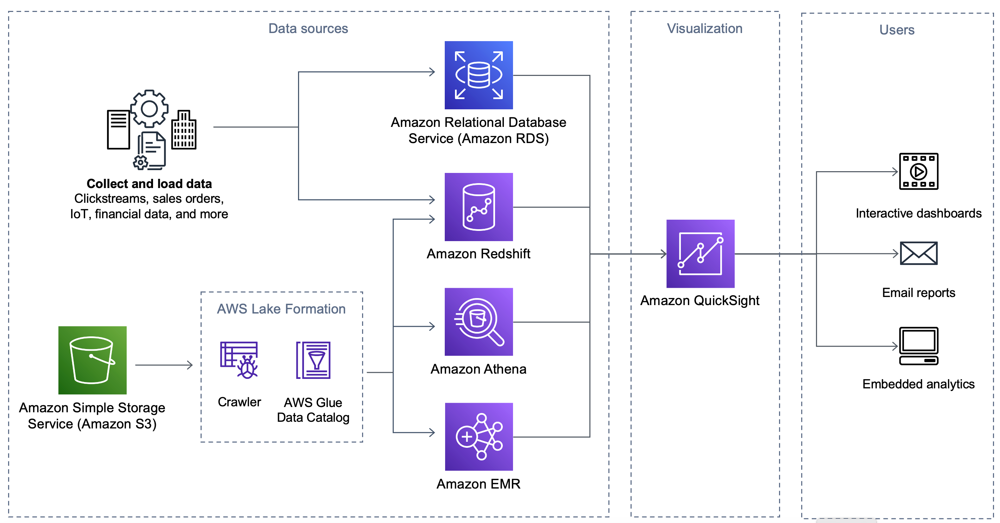

# Reference architecture

_Figure 6: QuickSight dashboard end-to-end design_

**Data sources:** Supports connection with traditional Data
Warehouse or databases and also have the capacity to connect to non-traditional sources such
as SaaS applications. Supported datasources in QuickSight include Amazon S3, Amazon Redshift, Amazon Aurora,
Oracle, MySQL, Microsoft SQL Server, Snowflake, Teradata, Jira, and ServiceNow. Check [here](../../../quicksight/latest/user/supported-data-sources.md "../../../quicksight/latest/user/supported-data-sources.md")
for the complete list of data sources supported in QuickSight. These data sources could be
secured behind a private subnet and QuickSight can connect in a secure mechanism using
strategies such as VPC endpoints, and secure firewalls.

**Visualization Tool:** Quick Suite.

**Consumers:** Visual dashboard consumers accessing a QuickSight
console or embedded QuickSight analytics dashboard.
