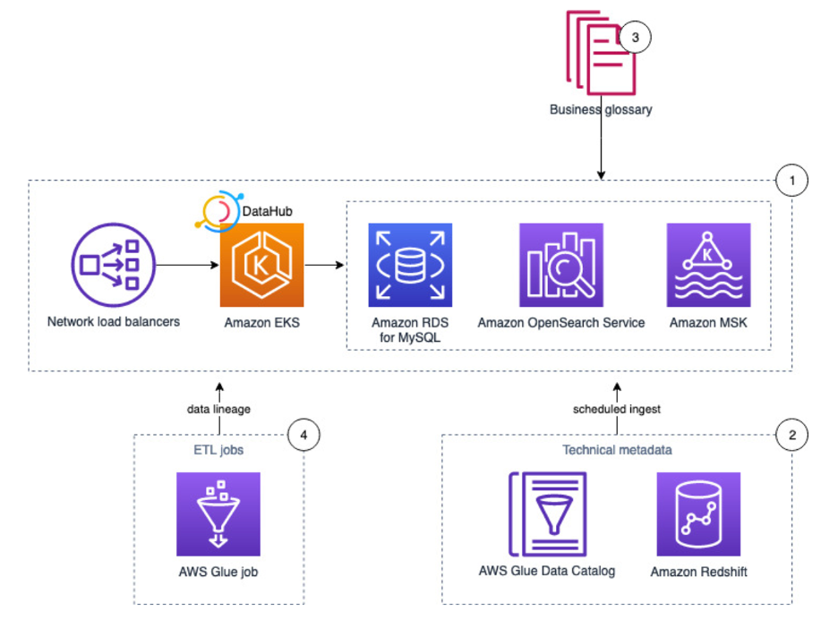

# Reference architecture

The following diagram illustrates the solution architecture and its key components for data cataloging, security, compliance, and data access requirements using DataHub.

_Reference architecture for data discovery_

1. DataHub is an open-source metadata management platform which enables end-to-end discovery, data observability, data governance , data lineage and many more. It runs on an Amazon EKS cluster, using Amazon OpenSearch Service, Amazon Managed Streaming for Apache Kafka (Amazon MSK), and RDS for MySQL as the storage layer for the underlying data model and indexes.
2. Pull technical metadata from AWS Glue and Amazon Redshift to DataHub.
3. Enrich the technical metadata with a business glossary.
4. Run an AWS Glue job to transform the data and observe the data lineage in DataHub.
