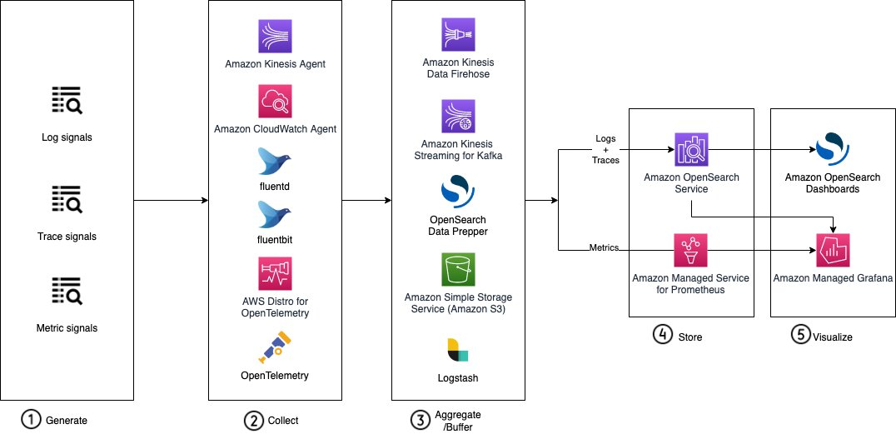

# Reference architecture

_Figure 5: Operational analytics reference architecture_

The reference architecture covers the data flow in an operational analytics use case. The
Ingestion pipeline contains up to five stages as follows:

1. With your operational and business goal in mind, you should instrument your
   system/plate-form to **produce** the relevant type of signals such as various logs, traces, and metrics, and expose the data to a
   set of collectors. At this stage, you choose open-source instrumentation tools such as
   [Jaeger](https://www.jaegertracing.io/ "https://www.jaegertracing.io/") or [Zipkin](https://zipkin.io/ "https://zipkin.io/"). And if you plan to generate different type of
   signals, we recommend that you include signal correlation beginning with the design step.
   Open-source tools such as [OpenTelemetry](https://opentelemetry.io/docs/ "https://opentelemetry.io/docs/") facilitate the context propagation by adding a Trace ID to all
   logs related to a specific request. This reduces the mean time to problem resolution by
   enhancing the observability of the system from multiple viewpoints.
2. The second step is to **collect** the telemetry data
   from the producers and deliver it to the aggregators or buffers. You can use native AWS
   services (such as [Amazon Kinesis Agent](../../../firehose/latest/dev/writing-with-agents.md "../../../firehose/latest/dev/writing-with-agents.md"), [CloudWatch
   agents](../../../AmazonCloudWatch/latest/logs/CWL_OpenSearch_Stream.md "../../../AmazonCloudWatch/latest/logs/CWL_OpenSearch_Stream.md"), or [AWS Distro for OpenTelemetry](https://aws.amazon.com/otel/?otel-blogs.sort-by=item.additionalFields.createdDate&otel-blogs.sort-order=desc "https://aws.amazon.com/otel/?otel-blogs.sort-by=item.additionalFields.createdDate&otel-blogs.sort-order=desc")) to let you instrument your applications just
   once, collect and correlate metrics and traces, along with contextual information and
   metadata about where the application is running. You can also use a number of lightweight
   shippers such as [Fluentd](https://docs.fluentd.org/ "https://docs.fluentd.org/") to collect logs,
   [Fluentbit](https://fluentbit.io/ "https://fluentbit.io/") to collect both logs and metrics,
   and open-source [OpenTelemetry](https://opentelemetry.io/docs/ "https://opentelemetry.io/docs/").
3. Before sending the data to [Amazon OpenSearch Service](https://aws.amazon.com/opensearch-service/ "https://aws.amazon.com/opensearch-service/"), it is recommended that you **buffer or
   aggregate** information from the collectors to reduce the overall connections
   to the domain and use the batch (\_bulk) API to send batches of documents rather than
   sending single documents. It is also possible at this stage (or at the collection stage)
   to transform and aggregate the data for the downstream analytics tools. To do this, you
   can use AWS services such as [Amazon Data Firehose](https://aws.amazon.com/kinesis/data-firehose/ "https://aws.amazon.com/kinesis/data-firehose/") and [Amazon Managed Streaming for Apache Kafka](https://aws.amazon.com/msk/ "https://aws.amazon.com/msk/"). For
   large-scale environments, you can use [Amazon S3](https://aws.amazon.com/s3/ "https://aws.amazon.com/s3/") to
   have a backup the data. It is also possible to use open-source tools such as OpenSearch
   Data Prepper for trace and log analytics, or you can use the [open source version of
   Logstash](https://opensearch.org/docs/latest/clients/logstash/index/ "https://opensearch.org/docs/latest/clients/logstash/index/") (check compatibility with Amazon OpenSearch Service [here](../../../opensearch-service/latest/developerguide/managedomains-logstash.md "../../../opensearch-service/latest/developerguide/managedomains-logstash.md")).
4. Amazon OpenSearch Service makes it easy for you to index and **store**
   telemetry data to perform interactive analytics. Amazon OpenSearch Service is built to handle a large
   volume of structured and unstructured data from multiple data sources at high ingestion
   rates. Amazon OpenSearch Service integrates not only with AWS services but also with open-source tools
   as the ones listed previously. It is also possible to use [Amazon Managed Service for Prometheus](https://aws.amazon.com/prometheus/ "https://aws.amazon.com/prometheus/") to **store** and **query** operational metrics. The
   service is integrated with Amazon Elastic Kubernetes Service (Amazon EKS), Amazon Elastic Container Service (Amazon ECS), and AWS Distro for Open
   Telemetry.
5. Amazon OpenSearch Service dashboard is the default **visualization**
   tool for data in Amazon OpenSearch Service. It also serves as a user interface for many of the OpenSearch
   plugins, including Observability, Security, Alerting, Index State Management, and SQL. You
   can also conduct interactive analysis and visualization on data with [Piped Processing Language (PPL)](../../../opensearch-service/latest/developerguide/ppl-support.md "../../../opensearch-service/latest/developerguide/ppl-support.md"), a query interface. You can use [Amazon Managed Grafana](https://aws.amazon.com/grafana/ "https://aws.amazon.com/grafana/") to complement Amazon OpenSearch Service
   on the visualization layer. And you connect Amazon Grafana to Amazon Managed Service for
   Prometheus to query, **visualize**, alert on, and understand
   metric data.
