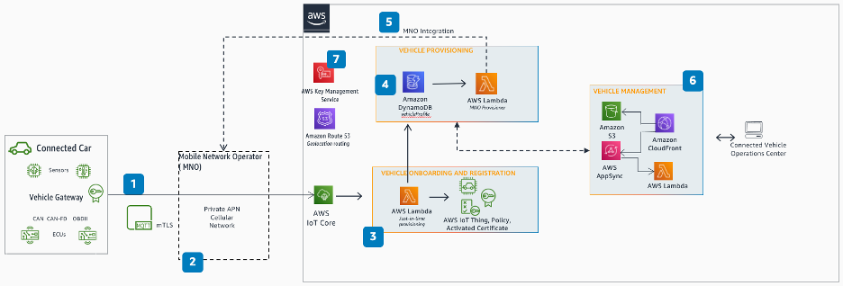
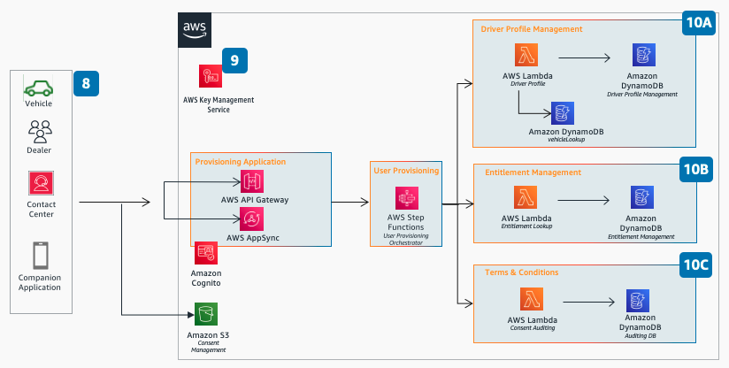

# CM-S01 Vehicle and user provisioning

Vehicle Provisioning links the Telematics Control Unit (TCU) with the Vehicle Identification Number (VIN). Vehicle Provisioning also enables secure and automatic provisioning of security certificates and installation of latest firmware. Such activities are performed before the vehicle leaves the factory or upon swapping of the TCU. End of Line (EOL) processes involve configuration and validation of the Telematics Control Unit which includes: setup the certificate for identity of the vehicle, provision the SIM with the Mobile Network Operator, and set the state of the vehicle in the Connected Mobility Platform. User Provisioning involves activating the Connected Mobility services for the customer in the Customer Relationship Management (CRM) and the Billing systems, and activate the SIM in the Mobile Network Operator (MNO) systems which allows the customer to actually use the service. The following are user stories in the Vehicle and User Provisioning scenario:

## User stories

**CM-S01-UC01 Vehicle provisioning at the factory:** Configuration of the Telematics Control Unit to set up the certificate for
identity of the vehicle. The Connected Mobility Systems also maps the TCU with the VIN
number in this step. All of this can be automatically initiated when the vehicle is started
and the TCU registers itself to the provisioning service.

**CM-S01-UC02 Mobile Network Operator (MNO) integration:** The Telematics Control Unit (TCU) comes with a Subscriber Identity Module (SIM) which is used to transmit or receive data or SMS on the mobile network. As part of the vehicle provisioning process the API of the MNO is invoked to register the SIM. When the vehicle is delivered to the owner, the Connected Mobility service activation process will activate the SIM. Throughout the lifecycle of vehicle ownership, the vehicle owner may buy Mobility services like Entertainment, Wi-Fi Hotspot etc. which will require integration with the MNO to activate data packs. Troubleshooting any network connection issues will require integration with MNO’s APIs to get the status and any health metrics

**CM-S01-UC03 Driver profile management:** When the user is provisioned, a Connected Mobility Platform may allow save and restore of one or more driver preferences per vehicle, such as seat adjustments, temperature preferences, media setting, data sharing preferences etc. These profiles may be portable to any vehicle owned or rented by the customer as long as they have an active Connected Mobility subscription.

**CM-S01-UC04 Application and configuration updates:** Update
latest software and configurations in vehicles' electronic control units (ECUs) by sending
continual and reliable updates. These updates provided by customers should:

- Have an audit trail of the update.
- Comply with security standards (such as Uptane).
- Comply with regulations (such as A-SPICE, UNR156, and ISO24089).
- Ensure safety of vehicle and occupants while installing updates by conducting checks
  (for example, vehicle operating status).
- Provide scalability to any number of vehicles.
- Have the ability to target a subset or fleet of vehicles.

## Reference architecture

_Vehicle provisioning reference architecture_

**Figure 1: CM-S01-a: Vehicle provisioning reference architecture**

1. Embedded in-vehicle devices with a unique identity principal
   (X.509 certificate) publish telemetry via MQTT to AWS IoT Core. To minimize in-vehicle software, only libraries
   necessary to connect to AWS IoT Core are implemented. The
   certificate is pre-installed in the vehicle during the End
   of the Line process.
2. The connection is made to AWS IoT Core through a private Access Point Name (APN) provided
   by the MNO and utilizing the customer’s own AWS IoT Core endpoint. All traffic is sent over
   MQTT protocol secured using mTLS.
3. Upon connecting to AWS IoT Core with the private
   certificate, the Lambda validates the Gateway and creates
   the IoT Thing and IoT Policy. Each vehicle ECU should have a unique certificate and
   potentially a unique IoT policy associated with it allowing
   only what is needed for the ECU to communicate to AWS.
4. Associate the Telematics Control Unit (TCU) with the Vehicle Identification Number
   (VIN). The vehicle is registered. The VIN is obtained from the telemetry data (see
   #1).
5. Use the Mobile Network Operator (MNO) API to register the Subscriber Identity Module
   (SIM).
6. Vehicle Management application allows the connected vehicle operations center to
   manage any discrepancy or out of band process during the vehicle registration.
7. Encryption at rest on the server-side is available in all the services with
   encryption keys managed in AWS Key Management Service (AWS KMS).

_User provisioning reference architecture_

**Figure 2: CM-S01-b: User Provisioning reference architecture** 8. User Provisioning can be performed either through self service by vehicle owner
using an application, assisted through intermediaries (for example, Dealers, and Contact
Center) or options through the vehicle. 9. Encryption at rest on the server-side is available in all the services with
encryption keys managed in AWS Key Management Service (AWS KMS).

10A. Assign Driver to Vehicle and manage one or manage preferences per vehicle.

10B. Entitlement management helps ensure that user permissions are assigned based on
user subscription and entitlements.

10C. Consent management is used to document, audit, and manage users consent to terms
and conditions.
