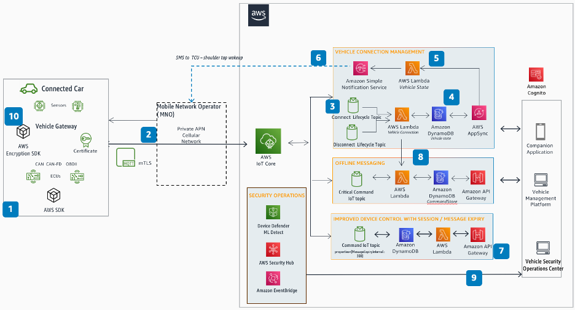

# CM-S02 Vehicle connectivity management

Vehicle connectivity management helps ensure resilient, secure, bidirectional connection
between the vehicle and the cloud. It enables high throughput data transfer, low latency
events and supports communication across all devices, in both low latency local area and wide
area network connection. The following user stories are supported in Vehicle Connectivity
Management.

## User stories

**CM-S02-UC01 Connectivity:** The ability of the vehicle
to connect and exchange data with its surroundings, such as city infrastructure, the driver,
passengers, pedestrians, and other vehicles, is commonly referred as V2X. The ability of the
vehicle to connect and exchange data with the cloud is referred to as V2C (Vehicle to Cloud)
or C2V (Cloud to Vehicle). Connectivity to these external systems should be secure and data
should be relevant to satisfy real time vehicle functions.

To achieve these objectives, vehicle connectivity management should be able to provide
the following:

- Be able to withstand connection drop and re-establish connection.
- Provide connectivity state and vehicle state in the cloud.
- Keep the vehicle network connected for extended periods while the vehicle is
  switched off.
- Ability for the connected vehicle to connect to the cloud Region that is in its
  geo-proximity and if it's not available, then it can failover to the alternate Region
  selected by the customer.
- Perform secure authentication and authorization.
- Ability to failover to a different network provider in case the Mobile Network
  Operator (MNO) service degrades.
- Ability to receive and act upon predictive Quality of Service (QoS) notifications
  from the MNO.
- Ability to run commands with low latency to ultra-low latency. Low latency is
  typically latency within 2–3 secs round trip and ultra-low latency is typically less
  than 200ms round trip. Remote commands and [tele-operations](https://www.mdpi.com/2076-3417/11/21/9799 "https://www.mdpi.com/2076-3417/11/21/9799") are example
  use cases for running with low latency and ultra-low latency respectively.

**CM-S02-UC02 Messaging:** Vehicle Connectivity
Management should be able to deliver messages to an individual vehicle or to a fleet of
vehicles. To ensure relevant messages are sent, there should be capability to control
message expiration and set message priority. It becomes essential to provide message
delivery functionality that ensures to deliver message at-least once and provide
traceability of the message generation. In certain instances, such as running remote
commands, there should be the ability to wake the vehicle. Such capability should
balance between low battery usage and latency in responding to the commands. Some common
mechanisms include extended discontinuous reception ([eDRX](https://www.everythingrf.com/community/what-is-edrx "https://www.everythingrf.com/community/what-is-edrx")) failing over
to shoulder tap in the case where the vehicle goes into deep sleep. The Vehicle
Connectivity Management should also have the ability to serialize and deserialize
messages over the air.

## Reference architecture

_Vehicle connectivity management reference
architecture_

**Figure 3: CM-S02 Vehicle connectivity management reference
architecture**

1. The connected vehicle acts as an IoT device, with a unique identity principal (X.509 certificate). AWS IoT Core is used for communication from edge-to-cloud to collect, analyze, and act upon the sensor data gathered from the vehicle.
2. The connection is made to AWS IoT Core through a private cellular network using the
   customer's own AWS IoT Core endpoint. All traffic is sent over the MQTT protocol secured
   using mTLS.
3. Upon connection, AWS IoT Core publishes the vehicle's connected state to the Connect
   Topic. This reserved topic is where connection events are published automatically upon
   connection.
4. The vehicle connection state is stored in the database for implementing
   observability solutions.
5. Messages published from the cloud use the Vehicle State AWS Lambda function to check
   connected state.
6. If the device is in a disconnected state, the vehicle state Lambda function invokes
   Amazon SNS, which will send an SMS to the dialable MSISDN on the SIM on the TCU to indicate
   that a command is waiting and to wake up and subscribe to command topics.
7. Messages are published based on vehicle connectivity state. Messages can also be
   expired by the MQTT Broker if it is not delivered on time. If the vehicle is connected,
   the command payload is published using the Command MQTT topic in AWS IoT Core that the
   vehicle has subscribed.
8. Critical system messages sent from the cloud to the vehicle can be stored,
   processed, and delivered when the vehicle comes back online.
9. AWS IoT Device Defender sends device audit and violation findings (such as unusual device behavior or
   software and configuration vulnerabilities) to AWS Security Hub CSPM, where security findings from
   other AWS services and AWS Partner products are aggregated and normalized. Security Hub CSPM sends
   findings to EventBridge, which routes them to a remediation workflow implemented in a vehicle
   security operations center.
10. The vehicle can use the AWS Encryption SDK using keys in AWS KMS for client-side encryption.
    The ECU can get temporary API credentials from the IoT credential provider to
    call AWS KMS APIs. You can also implement your own key management system for encryption
    keys.
