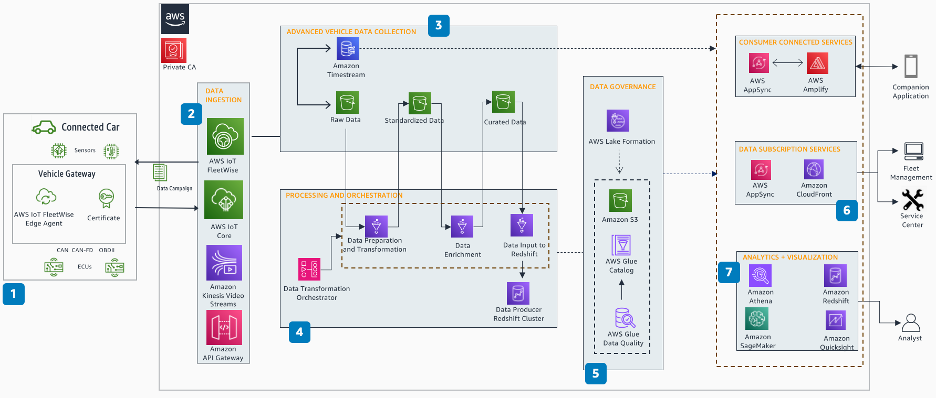

# CM-S03 Vehicle data management and

insights

Connected vehicles have hundreds of controllers and sensors producing thousands of
individual data elements for operating, and conveying the state of a vehicle. Vehicle data
management helps vehicle manufacturers to harness data as an asset, to drive sustained
innovation and create actionable insights and improve their customer experience. Vehicle
manufacturers are seeking cost-effective ways to simplify the process of collecting data from
vehicles that are connected to the cloud help power insights and improve vehicle performance
while maintaining the highest levels of confidentiality and security. There are regulations
(such as CCPA and GDPR) related to data privacy and data sharing that require customers to
provide data lineage and data governance capabilities.

## User stories

**CM-S03-UC01 Telemetry:** Automakers collect a variety and
large volume of data that is configurable based on rules and filters to support business
needs, such as predictive maintenance, location-based services, and insurance claims. In the
next generation of vehicles, with expansive amounts of data continuously ingested at high
rates from the vehicle, there are multiple verticals that would want to access the vehicle's
data, including insurance, municipalities, and content providers. With automakers monetizing
the vehicle data, managing the balance between cost, customer experience, data privacy, and
revenue realized important.

When determining the backend architecture for the vehicle's payload, there are a few key
concepts to keep in mind, namely size and frequency. Automakers could operate a hybrid
approach to ingestion, with support for both high-frequency as well as low-frequency data
ingestion. This hybrid approach allows automakers to optimize their cost while maximizing
the data monetization potential for the most valuable data attributes from the
vehicle.

The telemetry collection system should be able to withstand a sudden connection loss and
maintain data integrity. The majority of telemetry data is time series data. To maximize the
value of this data, processing and visualization of this data is a key capability needed to
help create valuable insights and build new solutions to support those insights. Time series
data differs from traditional vehicle sensor data in that it's used to perform queries in
time windows across differing time frames.

**CM-S03-UC02 Data management and governance:** Vehicle manufacturers and
vehicle owners need to establish data governance standards for collection, storing and
dissemination of data and adhere to local rules and regulations (such as CCPA and GDPR).
Vehicle owners and manufacturers need a consent management system to control, share, and
delete data that supports meeting local, national, and international data privacy
regulations and protects privacy of consumers.

**CM-S03-UC03 Data sharing and neutral servers:** Neutral
servers are servers operated and financed by operators not connected with vehicle
manufacturers. Such servers can be used by vehicle manufacturers to make vehicle data
readily discoverable and accessible to interested vendors with necessary security and
privacy controls.

**CM-S03-UC04 Insights and generating value from connected vehicle
data:** Vehicle manufacturers would like to generate value for their customers
from the connected vehicle data acquired throughout the lifetime of the vehicle, for
example:

- Provide Usage Based Insurance (UBI) dependent upon driver behavior, distance
  driven, and so on.
- Provide subscription-based value-added service, such as Feature on Demand through
  over-the-air (OTA) update.
- Increasing advertising reach and targeted advertising.
- Independent service stations would like to access vehicle data and fault codes to
  repair and maintain vehicles.
- Smart maintenance scheduling to reduce maintenance cost, increase fleet
  availability, and deliver a differentiating customer service.
- Drive vehicle optimization, efficiency, and early detection of deviations from
  normal operating condition using ML algorithms and advanced simulations on a digital
  twin of the vehicle in the cloud.

## Reference architecture

_Vehicle data management and insights reference architecture_

**Figure 4: CM-03: Vehicle data management and insights reference
architecture**

1. The connected vehicle, with a unique identity principal (X.509 certificate), has
   hundreds of sensors to collect data. AWS IoT FleetWise Edge Agent collects, stores, and organizes
   data from vehicle. Based on the campaign defined in AWS IoT FleetWise, the agent decodes signals from
   the vehicle and sends data payloads through AWS IoT Core.
2. The vehicle can communicate using OEM chosen protocols, such as MQTT and HTTPs, and
   use AWS services, such as AWS IoT Core and Amazon API Gateway. Vehicles can send video streams to
   the cloud using Amazon Kinesis Video Streams.
3. Improve data relevance by creating time- and event-based data collection campaigns
   that send the exact data you need to Amazon Timestream or Amazon S3.
4. By using purpose-built data processing components, vehicle manufacturers can
   generate data ready for consumption, organized by subject areas, segments, and
   profiles.
5. AWS Lake Formation makes it easier to centrally govern, secure, and globally share data. A
   data lake can be used to store and analyze multiple data types from wide variety of
   sources. Use AWS Glue Data Quality to measure and monitor the data quality and take
   corrective actions.
6. Enable different user personas from fleet aggregators to data scientists, analysts,
   and vehicle owners.
7. You can use Amazon SageMaker AI improve ADAS/AV models to optimize vehicle design for
   performance and efficiency. Insights from structured and semistructured data can be
   gathered by using Amazon Redshift. Utilizing Quick Suite and other analytics platforms to continually
   improve vehicle quality, safety, and autonomy using near real time data from AWS IoT FleetWise.
