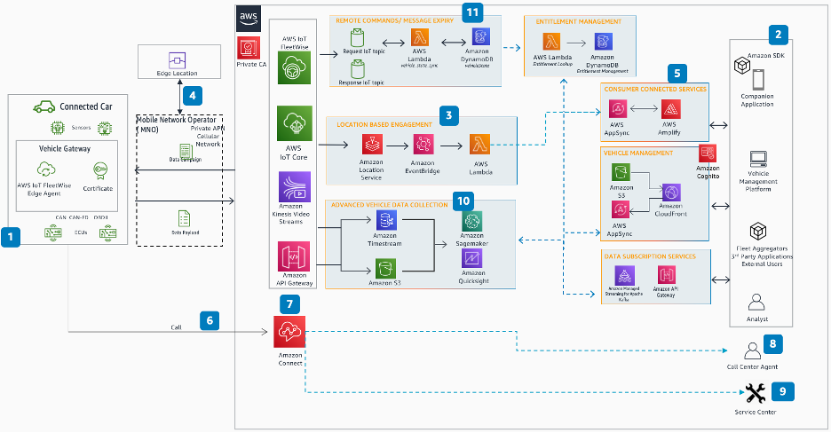

# CM-S04 Connected mobility core

services

Vehicle manufacturers can deliver value-added services to fleet operators and vehicle
operators that helps them improve the vehicle operating experience, such as remote lock or
unlock, remote vehicle monitoring, usage-based insurance, and improve experience throughout
the vehicle lifecycle.

## User stories

**CM-S04-UC01 Companion mobile app for vehicle operators:**
Vehicle manufacturers can provide a companion mobile app to vehicle operators to remotely
interact with the vehicles and view on demand vehicle information. Some examples are:

- Send remote commands to their vehicle to lock/unlock, start/stop their vehicle.
- Send destination and waypoints to the in-vehicle navigation system.
- Get EV charging status.
- Get diagnostic information, such as tire pressure, battery charge or fuel status,
  and oil life.
- Autonomous capabilities such as summoning the vehicle or parking.

**CM-S04-UC02 Predictive service:** Analyze component usage and
provide predictive maintenance guidelines to help uptime and manage the service
experience.

**CM-S04-UC03 Driver and passenger safety:** Connected vehicle
platforms are designed to provide seamless communication between vehicles and remote
applications to receive alerts of hazardous situations, enable more time to react, help
prevent accidents and automate emergency call in the event of an accident. Automakers should
implement redundancies in handling safety use cases to avoid any single point of failures.

**CM-S04-UC04 Vehicle security:** With connected vehicles
capability to remotely operate the vehicle and the amount of personal data collected and
stored in the cloud, it becomes essential to provide guardrails to prevent bad actors from
using these new attack surfaces. Authorities are rolling out cybersecurity regulations like
WP.29 Cybersecurity Vehicle Regulation Compliance regulation and related automotive
standards such as ISO/SAE 21434 standard to mitigate the cybersecurity risks posed to
vehicles.

**CM-S04-UC05 Diagnostics:** Send real-time and scheduled
diagnostic reports to the customer regarding the vehicle health like oil life, tire
pressure, battery health, and fuel or charge status. Call centers and repair centers can
also automatically find the reason for the vehicle breakdown.

**CM-S04-UC06 Location-based services:**

- Fleet operators and vehicle operators receive breakdown
  assistance by easily calling local roadside assistance in
  case of a vehicle breakdown. Mobile repair centers have the
  ability to get the accurate location of the vehicle to
  ensure efficient service to vehicle operators.
- Capability to set up geofencing to ensure vehicle safety by preventing unauthorized
  vehicle use.
- Location specific offers from merchants.

## Reference architecture

_Connected mobility core services reference architecture_

**Figure 5: CM-S04 Connected mobility core services reference
architecture**

1. The connected vehicle, with a unique identity principal (X.509 certificate), has
   hundreds of sensors to collect data. AWS IoT FleetWise Edge Agent collects, stores, and organizes
   data from vehicle. Based on the campaign defined in AWS IoT FleetWise, the agent decodes signals
   from the vehicle and sends data payloads through AWS IoT Core.
2. Adding location awareness to apps enables an enhanced experience, such as sending
   real-time messages, and information and service based on user location (for example,
   repair centers have the ability to get the accurate location of the vehicle to ensure
   efficient service to vehicle operators).
3. Amazon Location Service features, such as maps, trackers, and geofence collections, are used to
   send geolocation data to track and follow the vehicle location. Events are initiated on
   Amazon EventBridge when the vehicle enters or exits a geofence and notifies vehicle and fleet
   operators.
4. Applications that are latency sensitive, such as tele-operations or Cellular V2X
   applications, can be deployed at the edge. AWS Wavelength could be used to deploy such
   applications.
5. Applications developed with AWS Amplify and AWS AppSync are used by vehicle operators
   and owners to create messages and business rules for geofences and notify events to the
   users.
6. A vehicle can initiate a call to the emergency response center, such as when it
   detects a hard impact or airbag deployment. Emergency services can be dispatched even if
   the driver is unresponsive.
7. Amazon Connect starts the automatic contact flow for the call and based on the
   nature of the call can be attended by the call center agent, road side assistance, or
   virtual voice assistant.
8. Critical details, such as the speed at impact, the number of airbags deployed,
   vehicle operation status, and even video footage, can be transmitted to the
   operator.
9. The solution also integrates with roadside service assistance providers and shares
   any relevant data for assistance.
10. Collect real time telemetry, analyze performance and component usage metrics to
    provide prescriptive guidance to vehicle owners.
11. The Request/Response messaging pattern in AWS IoT Core is a
    method to track responses to client requests in an
    asynchronous way. For vehicle remote commands, this enables
    the publisher to specify a topic for the response to be sent
    for a particular message, ensuring proper messaging to the
    customer on success or failure of the command state. Using
    the Message Expiry feature of AWS IoT Core, the vehicle
    operator could specify how long to attempt the remote
    command before expiring the message.
