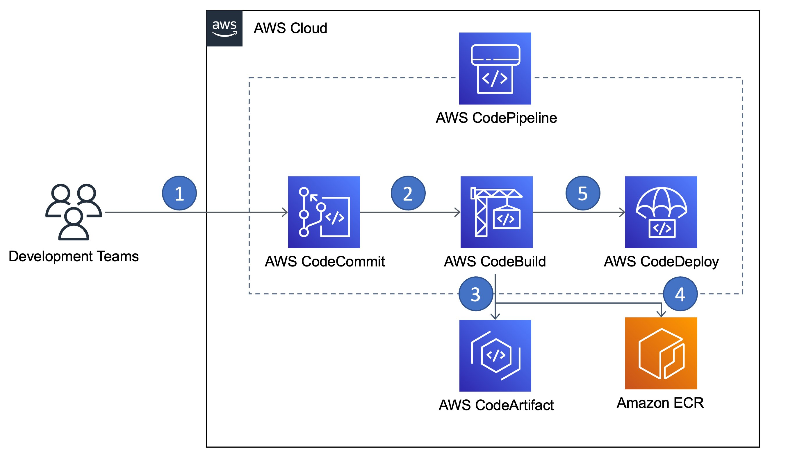

# Improving containerized CI/CD pipelines from performance efficiency and cost perspective

Continuous integration continuous delivery pipelines (CI/CD
pipelines) help you automate steps in your software delivery
process, such as initiating automatic builds and then deploying
to a compute platform of your choice. Usually, a CI/CD-pipeline
builds, tests, and deploys your code every time there is a code
change, based on the release process models you define. As
companies are adopting containers and container technologies
more and more, this also increases the usage of their
containerized build process. For further optimization, companies
might seek ways to improve the efficiency of the overall build
process, which includes containerization. There are several ways
to optimize the complete build process and the infrastructure
involved. In the following section, we highlight a few popular
optimization steps:

- Use managed services.
- Dynamically provision scalable infrastructure.
- Optimize the container images to support multiple runtimes
  and variations, which include different technologies and
  programming languages. This will improve not only the
  application performance efficiency, but also the
  sustainability impact of the containerized application.

Constantly checking and linting Dockerfile is considered a
security best practice, but also has the advantage that it’s
possible to identify potential obsolete or unused dependencies
for an application or for parent images. Organizations can
define a standardized golden image, which contains all
organization-related configuration that is necessary for all
container images. All other images that contain application or
tech domain-specific additions have to use this image as parent
(direct or indirect) image. This increases the reusability of
container images containing only relevant dependencies and
configurations for the specific aspect. It is important to point
out that this pattern requires images to be rebuilt if the
parent image changes in order to reflect the latest changes.

**Characteristics:**

- You have an existing CI/CD pipeline or you’re planning to
  introduce a pipeline.
- Your pipeline includes a build process for containerized
  applications.
- You are seeking to improve efficiency and cost of your
  pipeline solution.
- You want to create a framework that is easy to set up,
  operate, maintain, and scale, that you can extend with
  limited impact later.

## Reference architecture

_Figure 3. Improving the efficiency of a containerized
application's CI/CD pipeline_

The reference architecture shown implements a CI/CD pipeline that compiles source code
of an application to an executable, stores the executable in an artifact repository, build a
container image based on the executable, and stores the image in an image repository. For
the pipeline implementation, we use AWS CodePipeline, which automates the build, test, and deploy
phases of your release process every time there is a code change, based on the release model
you define.

1. Developers can
   push their code using standard Git mechanisms.
2. Once developers have committed code, AWS CodePipeline triggers AWS CodeBuild that
   compiles source code, runs tests, and produces software
   packages that are ready to deploy.
3. This step is optional and only applies if customers are in a
   transition phase in, which they have to support legacy
   workloads, which require artifacts like WAR-files for
   servlet engines. Those artifacts can be stored in AWS CodeArtifact.
4. The container image is built by AWS CodeBuild and is pushed
   to Amazon ECR.
5. The completed pipeline detects changes to your image, which
   is stored in an image repository such as Amazon ECR, and
   uses CodeDeploy to route and deploy traffic to an Amazon ECS
   cluster and load balancer. CodeDeploy uses a listener to
   reroute traffic to the port of the updated container
   specified in the AppSpec file.

## Configuration notes

- To minimize your container images as much as possible, refer
  to multi-stage builds in the Performance efficiency section,
  which also verifies that your builds are reproducible.
  Multi-stage builds allow you to create consistent a build
  process, which consists of multiple steps for building your
  container image. By using multi-stage builds, your final
  container image should contain only relevant binaries,
  executables, or configurations, which are necessary to run
  the application.
- After building the images, check that the images are as
  compact as you expected.
- Use standardized tools like hadolint for Dockerfile linting
  as described in the Security Pillar.

## References

- [Building ARM64 applications on AWS Graviton2 using the AWS CDK and Self-Hosted
  Runners for GitHub Actions](https://aws.amazon.com/blogs/compute/building-arm64-applications-on-aws-graviton2-using-the-aws-cdk-and-self-hosted-runners-for-github-actions/ "https://aws.amazon.com/blogs/compute/building-arm64-applications-on-aws-graviton2-using-the-aws-cdk-and-self-hosted-runners-for-github-actions/")
- [Build and Deploy Docker Images to AWS using EC2 Image Builder](https://aws.amazon.com/blogs/devops/build-and-deploy-docker-images-to-aws-using-ec2-image-builder/ "https://aws.amazon.com/blogs/devops/build-and-deploy-docker-images-to-aws-using-ec2-image-builder/")
- [stackrox/kube-linter](https://github.com/stackrox/kube-linter "https://github.com/stackrox/kube-linter")
- [Dockerfile Linter](https://hadolint.github.io/hadolint/ "https://hadolint.github.io/hadolint/")
