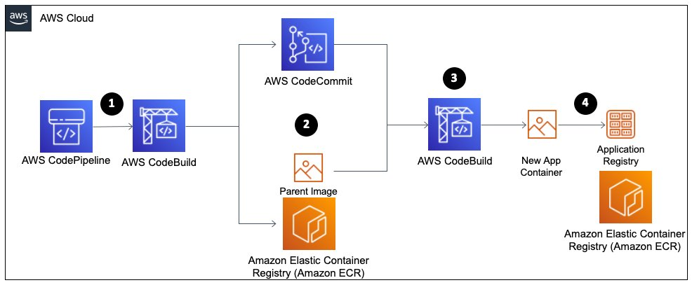

# Improving performance for container image build process

It is important for an organization to deliver applications and services at high velocity, evolving and improving products at a faster pace than organizations using traditional software development and infrastructure management processes. This speed enables organizations to serve their customers better and compete more effectively in the market.

Part of this process is automating the container build process and enabling it to do so at a high velocity. To do so, your organization can adopt methods and processes, such as:

- Using prebuilt images.
- Using the smallest parent image possible.
- Identify only what your container requires to accomplish
  your business goals.

## Reference architecture

- You want a quick image build to enable you to iterate
  quickly in your development process.
- You want to ensure that your container images and supporting
  packages maintain your expected security posture.
- You want to use prebuilt images that include many of the
  packages that your container is dependent upon to speed up
  the build process.

_Figure 4. Improving the build pipeline performance of
containerized applications_

1. A **CodePipeline** pipeline
   for your application build is triggered, usually by
   something like a push to a code repository or writing an
   object to an Amazon Simple Storage Service (Amazon S3)
   bucket. This kicks off a CodeBuild stage.
2. The **CodeBuild** stage will
   initiate the building of your containerized application. It
   pulls the code from the code repository and takes the
   necessary steps to build your application code.
3. It pulls the parent image from the parent image container
   repository. It runs through the build steps for your
   application, as defined in your Dockerfile.
4. It then pushes the built containerized application image in
   the container registry.

## Configuration notes

- Using prebuilt parent images can decrease the time it takes
  to build the application specific container image. Your
  image has to install fewer packages as many of them will be
  included in the parent image.
- Using a base image built in-house, you will have to do less
  functional testing because the base image has already been
  tested in previous builds.
- Work with other teams in your organization to determine the
  baseline security and business requirements that apply to
  all containerized applications and where there are some
  overlaps between teams.
- The base image of your container image should have the
  minimum packages and libraries that are required to build
  your application container image.
- Identify only what your container requires to accomplish
  your business goals, store things like picture images and
  state data outside of your container.
- If your running application is a compiled artifact, place
  only the artifact and necessary supporting packages in the
  container, excluding the unnecessary application code.

## References

[Build a continuous delivery pipeline for your container images with Amazon ECR as a source](https://aws.amazon.com/blogs/devops/build-a-continuous-delivery-pipeline-for-your-container-images-with-amazon-ecr-as-source/ "https://aws.amazon.com/blogs/devops/build-a-continuous-delivery-pipeline-for-your-container-images-with-amazon-ecr-as-source/")
