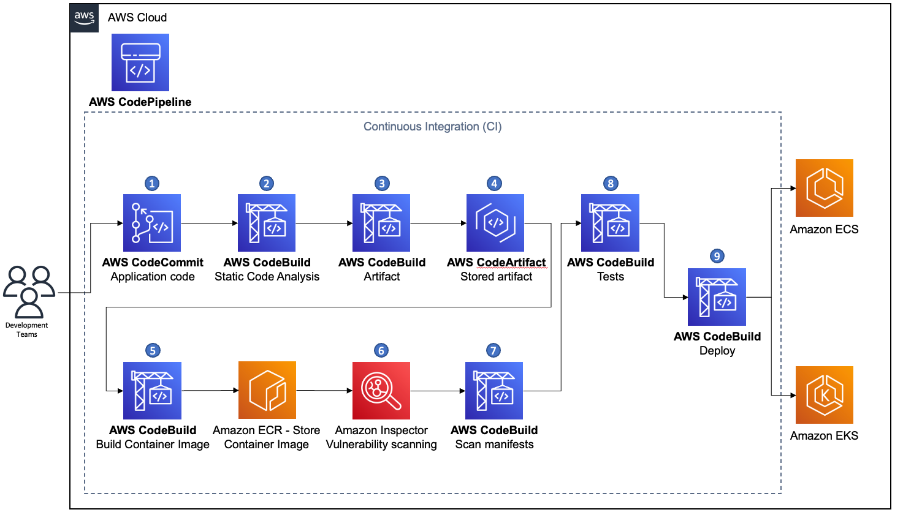

# Securing containerized build pipelines

A build pipeline is the process of creating a runnable and deployable artifact from the
application source code. One of the steps towards adopting the use of container technologies,
is updating the build pipeline to include the relevant steps for building containerized
applications. When doing so, security measures should be considered for the build pipeline
itself. This scenario suggests an architecture for creating a container build pipeline while
handling various types of security aspects of the build pipeline itself, which are relevant to
containers.

###### Note

All the security measures, controls, and tasks in this scenario come _in addition_ to the relevant security actions needed when running any type of
pipeline. An example can be seen in [AWS CodePipeline security docs](../../../codepipeline/latest/userguide/security.md "../../../codepipeline/latest/userguide/security.md"), AWS
[blogs](https://aws.amazon.com/blogs/devops/building-end-to-end-aws-devsecops-ci-cd-pipeline-with-open-source-sca-sast-and-dast-tools/ "https://aws.amazon.com/blogs/devops/building-end-to-end-aws-devsecops-ci-cd-pipeline-with-open-source-sca-sast-and-dast-tools/"), and other relevant content and materials.

## Reference architecture

The following reference architecture diagram shows a containerized build pipeline with
its steps.

_Figure 2. Continuous integration pipeline for containerized
applications_

1. Developers push a code change to the source code repository.
2. Static code analysis is triggered to identify potential
   misconfigurations, vulnerabilities of dependencies, ensure
   good coding practices, and more.
3. Build artifact from code (for example compile and link, or
   packaging source code).
4. Push and store artifacts in a targeted artifact or binary
   repository management service (for example AWS CodeArtifact,
   Nexus repository, or Jfrog Artifactory).
5. Build the container image based on the build manifest file
   (for example Dockerfile), handle tags and push it to the
   targeted registry.
   1. If building containerized only pipeline, you might skip
      storing the compiled artifact, as the target artifact is
      the container image.
   2. Enable tag immutability on your registry to reduce risk
      of pushing untrusted tags or versions of already
      existing container images.

6. Run static code analysis for the container image (for example using built-in
   registry scanning as exists in [Amazon ECR](../../../AmazonECR/latest/userguide/image-scanning.md "../../../AmazonECR/latest/userguide/image-scanning.md"), or use third-party
   tools such as [Clair](https://github.com/quay/clair "https://github.com/quay/clair") as used in [Quai.io](http://Quai.io "http://Quai.io")).
7. Based on the targeted orchestrator, the deployment manifests
   (for example Kubernetes YAML objects definitions, Helm chart
   packaging files, or Amazon ECS task definitions) should be
   scanned for vulnerabilities as well. Tools like
   [checkcov](https://www.checkov.io/ "https://www.checkov.io/")
   can be used to perform such scans.
8. Run acceptance tests against the built container image.
9. Proceed to the deployment process.

One of the steps towards adopting the use of container technologies is adding steps
related to building container images to the build pipeline. Usually, the following steps are
the minimal necessary steps. Based on the previous list, they usually fall after step 3:

- Build the container image based on the build manifest file
  (for example Dockerfile), handle tags and push it to the
  targeted registry.
- Enable tag immutability on your registry to reduce risk of
  pushing untrusted tags or versions of already existing
  container images.
- Run static code analysis for the container image (for example using built-in
  registry scanning as exists in [Amazon ECR](../../../AmazonECR/latest/userguide/image-scanning.md "../../../AmazonECR/latest/userguide/image-scanning.md"), or use third-party
  tools such as [Clair](https://github.com/quay/clair "https://github.com/quay/clair") as used in [Quai.io](http://Quai.io "http://Quai.io")).
- Based on the targeted orchestrator, the deployment manifests
  (for example Kubernetes YAML objects definitions, Helm chart
  packaging files, or Amazon ECS task definitions) should be
  scanned for vulnerabilities as well. Tools like
  [checkcov](https://www.checkov.io/ "https://www.checkov.io/")
  can be used to perform such scans.
- Run acceptance tests against the built container image.

## Configuration notes

- Based on your targeted containers orchestrator, refer to the security best
  practices for [Amazon EKS](https://aws.github.io/aws-eks-best-practices/security/docs/ "https://aws.github.io/aws-eks-best-practices/security/docs/"), or for [Amazon ECS](../../../AmazonECS/latest/bestpracticesguide/security.md "../../../AmazonECS/latest/bestpracticesguide/security.md").
- Scan your container images, container manifests, and
  deployment manifests for vulnerabilities - your build
  pipeline should include a step for scanning the resulted
  container images for vulnerabilities.
- Make sure that your container images are built to use a
  user other than root.
- Ensure that your container images contain only relevant
  configuration and dependencies to the running application.
- Reduce attack surface for your container images (use minimal parent images, remove
  package managers, remove shell access). For more information, refer to the [Protecting Compute](../security-pillar/protecting-compute.md "../security-pillar/protecting-compute.md") section in the [Security Pillar whitepaper](../security-pillar/welcome.md "../security-pillar/welcome.md").
- Use private container registries to store your trusted
  parent container images, after they were scanned and signed.

## References

- [Build a Continuous Delivery Pipeline for your Container Images with Amazon ECR as a Source](https://aws.amazon.com/blogs/devops/build-a-continuous-delivery-pipeline-for-your-container-images-with-amazon-ecr-as-source/ "https://aws.amazon.com/blogs/devops/build-a-continuous-delivery-pipeline-for-your-container-images-with-amazon-ecr-as-source/")
- [Choosing a Well-Architected CI/CD approach: Open-source software and AWS services](https://aws.amazon.com/blogs/devops/choosing-well-architected-ci-cd-open-source-software-aws-services/ "https://aws.amazon.com/blogs/devops/choosing-well-architected-ci-cd-open-source-software-aws-services/")
- [How to build a CI/CD pipeline for container vulnerability scanning with Trivy and
  AWS Security Hub CSPM](https://aws.amazon.com/blogs/security/how-to-build-ci-cd-pipeline-container-vulnerability-scanning-trivy-and-aws-security-hub/ "https://aws.amazon.com/blogs/security/how-to-build-ci-cd-pipeline-container-vulnerability-scanning-trivy-and-aws-security-hub/")
- [Building end-to-end AWS DevSecOps CI/CD pipeline with open source SCA, SAST and
  DAST tools](https://aws.amazon.com/blogs/devops/building-end-to-end-aws-devsecops-ci-cd-pipeline-with-open-source-sca-sast-and-dast-tools/ "https://aws.amazon.com/blogs/devops/building-end-to-end-aws-devsecops-ci-cd-pipeline-with-open-source-sca-sast-and-dast-tools/")
