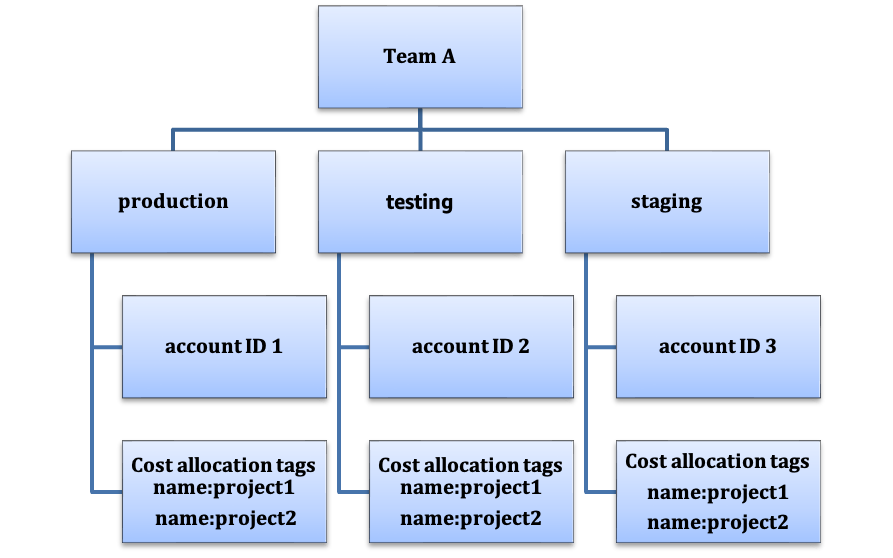

# COST03-BP03 Identify cost attribution categories

Identify organization categories such as business units, departments
or projects that could be used to allocate cost within your
organization to the internal consuming entities. Use those
categories to enforce spend accountability, create cost awareness
and drive effective consumption behaviors.

**Level of risk exposed if this best practice
is not established:** High

## Implementation guidance

The process of categorizing costs is crucial in budgeting,
accounting, financial reporting, decision making, benchmarking,
and project management. By classifying and categorizing expenses,
teams can gain a better understanding of the types of costs they
incur throughout their cloud journey helping teams make
informed decisions and manage budgets effectively.

Cloud spend accountability establishes a strong incentive for
disciplined demand and cost management. The result is
significantly greater cloud cost savings for organizations that
allocate most of their cloud spend to consuming business units or
teams. Moreover, allocating cloud spend helps organizations
adopt more best practices of centralized cloud governance.

Work with your finance team and other relevant stakeholders to
understand the requirements of how costs must be allocated within
your organization during your regular cadence calls. Workload
costs must be allocated throughout the entire lifecycle, including
development, testing, production, and decommissioning. Understand
how the costs incurred for learning, staff development, and idea
creation are attributed in the organization. This can be helpful
to correctly allocate accounts used for this purpose to training
and development budgets instead of generic IT cost budgets.

After defining your cost attribution categories with stakeholders
in your organization, use
[AWS Cost Categories](https://aws.amazon.com/aws-cost-management/aws-cost-categories/ "https://aws.amazon.com/aws-cost-management/aws-cost-categories/") to group your cost and usage information
into meaningful categories in the AWS Cloud, such as cost for
a specific project, or AWS accounts for departments or business
units. You can create custom categories and map your cost and
usage information into these categories based on rules you define
using various dimensions such as account, tag, service, or charge
type. Once cost categories are set up, you can view your cost and
usage information by these categories, which allows your organization
to make better strategic and purchasing decisions. These
categories are visible in AWS Cost Explorer, AWS Budgets, and AWS Cost and Usage Report as well.

For example, create cost categories for your business units
(DevOps team), and under each category create multiple rules
(rules for each sub category) with multiple dimensions (AWS accounts, cost allocation tags, services or charge type) based on
your defined groupings. With cost categories, you can organize
your costs using a rule-based engine. The rules that you configure
organize your costs into categories. Within these rules, you can
filter by using multiple dimensions for each category such as
specific AWS accounts, AWS services, or charge types. You can then
use these categories across multiple products in the
[AWS Billing and Cost Management and Cost Management](../../../awsaccountbilling/latest/aboutv2/billing-what-is.md "../../../awsaccountbilling/latest/aboutv2/billing-what-is.md")
[console](../../../awsaccountbilling/latest/aboutv2/view-billing-dashboard.md "../../../awsaccountbilling/latest/aboutv2/view-billing-dashboard.md").
This includes AWS Cost Explorer, AWS Budgets, AWS Cost and Usage Report, and AWS Cost Anomaly Detection.

As an example, the following diagram displays how to group
your costs and usage information in your organization by having
multiple teams (cost category), multiple environments (rules), and
each environment having multiple resources or assets (dimensions).

_Cost and usage organization chart_

You can create groupings of costs using cost categories as well.
After you create the cost categories (allowing up to 24 hours
after creating a cost category for your usage records to be
updated with values), they appear in
[AWS Cost Explorer](https://aws.amazon.com/aws-cost-management/aws-cost-explorer/ "https://aws.amazon.com/aws-cost-management/aws-cost-explorer/"),
[AWS Budgets](../../../cost-management/latest/userguide/budgets-managing-costs.md "../../../cost-management/latest/userguide/budgets-managing-costs.md"),
[AWS Cost and Usage Report](../../../cur/latest/userguide/what-is-cur.md "../../../cur/latest/userguide/what-is-cur.md"), and
[AWS Cost Anomaly Detection](https://aws.amazon.com/aws-cost-management/aws-cost-anomaly-detection/ "https://aws.amazon.com/aws-cost-management/aws-cost-anomaly-detection/"). In AWS Cost Explorer and
AWS Budgets, a cost category appears as an additional billing
dimension. You can use this to filter for the specific cost
category value, or group by the cost category.

### Implementation steps

- **Define your organization
  categories:** Meet with internal stakeholders and
  business units to define categories that reflect your
  organization's structure and requirements. These categories
  should directly map to the structure of existing financial
  categories, such as business unit, budget, cost center, or
  department. Look at the outcomes the cloud delivers for your
  business such as training or education, as these are also
  organization categories.
- **Define your functional
  categories:** Meet with internal stakeholders and
  business units to define categories that reflect the
  functions that you have within your business. This may be
  the workload or application names, and the type of
  environment, such as production, testing, or development.
- **Define AWS Cost
  Categories:** Create cost categories to organize
  your cost and usage information by using
  [AWS Cost Categories](https://aws.amazon.com/aws-cost-management/aws-cost-categories/ "https://aws.amazon.com/aws-cost-management/aws-cost-categories/") and map your AWS cost and
  usage into
  [meaningful
  categories](../../../awsaccountbilling/latest/aboutv2/create-cost-categories.md "../../../awsaccountbilling/latest/aboutv2/create-cost-categories.md"). Multiple categories can be assigned to a
  resource, and a resource can be in multiple different
  categories, so define as many categories as needed so that
  you can
  [manage
  your costs](../../../awsaccountbilling/latest/aboutv2/manage-cost-categories.md "../../../awsaccountbilling/latest/aboutv2/manage-cost-categories.md") within the categorized structure using AWS
  Cost Categories.

## Resources

**Related documents:**

- [Tagging
  AWS resources](../../../general/latest/gr/aws_tagging.md "../../../general/latest/gr/aws_tagging.md")
- [Using
  Cost Allocation Tags](../../../awsaccountbilling/latest/aboutv2/cost-alloc-tags.md "../../../awsaccountbilling/latest/aboutv2/cost-alloc-tags.md")
- [Analyzing
  your costs with AWS Budgets](../../../awsaccountbilling/latest/aboutv2/budgets-managing-costs.md "../../../awsaccountbilling/latest/aboutv2/budgets-managing-costs.md")
- [Analyzing
  your costs with Cost Explorer](../../../awsaccountbilling/latest/aboutv2/cost-explorer-what-is.md "../../../awsaccountbilling/latest/aboutv2/cost-explorer-what-is.md")
- [Managing
  AWS Cost and Usage Reports](../../../awsaccountbilling/latest/aboutv2/billing-reports-costusage-managing.md "../../../awsaccountbilling/latest/aboutv2/billing-reports-costusage-managing.md")
- [AWS Cost Categories](../framework/aws-cost-management/aws-cost-categories.md "../framework/aws-cost-management/aws-cost-categories.md")
- [Managing
  your costs with AWS Cost Categories](../../../awsaccountbilling/latest/aboutv2/manage-cost-categories.md "../../../awsaccountbilling/latest/aboutv2/manage-cost-categories.md")
- [Creating
  cost categories](../../../awsaccountbilling/latest/aboutv2/create-cost-categories.md "../../../awsaccountbilling/latest/aboutv2/create-cost-categories.md")
- [Tagging
  cost categories](../../../awsaccountbilling/latest/aboutv2/tag-cost-categories.md "../../../awsaccountbilling/latest/aboutv2/tag-cost-categories.md")
- [Splitting
  charges within cost categories](../../../awsaccountbilling/latest/aboutv2/splitcharge-cost-categories.md "../../../awsaccountbilling/latest/aboutv2/splitcharge-cost-categories.md")
- [AWS Cost Categories Features](https://aws.amazon.com/aws-cost-management/aws-cost-categories/features/ "https://aws.amazon.com/aws-cost-management/aws-cost-categories/features/")

**Related examples:**

- [Organize
  your cost and usage data with AWS Cost Categories](https://aws.amazon.com/blogs/aws-cloud-financial-management/organize-your-cost-and-usage-data-with-aws-cost-categories/ "https://aws.amazon.com/blogs/aws-cloud-financial-management/organize-your-cost-and-usage-data-with-aws-cost-categories/")
- [Managing
  your costs with AWS Cost Categories](https://aws.amazon.com/aws-cost-management/resources/managing-your-costs-with-aws-cost-categories/ "https://aws.amazon.com/aws-cost-management/resources/managing-your-costs-with-aws-cost-categories/")
