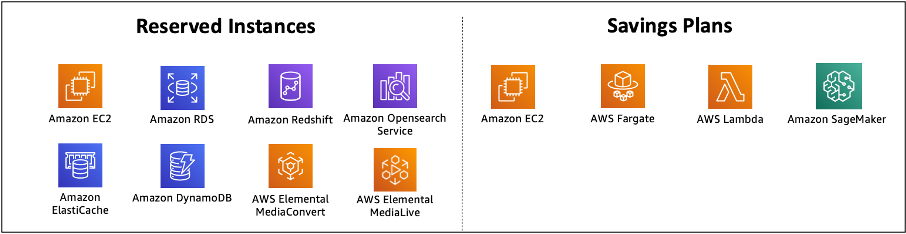

# COST07-BP04 Implement pricing models for all components of this

workload

Permanently running resources should utilize reserved capacity such
as Savings Plans or Reserved Instances. Short-term capacity is
configured to use Spot Instances, or Spot Fleet. On-Demand Instances are only
used for short-term workloads that cannot be interrupted and do not
run long enough for reserved capacity, between 25% to 75% of the
period, depending on the resource type.

**Level of risk exposed if this best practice
is not established:** Low

## Implementation guidance

To improve cost efficiency, AWS provides multiple commitment recommendations based on your past usage. You can use these recommendations to understand what you can save, and how the commitment will be used. You can use these services as On-Demand, Spot, or make a commitment for a certain period of time and reduce your on-demand costs with Reserved Instances (RIs) and Savings Plans (SPs). You need to understand not only each workload components and multiple AWS services, but also commitment discounts, purchase options, and Spot Instances for these services to optimize your workload.

Consider the requirements of your workload’s components, and understand the different pricing models for these services. Define the availability requirement of these components. Determine if there are multiple independent resources that perform the function in the workload, and what the workload requirements are over time. Compare the cost of the resources using the default On-Demand pricing model and other applicable models. Factor in any potential changes in resources or workload components.

For example, let’s look at this Web Application Architecture on AWS. This sample workload consists of multiple AWS services, such as Amazon Route 53, AWS WAF, Amazon CloudFront, Amazon EC2 instances, Amazon RDS instances, Load Balancers, Amazon S3 storage, and Amazon Elastic File System (Amazon EFS). You need to review each of these services, and identify potential cost saving opportunities with different pricing models. Some of them may be eligible for RIs or SPs, while some of them may be available only on-demand. As the following image shows, some of the AWS services can be committed using RIs or SPs.

_AWS services committed using Reserved Instances and Savings Plans_

### Implementation steps

- **Implement pricing models:** Using your analysis results, purchase Savings Plans, Reserved Instances, or implement Spot Instances. If it is your first commitment purchase, choose the top five or ten recommendations in the list, then monitor and analyze the results over the next month or two. AWS Cost Management Console guides you through the process. Review the RI or SP recommendations from the console, customize the recommendations (type, payment, and term), and review hourly commitment (for example $20 per hour), and then add to cart. Discounts apply automatically to eligible usage. Purchase a small amount of commitment discounts in regular cycles (for example every 2 weeks or monthly). Implement Spot Instances for workloads that can be interrupted or are stateless. Finally, select on-demand Amazon EC2 instances and allocate resources for the remaining requirements.
- **Workload review cycle:** Implement a review cycle for the workload that specifically analyzes pricing model coverage. Once the workload has the required coverage, purchase additional commitment discounts partially (every few months), or as your organization usage changes.

## Resources

**Related documents:**

- [Understanding your Savings Plans recommendations](../../../savingsplans/latest/userguide/sp-recommendations.md "../../../savingsplans/latest/userguide/sp-recommendations.md")
- [Accessing
  Reserved Instance recommendations](../../../awsaccountbilling/latest/aboutv2/ri-recommendations.md "../../../awsaccountbilling/latest/aboutv2/ri-recommendations.md")
- [How
  to Purchase Reserved Instances](https://aws.amazon.com/ec2/pricing/reserved-instances/buyer/ "https://aws.amazon.com/ec2/pricing/reserved-instances/buyer/")
- [Instance
  purchasing options](../../../AWSEC2/latest/UserGuide/instance-purchasing-options.md "../../../AWSEC2/latest/UserGuide/instance-purchasing-options.md")
- [Spot
  Instances](../../../AWSEC2/latest/UserGuide/using-spot-instances.md "../../../AWSEC2/latest/UserGuide/using-spot-instances.md")
- [Reservation models for other AWS services](../../../whitepapers/latest/cost-optimization-reservation-models/reservation-models-for-other-aws-services.md "../../../whitepapers/latest/cost-optimization-reservation-models/reservation-models-for-other-aws-services.md")
- [Savings Plans Supported Services](../../../savingsplans/latest/userguide/sp-services.md "../../../savingsplans/latest/userguide/sp-services.md")

**Related videos:**

- [Save
  up to 90% and run production workloads on Spot](https://www.youtube.com/watch?v=BlNPZQh2wXs "https://www.youtube.com/watch?v=BlNPZQh2wXs")

**Related examples:**

- [What should you consider before purchasing Savings Plans?](https://repost.aws/knowledge-center/savings-plans-considerations "https://repost.aws/knowledge-center/savings-plans-considerations")
- [How can I use Cost Explorer to analyze my spending and usage?](https://repost.aws/knowledge-center/cost-explorer-analyze-spending-and-usage "https://repost.aws/knowledge-center/cost-explorer-analyze-spending-and-usage")
