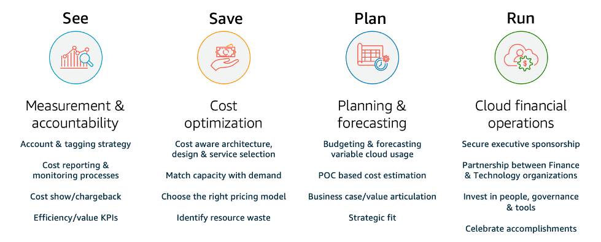

# Practice Cloud Financial Management

Managing cloud finance requires evolving your existing finance processes to establish and operate with cost transparency,
control, planning, and optimization for your AWS environments.

Applying traditional, static waterfall planning, IT budgeting, and cost assessment models to dynamic cloud usage can create risks,
lead to inaccurate planning, and result in less visibility. Ultimately, this results in a lost opportunity to effectively optimize
and control costs and realize long-term business value. To avoid these pitfalls, actively manage costs throughout the cloud journey,
whether you are building applications natively in the cloud, migrating your workloads to the cloud, or expanding your adoption of
cloud services.

_Cloud Financial Management_ (CFM) allows finance, product, technology, and business organizations to manage, optimize,
and plan costs as they grow their usage and scale on AWS. The primary goal of CFM is to allow customers to achieve their
business outcomes in the most cost-efficient manner and accelerate economic and business value creation while finding the
right balance between agility and control.

CFM solutions help transform your business through cost transparency, control, forecasting,
and optimization. These solutions can also create a cost-conscious culture that drives
accountability across all teams and functions. Finance teams can see where costs are coming
from, run operations with minimal unexpected expenses, plan for dynamic cloud usage, and save on
cloud expenses while teams scale their adoptions in the cloud. Sharing this with engineering
teams can provide necessary financial context for their resource selection, use, and
optimization.

AWS CFM offers a set of capabilities to manage, optimize, and plan for cloud costs while maintaining business agility.
CFM is paramount not only to effectively manage costs, but also to verify that investments are driving expected business outcomes. These are the four
pillars of the Cloud Financial Management Framework in the AWS Cloud: _see_, _save_, _plan_, and _run_. Each of these pillars has a set of activities and
capabilities.

_The four pillars of Cloud Financial Management._

- **See:** How are you currently measuring, monitoring and creating accountability for your cloud spend?
  If you are new to AWS or planning on using AWS, do you have a plan to establish cost and usage visibility?

To understand your AWS costs and optimize spending, you need to know where those costs are coming from. This requires a deliberate
structure for your accounts and resources, helping your finance organization track spending flows and hold teams accountable
for their portion of the bottom line.

**AWS Services:** AWS Control Tower, AWS Organizations, Cost allocations tags, Tag policies, AWS Resource Groups, AWS Cost Categories,
AWS Cost Explorer, AWS Cost and Usage Report, RIs and SPs

**Resources:** AWS Tagging Best Practices, AWS Cost Categories

- **Save:** What cost optimization levers are you currently using to optimize your spend? If you are not
  using AWS, are you familiar with common usage-based and pricing model-based optimizations?

In the save tenet, we optimize costs with pricing and resource recommendations. Optimizing costs begins with having a well-defined strategy
for your new cloud operating model. Ideally, this should start as early as possible in your cloud journey, setting the stage for a cost-conscious
culture reinforced by the right processes and behaviors.

There are many different ways you can optimize cloud costs. One of them is selecting the right purchase model (RIs and SPs) or whether your
workload is immutable and containerized so that you can adopt Amazon EC2 Spot Instances. In addition, scale your workload using Amazon EC2 Auto Scaling Groups.

**AWS Services:** RIs and SPs, Amazon EC2 Auto Scaling Groups, Spot Instances

**Resources:** Reserved Instances, Savings Plans, Best practices for handling Amazon EC2

- **Plan:** How do you currently plan for future cloud usage and spend? Do you have a methodology to
  quantify value generation for a new migration? Have you evolved your current budgeting and forecasting processes to adopt variable
  usage of the cloud?

The plan tenet means improving your planning with flexible budgeting and forecasting. Once you’ve established visibility and cost controls,
you will likely want to plan and set expectations for spending on cloud projects. AWS gives you the flexibility to build dynamic
forecasting and budgeting processes so you can stay informed on whether costs adhere to, or exceed, budgetary limits.

**AWS Services:** AWS Cost Explorer, AWS Cost and Usage Report, AWS Budgets

**Resources:** Usage-Based Forecasting, AWS Budget Reports and Alerts

- **Run:** What are some of the operational processes and tools you are currently using to manage your cloud
  expenditures, and who is leading those efforts? Have you put any thought into how things will work from a daily operations perspective
  once you start using AWS?

The run tenet is actually managing billing and cost control. You can establish guardrails and set governance to ensure expenses stay in
line with budgets. AWS provides several tools to help you get started.

**AWS Services:** AWS Billing and Cost Management Console, AWS Identity and Access Management, Service Control Policies (SCP), AWS Service Catalog, AWS Cost Anomaly Detection, AWS Budgets

**Resources:** Getting Started with AWS Billing Console

The following are Cloud Financial Management best practices:

###### Best practices

- [COST01-BP01 Establish ownership of cost optimization](cost_cloud_financial_management_function.md "cost_cloud_financial_management_function.md")
- [COST01-BP02 Establish a partnership between finance and
  technology](cost_cloud_financial_management_partnership.md "cost_cloud_financial_management_partnership.md")
- [COST01-BP03 Establish cloud budgets and forecasts](cost_cloud_financial_management_budget_forecast.md "cost_cloud_financial_management_budget_forecast.md")
- [COST01-BP04 Implement cost awareness in your organizational
  processes](cost_cloud_financial_management_cost_awareness.md "cost_cloud_financial_management_cost_awareness.md")
- [COST01-BP05 Report and notify on cost optimization](cost_cloud_financial_management_usage_report.md "cost_cloud_financial_management_usage_report.md")
- [COST01-BP06 Monitor cost proactively](cost_cloud_financial_management_proactive_process.md "cost_cloud_financial_management_proactive_process.md")
- [COST01-BP07 Keep up-to-date with new service releases](cost_cloud_financial_management_scheduled.md "cost_cloud_financial_management_scheduled.md")
- [COST01-BP08 Create a cost-aware culture](cost_cloud_financial_management_culture.md "cost_cloud_financial_management_culture.md")
- [COST01-BP09 Quantify business value from cost optimization](cost_cloud_financial_management_quantify_value.md "cost_cloud_financial_management_quantify_value.md")
