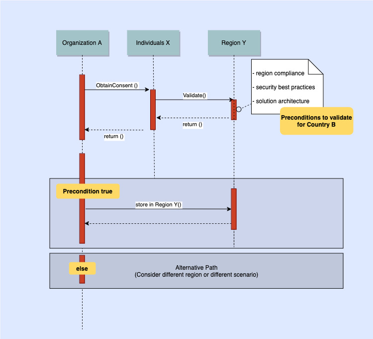

# Scenario A: User and audit consent for data storage outside country

This scenario covers situations where regulations allow data
storage outside the country with user consent as data subjects
or the permission or notification of the regulators (or both).

_Scenario A_

The use case diagram depicts the following:

- Organization A in Country B seeks consent from Individuals X
  (the data subjects).
- Validation checks the consent and verifies compliance.
- A precondition is validated based on Country B's
  regulations, which must be met before storing data in Region
  Y.
- If the precondition is satisfied, the data can be stored in
  Region Y, which may be outside of Country B. This suggests
  that the data storage could occur in a different
  geographical region while still complying with Country B's
  legal requirements.
- If the precondition fails, an Alternative Path is triggered,
  which may involve considering a different region or scenario
  that meets compliance requirements.
