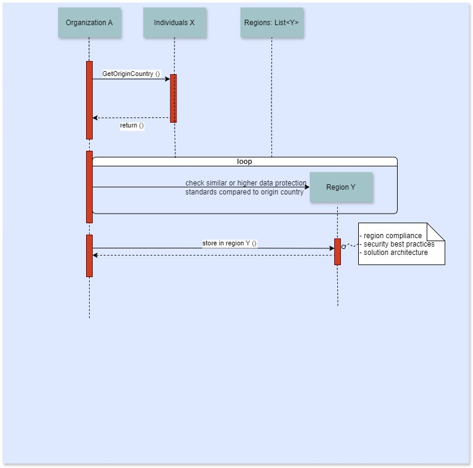

# Scenario B: Sharing data across countries that adhere to same specific set of standards

Transfer of in-scope data may be allowed to countries that
adhere to the same specific set of standards (or higher) than
the originating country with permissions or notification to the
regulators.

_Scenario B_

This diagram shows the process of selecting a Region to store
data based on its origin country:

- Organization A retrieves the origin country of the data from
  Individuals X.
- Organization A checks available Regions for different
  countries that potentially have similar or higher data
  protection standards compared to the origin country.
- When Region Y meets the requirements, the data is stored in
  that Region.
