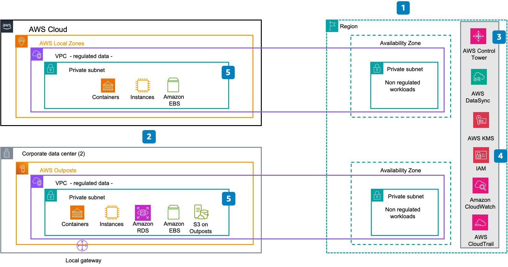
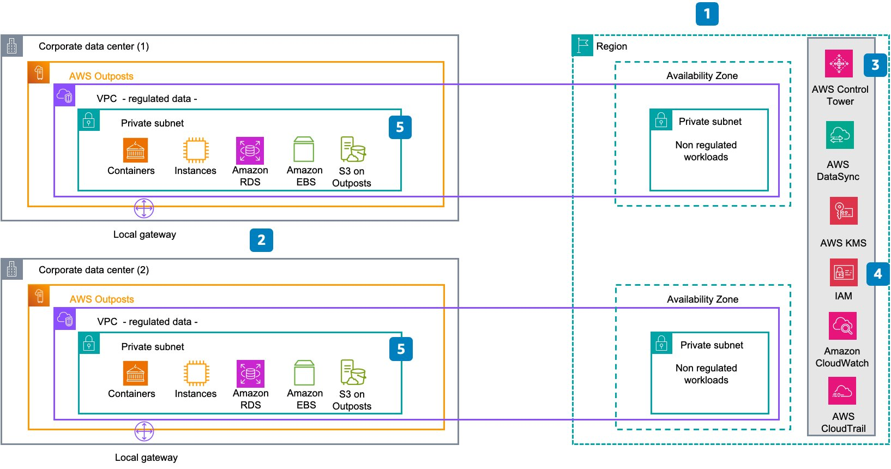

# Scenario C: Maintain primary service copy within country or jurisdiction

In a scenario where the law mandates data residency requirements
that specify that the primary copy of the data must be
maintained within the country or jurisdiction, several factors
should be considered.

In this case, in-scope data can be stored or transferred outside
the borders, but the primary servicing copy must be held within
the border of your jurisdiction.

For your deployment needs, you have two options depending on
the availability of Local Zones in your
[location](https://aws.amazon.com/about-aws/global-infrastructure/localzones/locations/ "https://aws.amazon.com/about-aws/global-infrastructure/localzones/locations/")
and the specific workloads you need to deploy, as outlined in
the following diagrams:

_Scenario C, option one: AWS Local Zones_

The first option for deploying AWS
services specifically focuses on the use of AWS Local Zones
and AWS Outposts:

1. Assess data residency requirements specific to the
   organization and regulatory environment, and identify
   regulated data.
2. Plan, order, and deploy
   [AWS Outposts racks](https://aws.amazon.com/outposts/rack/ "https://aws.amazon.com/outposts/rack/") in the corporate data centers for
   [high
   availability](../../../whitepapers/latest/aws-outposts-high-availability-design/aws-outposts-high-availability-design.md "../../../whitepapers/latest/aws-outposts-high-availability-design/aws-outposts-high-availability-design.md") alongside
   [AWS Local Zones](https://aws.amazon.com/about-aws/global-infrastructure/localzones/ "https://aws.amazon.com/about-aws/global-infrastructure/localzones/").
3. (Optional) Set up the
   [landing
   zone](../../../controltower/latest/userguide/setting-up.md "../../../controltower/latest/userguide/setting-up.md") for centralized management and governance.
   Then add the Outpost accounts to your AWS Organization.
4. Configure access levels for your accounts for proper
   permissions and security.
5. Deploy regulated workloads on AWS Local Zones and AWS Outposts. Optionally, you can configure backups and
   snapshots to be stored within the Region and synchronize
   your Amazon S3 data accordingly.

_Scenario C, option two: AWS Outposts_

The second option for deploying AWS
services focuses on the use of AWS Outposts:

1. Assess data residency requirements specific to the
   organization and regulatory environment, and identify
   regulated data.
2. Plan, order, and deploy
   [AWS Outposts racks](https://aws.amazon.com/outposts/rack/ "https://aws.amazon.com/outposts/rack/") in the corporate data centers with
   [high
   availability](../../../whitepapers/latest/aws-outposts-high-availability-design/aws-outposts-high-availability-design.md "../../../whitepapers/latest/aws-outposts-high-availability-design/aws-outposts-high-availability-design.md").
3. (Optional) Set up the
   [landing
   zone](../../../controltower/latest/userguide/setting-up.md "../../../controltower/latest/userguide/setting-up.md") for centralized management and governance.
   Then add the Outpost accounts to your AWS Organization.
4. Configure access levels for your accounts for proper
   permissions and security.
5. Deploy regulated workloads on AWS Outposts. Optionally,
   you can configure backups and snapshots to be stored
   within the Region and synchronize your Amazon S3 data
   accordingly.
