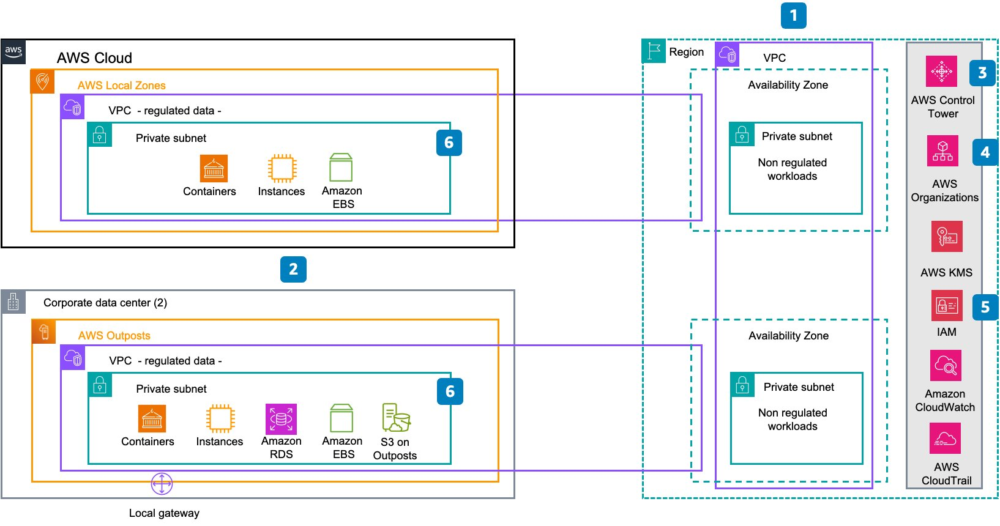
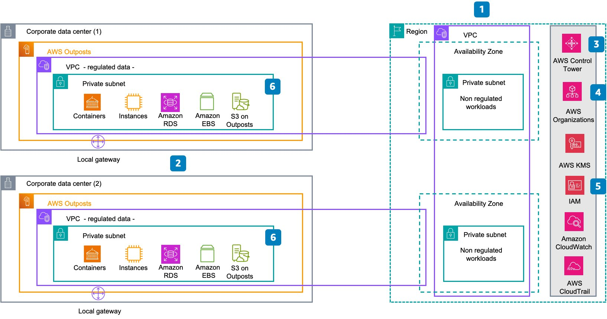

# Scenario D: In-scope data must be stored and processed in country

In a scenario where the law mandates that data must be stored
and processed within the borders of a specific country,
organizations operating within that jurisdiction must adhere to
strict data localization policies.

For your deployment needs, you have two options depending on the
availability of Local Zones in your
[location](https://aws.amazon.com/about-aws/global-infrastructure/localzones/locations/ "https://aws.amazon.com/about-aws/global-infrastructure/localzones/locations/")
and the specific workloads you need to deploy, as outlined in
the following diagrams:

_Scenario D, option one: AWS Local Zones_

The first option for deploying AWS services
focuses on the use of AWS Local Zones and AWS Outposts:

1. Assess data residency requirements specific to the
   organization and regulatory environment. And identify
   regulated data.
2. Plan, order, and deploy
   [AWS Outposts racks](https://aws.amazon.com/outposts/rack/ "https://aws.amazon.com/outposts/rack/") in the corporate data centers for
   [high
   availability](../../../whitepapers/latest/aws-outposts-high-availability-design/aws-outposts-high-availability-design.md "../../../whitepapers/latest/aws-outposts-high-availability-design/aws-outposts-high-availability-design.md") alongside
   [AWS Local Zones](https://aws.amazon.com/about-aws/global-infrastructure/localzones/ "https://aws.amazon.com/about-aws/global-infrastructure/localzones/").
3. Set up the
   [landing
   zone](../../../controltower/latest/userguide/setting-up.md "../../../controltower/latest/userguide/setting-up.md") for centralized management and governance. Then
   add the Outpost accounts to your AWS Organization.
4. Configure service-control policies (SCPs) in the
   Organizational Unit (OU) that belongs to regulated data,
   using some or all of the Local Zone data residency
   [custom
   guardrails](https://aws.amazon.com/blogs/compute/best-practices-for-managing-data-residency-in-aws-local-zones-using-landing-zone-controls/ "https://aws.amazon.com/blogs/compute/best-practices-for-managing-data-residency-in-aws-local-zones-using-landing-zone-controls/"). For Outposts, you can use
   [custom
   controls](https://aws.amazon.com/blogs/compute/architecting-for-data-residency-with-aws-outposts-rack-and-landing-zone-guardrails/ "https://aws.amazon.com/blogs/compute/architecting-for-data-residency-with-aws-outposts-rack-and-landing-zone-guardrails/").
5. Configure access levels for your accounts for proper
   permissions and security.
6. Deploy the regulated workload on the Local Zone and Outpost.

_Scenario D, option two: AWS Outposts_

The second option for deploying AWS services focuses on the use
of AWS Outposts without AWS Local Zones. Follow steps 1 to 5 as
above in Option 1: AWS Local Zones, and deploy the regulated
workload on AWS Outposts.

**Note:** For business continuity
and disaster recovery (DR) purposes, backup and snapshot
considerations are not included in this step. Since data is
being stored within a specific Region or Local Zone, backup or
snapshot to a remote Region may be necessary for meeting RTO and
RPO requirements. These aspects should be validated with
relevant regulators.
