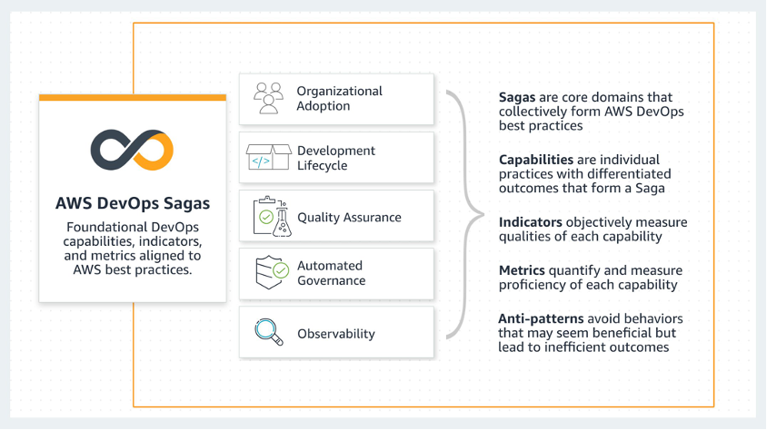

# The DevOps Sagas

To remove ambiguity about what DevOps means to us in this guidance, we define it through
the AWS DevOps Sagas—a collection of modern capabilities that together form a comprehensive
approach to designing, developing, securing, and efficiently operating software at cloud scale.
We chose the term _saga_ to reflect that sustainably practicing DevOps takes
time and involves an ongoing, interconnected set of capabilities. Each DevOps saga includes
prescriptive capabilities that provide indicators of success, metrics to measure, and common
anti-patterns to avoid.

This section outlines each of the DevOps Sagas, featuring definitions, capabilities,
indicators of success, metrics, and anti-patterns. The DevOps Sagas have been carefully crafted to focus on DevOps adoption
and sustainable usage over time. The capabilities are solely focused on operating in a DevOps
environment. When assessing workloads that will operate in a DevOps environment in the
AWS Cloud, we recommend that you use the DevOps Guidance in conjunction with the [AWS
Well-Architected Framework whitepaper](../framework/welcome.md "../framework/welcome.md").

The DevOps Sagas are:

- **Organizational adoption:**
  Inspires the formation of a customer-centric, adaptive culture
  focused on optimizing people-driven processes, personal and
  professional development, and improving developer experience to
  set the foundation for successful DevOps adoption.
- **Development lifecycle:**  Aims to enhance the organization's
  capacity to develop, review, and deploy workloads swiftly and securely. It uses feedback
  loops, consistent deployment methods, and the _everything as code_
  approach to attain efficiency in deployment.
- **Quality assurance:** Advocates for a proactive, test-first
  methodology integrated into the development process to help ensure that applications are
  well-architected by design, secure, cost-efficient, sustainable, and delivered with
  increased agility through automation.
- **Automated governance:** Facilitates directive, detective,
  preventive, and responsive measures at all stages of the development process. It emphasizes
  risk management, business process adherence, and application and infrastructure compliance
  at scale using automated processes, policies, and guardrails.
- **Observability:** Presents an approach to incorporating
  observability within environment and workloads, allowing teams to detect and address issues,
  improve performance, reduce costs, and help ensure alignment with business objectives and
  customer needs.

###### Sagas

- [Organizational adoption](organizational-adoption.md "organizational-adoption.md")
- [Development lifecycle](development-lifecycle.md "development-lifecycle.md")
- [Quality assurance](quality-assurance.md "quality-assurance.md")
- [Automated governance](automated-governance.md "automated-governance.md")
- [Observability](observability.md "observability.md")
