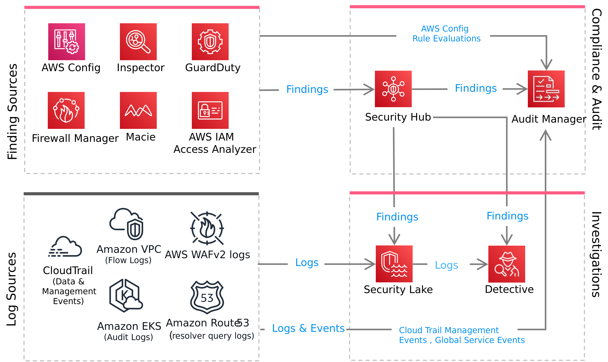

# DSOPS03-BP02 Automate evidence collection and reporting

Manual evidence collection is time-consuming, error-prone, and may not provide a
comprehensive view of your AWS environment. Automating these processes improve accuracy,
efficiency, and audit readiness.

**Desired outcome:** Automated evidence collection and reporting
system that continuously gathers, organizes, and presents compliance data across your workloads
with minimal manual intervention.

**Common anti-patterns:**

- Relying solely on manual screenshots and documentation for audit evidence.
- Collecting evidence only during audit periods rather than continuously.
- Storing evidence in formats that are not readily searchable or retrievable.

**Benefits of establishing this best practice:**

- Reduces audit preparation time from weeks to hours or days.
- Provides real-time visibility into compliance status and security posture.
- Reduces human error and maintains consistent quality of documentation.
- Enables proactive identification and remediation of compliance gaps.

**Level of risk exposed if this best practice is not established:**
Medium

## Implementation guidance

Implementing automated evidence collection requires a systematic approach that combines
AWS services with third-party tools where necessary. Establish a centralized evidence
repository with proper access controls, implement continuous monitoring and collection
mechanisms, and create automated reporting workflows.

### Implementation steps

Design audit-ready applications using a source, analyze, visualize, evidence (SAVE)
paradigm. The following diagram illustrates how this paradigm applies in practice:

1. **Source**: Begin by identifying sources. There are two
   types of sources:
   - **Logs**: Collect and forward logs to a centralized
     location. Use a dedicated [log archive account](../../../prescriptive-guidance/latest/security-reference-architecture/log-archive.md "../../../prescriptive-guidance/latest/security-reference-architecture/log-archive.md") to store large volumes of logs securely, and maintain
     integrity of log files. [Amazon
     Security Lake](https://aws.amazon.com/security-lake/ "https://aws.amazon.com/security-lake/") can collect logs and events from several supported AWS services.
     Security Lake automatically converts logs and events sourced from supported AWS services to
     the open-source Open Cybersecurity Schema Framework [(OCSF)](https://github.com/ocsf "https://github.com/ocsf") schema. After conversion to OCSF,
     Security Lake stores this data in an Amazon S3 bucket (one bucket per AWS Region) in your
     AWS account. Security Lake sources include:
     - [AWS CloudTrail
       management and data events (S3, Lambda)](../../../awscloudtrail/latest/userguide/cloudtrail-events.md "../../../awscloudtrail/latest/userguide/cloudtrail-events.md")
     - [Amazon Elastic Kubernetes Service (Amazon EKS)
       Audit Logs](../../../eks/latest/best-practices/auditing-and-logging.md "../../../eks/latest/best-practices/auditing-and-logging.md")
     - [Amazon Route 53 resolver
       query logs](../../../Route53/latest/DeveloperGuide/resolver-query-logs.md "../../../Route53/latest/DeveloperGuide/resolver-query-logs.md")
     - [AWS Security Hub
       findings](../../../securityhub/latest/userguide/securityhub-findings.md "../../../securityhub/latest/userguide/securityhub-findings.md")
     - [Amazon Virtual Private Cloud
       (Amazon VPC) Flow Logs](../../../vpc/latest/userguide/flow-logs.md "../../../vpc/latest/userguide/flow-logs.md")
     - [AWS WAF logs](../../../waf/latest/developerguide/logging.md "../../../waf/latest/developerguide/logging.md")

   - **Findings**: [AWS Config](../../../config/latest/developerguide/WhatIsConfig.md "../../../config/latest/developerguide/WhatIsConfig.md"), [Amazon Inspector](../../../inspector/latest/user/what-is-inspector.md "../../../inspector/latest/user/what-is-inspector.md"), [Amazon GuardDuty](../../../guardduty/latest/ug/what-is-guardduty.md "../../../guardduty/latest/ug/what-is-guardduty.md"), [Amazon Macie](https://aws.amazon.com/macie/ "https://aws.amazon.com/macie/"), and [AWS
     IAM Access Analyzer](../../../IAM/latest/UserGuide/what-is-access-analyzer.md "../../../IAM/latest/UserGuide/what-is-access-analyzer.md") can automatically detect and generate findings. These
     findings are derived from compliance drifts, threats, vulnerabilities, and
     over-permissive configurations. Consider enabling [built-in security
     standards](../../../securityhub/latest/userguide/standards-reference.md "../../../securityhub/latest/userguide/standards-reference.md"), with AWS Security Hub CSPM to automatically collect and correlate findings
     related to well-known security standards (for example, NIST 800-53 Rev. 5).

2. **Analyze**: You can use AWS services and third-party
   security information and event management (SIEM) tools to run analytical queries and
   discover new insights from logs. You can also use AWS services and third-party
   providers (known as finding providers) to conduct advanced analytics.
   - **Run custom analytics**: Amazon Security Lake offers [several integrations](../../../security-lake/latest/userguide/aws-integrations.md "../../../security-lake/latest/userguide/aws-integrations.md") with downstream analytics tools including:
     - [Amazon Bedrock](../../../bedrock/latest/userguide/what-is-bedrock.md "../../../bedrock/latest/userguide/what-is-bedrock.md") and [Amazon SageMaker AI AI](../../../sagemaker/latest/dg/whatis.md "../../../sagemaker/latest/dg/whatis.md") can generate
       AI-powered insights from Security Lake data.
     - [Amazon
       Detective](../../../detective/latest/userguide/what-is-detective.md "../../../detective/latest/userguide/what-is-detective.md") can investigate and identify the root cause of security
       findings or suspicious activities.
     - [Amazon OpenSearch Service](../../../opensearch-service/latest/developerguide/what-is.md "../../../opensearch-service/latest/developerguide/what-is.md")
       and [Amazon OpenSearch Service
       ingestion pipeline](../../../opensearch-service/latest/developerguide/ingestion.md "../../../opensearch-service/latest/developerguide/ingestion.md") can generate security insights from Security Lake data by
       using OpenSearch Service ingestion.
     - Since Security Lake normalizes logs into the OCSF format, you can forward data to
       several [popular
       SIEM and analytics tools](../../../securityhub/latest/userguide/securityhub-partner-providers.md "../../../securityhub/latest/userguide/securityhub-partner-providers.md") without having to build transformations.

   - **Use built-in intelligence**: Find providers like
     [AWS
     services](../../../securityhub/latest/userguide/securityhub-internal-providers.md "../../../securityhub/latest/userguide/securityhub-internal-providers.md") and [third
     parties](../../../securityhub/latest/userguide/securityhub-partner-providers.md "../../../securityhub/latest/userguide/securityhub-partner-providers.md") that use built-in intelligence to generate and send new findings
     to Security Hub. For AWS Security Hub, a finding is an observable record of a security check or
     a security-related detection. The provider analyzes your data and delivers findings,
     reducing the need for custom query development.

   For example, Amazon GuardDuty analyzes AWS logs and network traffic to detect
   threats and malicious activity in your AWS environment. It uses machine learning,
   anomaly detection, and integrated threat intelligence to identify unexpected and
   unauthorized activities like cryptocurrency mining, credential harvesting, and
   potentially compromised instances.

   Security Hub ingests and groups related findings to generate [insights](../../../securityhub/latest/userguide/securityhub-insights.md "../../../securityhub/latest/userguide/securityhub-insights.md").

3. **Visualize:** Use built-in dashboards or build your own
   visualizations and make them available through self-service portals. Allow auditors
   access to self-service portals so that they can collect the evidence they need without
   having to rely on your teams.
   - **Use built-in dashboards**: AWS Config, Amazon GuardDuty, and
     Amazon Inspector provide built-in summary dashboards over findings. When you consolidate your
     findings to Security Hub, it can contextualize those findings, map it to known security
     standards, and present overall security scores. Security Hub also lets you create your
     [own
     insights](../../../securityhub/latest/userguide/securityhub-custom-insights.md "../../../securityhub/latest/userguide/securityhub-custom-insights.md") and build visualizations over those insights.
   - **Build your own visualizations**: Explore and
     interpret logs in Security Lake by combining with a query tool like [Amazon Athena](https://aws.amazon.com/athena/ "https://aws.amazon.com/athena/"). Build visualizations and dashboards using
     business intelligence and reporting tools like [Amazon Quick Suite](https://aws.amazon.com/quicksuite/ "https://aws.amazon.com/quicksuite/"). With [Amazon OpenSearch Service](../../../opensearch-service/latest/developerguide/configure-client-security-lake.md "../../../opensearch-service/latest/developerguide/configure-client-security-lake.md"), you can create a subscription that replicates data from Security Lake
     to your ingestion pipeline and build visualizations on top.

4. **Evidence:** A traditional audit process follows a pattern
   like the one below and can take multiple weeks. With an automated solution you can
   potentially reduce this effort.

|                   | With automation | Without automation    | Automation capabilities                                                                                       |
| ----------------- | --------------- | --------------------- | ------------------------------------------------------------------------------------------------------------- |
| Planning          | 1-2 weeks       | <1 week               | Pre-built mapping frameworks. Lists cloud provider technical controls mapping to known security standards. |
| Evidence requests | 2-3 weeks       | Immediate. No delays. | Pre-provisioned auditor roles. Auditors have real-time access to compliance dashboards.                    |
| Evidence review   | 3-4 weeks       | 1-2 weeks             | Pre-organized and categorized by security standards.                                                          |
| Report writing    | 2-3 weeks       | 1-2 weeks             | Automated report generation                                                                                   |
| **Total**         | **8-12 weeks**  | **3-5 weeks**         | –                                                                                                             |

Consider using [AWS Audit Manager](../../../audit-manager/latest/userguide/what-is.md "../../../audit-manager/latest/userguide/what-is.md") to
automatically collect evidence and generate reports. Audit Manager provides [prebuilt frameworks](../../../audit-manager/latest/userguide/framework-overviews.md "../../../audit-manager/latest/userguide/framework-overviews.md") that structure and automate assessments for a given
compliance standard or regulation. You can create an assessment from a pre-built
framework. When you create an assessment, Audit Manager automatically runs resource
evaluations and collects evidences using built-in integrations with several [AWS Services](../../../audit-manager/latest/userguide/control-data-sources.md "../../../audit-manager/latest/userguide/control-data-sources.md"). The data that's collected is automatically transformed into
audit-friendly evidence.

Audit Manager is extensible. For example, you can create a [custom framework](../../../audit-manager/latest/userguide/example_auditmanager_Scenario_CustomFrameworkFromConformancePack_section.md "../../../audit-manager/latest/userguide/example_auditmanager_Scenario_CustomFrameworkFromConformancePack_section.md") by wrapping over an AWS Config Conformance Pack. AWS Config is
[also
extensible](../../../config/latest/developerguide/evaluate-config_develop-rules.md "../../../config/latest/developerguide/evaluate-config_develop-rules.md"). You can develop custom rules with Config, have Audit Manager
trigger those rules, collect the evidence, and produce audit-ready reports.

## Resources

**Related best practices:**

- [SEC04-BP01 Configure service and application logging](../security-pillar/sec_detect_investigate_events_app_service_logging.md "../security-pillar/sec_detect_investigate_events_app_service_logging.md")
- [SEC04-BP02 Analyze logs, findings, and metrics centrally](../security-pillar/sec_detect_investigate_events_logs.md "../security-pillar/sec_detect_investigate_events_logs.md")
- [OPS08-BP02 Analyze workload logs](../operational-excellence-pillar/ops_workload_observability_analyze_workload_logs.md "../operational-excellence-pillar/ops_workload_observability_analyze_workload_logs.md")
- [Best practice 5.4 – Secure the audit logs that record every data or resource access in
  analytics infrastructure](../analytics-lens/best-practice-5.4---secure-the-audit-logs-that-record-every-data-or-resource-access-in-analytics-infrastructure..md "../analytics-lens/best-practice-5.4---secure-the-audit-logs-that-record-every-data-or-resource-access-in-analytics-infrastructure..md")

**Related documents:**

- [Automate evidence gathering for compliance audit reports](https://maturitymodel.security.aws.dev/en/4.-optimized/automate-evidence-gathering/ "https://maturitymodel.security.aws.dev/en/4.-optimized/automate-evidence-gathering/")
- [Audit Manager Mind Map](https://www.xmind.net/m/AY2Rgu "https://www.xmind.net/m/AY2Rgu")
- [How to visualize Amazon Security Lake findings with Quick Suite](https://aws.amazon.com/blogs/security/how-to-visualize-amazon-security-lake-findings-with-amazon-quicksight/ "https://aws.amazon.com/blogs/security/how-to-visualize-amazon-security-lake-findings-with-amazon-quicksight/")
- [Introducing Amazon OpenSearch Service and Amazon Security Lake integration to simplify security
  analytics](https://aws.amazon.com/blogs/aws/introducing-amazon-opensearch-service-zero-etl-integration-for-amazon-security-lake/ "https://aws.amazon.com/blogs/aws/introducing-amazon-opensearch-service-zero-etl-integration-for-amazon-security-lake/")

**Related videos:**

- [Visualizing Security Lake Data with Quick Suite:
  2024 Quick Suite Learning Series](https://www.youtube.com/watch?v=vxvMHnfCCGw "https://www.youtube.com/watch?v=vxvMHnfCCGw")
- [Remediating Amazon GuardDuty and AWS Security Hub
  Findings](https://youtu.be/nyh4imv8zuk "https://youtu.be/nyh4imv8zuk")
- [AWS re:Invent 2025 -
  Observability & Security unite: Unify your data in Amazon CloudWatch (COP361)](https://www.youtube.com/watch?v=5-_l3MYJdLs "https://www.youtube.com/watch?v=5-_l3MYJdLs")
- [AWS re:Invent 2025 - Building
  agentic workflows for augmented observability (COP405)](https://www.youtube.com/watch?v=fLDjHr6eEIw "https://www.youtube.com/watch?v=fLDjHr6eEIw")

**Related examples:**

- [Workshop: AWS Cloud – An Auditors Lens](https://catalog.us-east-1.prod.workshops.aws/workshops/be5ac274-af86-47ef-b3ae-efae7fad136c/en-US "https://catalog.us-east-1.prod.workshops.aws/workshops/be5ac274-af86-47ef-b3ae-efae7fad136c/en-US")
- [Workshop: AWS Config Resource Compliance Dashboard - Part of Cloud Intelligence
  Dashboards Framework](https://catalog.workshops.aws/awscid/en-US/dashboards/additional/config-resource-compliance-dashboard/ "https://catalog.workshops.aws/awscid/en-US/dashboards/additional/config-resource-compliance-dashboard/")
