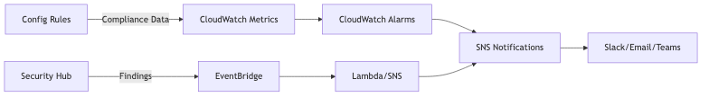

# DSOPS04-BP01 Maintain continuous visibility of your compliance

status

Proactive monitoring reduces risks of data breaches, misconfigurations, and audit failures
by providing visibility into resource configurations and user activity.

**Desired outcome:** Improve compliance visibility with real-time
alerts for deviations from regulatory requirements or internal policies.

**Common anti-patterns:**

- Current data collection processes exclude critical sources.
- Teams do not analyze collected data to identify compliance drifts, potentially missing
  opportunities for improvement.

**Benefits of establishing this best practice:**

- Increased visibility into compliance status across AWS resources.
- Reduced manual audit efforts and associated costs.
- Reduced risk of violations and associated penalties.
- Early detection of configuration drift and policy violations.
- Improves continual regulatory adherence rather than point-in-time assessments.

**Level of risk exposed if this best practice is not established:**
Medium

## Implementation guidance

Start by enabling logging and monitoring services, then define compliance baselines using
AWS tools. Prioritize the following:

1. Derive and aggregate findings from each source. Gathering useful telemetry data can
   improve your findings.
2. Prefer ready-made findings and known analysis methods where possible. For example,
   [AWS Config](https://aws.amazon.com/config/ "https://aws.amazon.com/config/"), [Amazon Inspector](https://aws.amazon.com/inspector/ "https://aws.amazon.com/inspector/"), [Amazon GuardDuty](https://aws.amazon.com/guardduty/ "https://aws.amazon.com/guardduty/"), [Amazon Macie](https://aws.amazon.com/macie/ "https://aws.amazon.com/macie/"), and [AWS IAM Access Analyzer](https://aws.amazon.com/iam/features/analyze-access/ "https://aws.amazon.com/iam/features/analyze-access/") can
   automatically detect and generate findings resulting from compliance drifts, threats,
   vulnerabilities and over-permissive configurations.
3. Rank and score compliance findings by dimensions such as data sensitivity, network
   boundaries (for example, VPC or subnet), geo-location, trust boundary, and organizational
   priorities. Adjust weights as needed. Keep metrics updated with findings sourced in near
   real time.
4. Set alarms and send notifications to a pre-defined audience when thresholds are
   breached.

### Implementation steps

1.  **Collect logs**:
    - **Using AWS CloudTrail:** AWS CloudTrail is a service that enables
      governance, compliance, and operational auditing of your AWS account. It records
      and logs API activities and events that occur in your AWS account. These include
      [management events](../../../awscloudtrail/latest/userguide/cloudtrail-events.md#cloudtrail-management-events "../../../awscloudtrail/latest/userguide/cloudtrail-events.md#cloudtrail-management-events"), [data events](../../../awscloudtrail/latest/userguide/cloudtrail-events.md#cloudtrail-data-events "../../../awscloudtrail/latest/userguide/cloudtrail-events.md#cloudtrail-data-events"), [network activity events](../../../awscloudtrail/latest/userguide/cloudtrail-events.md#cloudtrail-network-events "../../../awscloudtrail/latest/userguide/cloudtrail-events.md#cloudtrail-network-events") and [insights events](../../../awscloudtrail/latest/userguide/cloudtrail-events.md#cloudtrail-insights-events "../../../awscloudtrail/latest/userguide/cloudtrail-events.md#cloudtrail-insights-events").
      - Events contain information about who, what, when, how, and the outcome of
        the event. By default, CloudTrail logs management events only. These events are
        enabled by default [and can be
        viewed](../../../awscloudtrail/latest/userguide/view-cloudtrail-events.md "../../../awscloudtrail/latest/userguide/view-cloudtrail-events.md") through the AWS Management Console (or with the CLI) for up to 90 days. To
        retain data beyond 90 days, you can create your own CloudTrail trail and filter events
        by service, resource, or event type.
      - AWS services are integrated with CloudTrail. For example, when you provision an
        Amazon S3 bucket, you [can
        enable](../../../AmazonS3/latest/userguide/cloudtrail-logging-s3-info.md "../../../AmazonS3/latest/userguide/cloudtrail-logging-s3-info.md") both management and data events (for example,GetObject,
        DeleteObject, and PutObject).

    - **Other log sources:** Beyond CloudTrail, other important log
      sources include [Amazon VPC Flow Logs](../../../vpc/latest/userguide/flow-logs.md "../../../vpc/latest/userguide/flow-logs.md"), [Amazon EKS
      Audit Logs](../../../eks/latest/userguide/control-plane-logs.md "../../../eks/latest/userguide/control-plane-logs.md"), [Amazon Route 53 DNS Query
      Logs](../../../Route%C2%A053/latest/DeveloperGuide/query-logs.md "../../../Route%C2%A053/latest/DeveloperGuide/query-logs.md"), and [AWS WAFv2 Logs](../../../waf/latest/developerguide/logging.md "../../../waf/latest/developerguide/logging.md").
      Additionally, capture logs generated by your applications and their dependent
      libraries and [forward those to Amazon CloudWatch](../../../prescriptive-guidance/latest/implementing-logging-monitoring-cloudwatch/welcome.md "../../../prescriptive-guidance/latest/implementing-logging-monitoring-cloudwatch/welcome.md").

2.  **Aggregate logs at a central place**:
    - **Aggregate CloudTrail logs**: AWS Control Tower creates a [Log Archive account](../../../prescriptive-guidance/latest/security-reference-architecture/log-archive.md "../../../prescriptive-guidance/latest/security-reference-architecture/log-archive.md") within a Security Organizational Unit (OU) when
      customers set up their own Landing Zone. Control Tower version 3.0 (released July
    2022. automatically configures organizational logging with these capabilities.

        + An organization-level AWS CloudTrail trail is deployed in the organization's
         management account. This automatically captures actions of each member account.
        + The logs are stored in a central Amazon S3 bucket located in the Log Archive
         account.
        + By default, this trail is configured to log management events only.
        + You can also manually enable CloudTrail [organization trails](../../../awscloudtrail/latest/userguide/cloudtrail-delegated-administrator.md "../../../awscloudtrail/latest/userguide/cloudtrail-delegated-administrator.md"). For more detail, see [Creating
         a trail for an organization](../../../awscloudtrail/latest/userguide/creating-trail-organization.md "../../../awscloudtrail/latest/userguide/creating-trail-organization.md").

    - **Aggregate Amazon CloudWatch logs**: You can strengthen your
      security and regulatory posture by collecting logs from applications that process
      sensitive data, including PII, PHI, and payment card data. To accomplish this,
      aggregate selected CloudWatch logs from your workload accounts into the centralized Log
      Archive account:
      - In each workload account, identify the CloudWatch log groups you want to
        centralize.
      - Create a CloudWatch Logs subscription filter for each log group.
      - Set the destination of the subscription filter to a CloudWatch logs destination
        in the Log Archive Account.
      - In the Log Archive Account, create a CloudWatch logs destination.
      - Configure the destination to point to an Amazon Data Firehose delivery stream. Create
        a Firehose delivery stream.
      - Configure the stream to deliver logs to an S3 bucket in the Log Archive
        Account.
      - Finally, for each CloudWatch log group in the workload accounts, enable the
        subscription to send logs to the destination in the Log Archive Account.

3.  **Collect and aggregate findings:** Collect findings across
    your AWS environments by enabling compliance standards. There are two approaches, one
    using AWS Control Tower and other using AWS Security Hub CSPM.
    - **Using AWS Control Tower**: In a multi-account environment,
      we recommend starting with AWS Control Tower to set organization-wide, consistent
      guardrails aligned with compliance standards. AWS Control Tower consolidates 700-plus
      controls marked as _mandatory_, _strongly
      recommended_, and _elective_.
      - To assist in choosing, controls are also grouped by categories. The
        categories are by _common controls_, by _AWS
        services_, by _frameworks_, and by
        _groups_. If you have already set up a landing zone using
        Control Tower, we recommend evaluating the 240-plus controls under the
        _digital sovereignty_ group. Alternatively, you can enable
        control by frameworks (for example, NIST-SP-800-53-r5, PCI-DSS-v4.0,
        CIS-AWS-Benchmark-v1.4, or CCCS-Medium-Cloud-Control-May-2019).
      - Technically, controls are implemented in three ways:
        - **Preventative controls:** Use service control
          policies (SCPs), resource control policies (RCPs), and declarative policies,
          which are part of AWS Organizations.
        - **Proactive controls:** Use [AWS CloudFormation hooks](../../../cloudformation-cli/latest/hooks-userguide/what-is-cloudformation-hooks.md "../../../cloudformation-cli/latest/hooks-userguide/what-is-cloudformation-hooks.md") and [hooks managed
          by AWS Control Tower](../../../controltower/latest/controlreference/update-hooks.md "../../../controltower/latest/controlreference/update-hooks.md").
        - **Detective controls:** Use AWS Config.

      - Compliance findings are aggregated through AWS Security Hub CSPM and AWS Config
        Aggregators which reside in your [audit account](../../../controltower/latest/userguide/accounts.md "../../../controltower/latest/userguide/accounts.md"). Security Hub CSPM
        controls are identified in the AWS Control Tower console as SH.ControlID (for
        example, SH.CodeBuild.1). When you enable a Security Hub managed control in Control
        Tower, it also enables Security Hub CSPM for you.

    - **Using AWS Security Hub CSPM**: In a single-account environment,
      consider starting from AWS Security Hub CSPM. Although it does not provide out-of-the-box
      preventative controls (unlike Control Tower), and is primarily meant to activate
      detective and proactive controls, it does provide a set of in-built security
      standards to map to. In AWS Security Hub, a _security standard_ is a
      set of requirements that's based [on regulatory
      frameworks](../../../securityhub/latest/userguide/standards-reference.md "../../../securityhub/latest/userguide/standards-reference.md"), industry best practices, or company policies. Security Hub CSPM maps these
      requirements to controls, and runs security checks on the controls to assess whether
      the requirements of a standard are being met. The security checks result in Security Hub CSPM
      findings. Depending upon the [integrations](../../../securityhub/latest/userguide/securityhub-integrations-view-filter.md "../../../securityhub/latest/userguide/securityhub-integrations-view-filter.md") you enable and [region availability](../../../securityhub/latest/userguide/securityhub-regions.md#securityhub-regions-integration-support "../../../securityhub/latest/userguide/securityhub-regions.md#securityhub-regions-integration-support"), Security Hub CSPM receives findings from:
      - [AWS Config](../../../securityhub/latest/userguide/securityhub-internal-providers.md#integration-config "../../../securityhub/latest/userguide/securityhub-internal-providers.md#integration-config")
      - [AWS Firewall Manager](../../../securityhub/latest/userguide/securityhub-internal-providers.md#integration-aws-firewall-manager "../../../securityhub/latest/userguide/securityhub-internal-providers.md#integration-aws-firewall-manager")
      - [Amazon GuardDuty](../../../securityhub/latest/userguide/securityhub-internal-providers.md#integration-amazon-guardduty "../../../securityhub/latest/userguide/securityhub-internal-providers.md#integration-amazon-guardduty")
      - [AWS Health](../../../securityhub/latest/userguide/securityhub-internal-providers.md#integration-health "../../../securityhub/latest/userguide/securityhub-internal-providers.md#integration-health")
      - [AWS Identity and Access Management Access Analyzer](../../../securityhub/latest/userguide/securityhub-internal-providers.md#integration-iam-access-analyzer "../../../securityhub/latest/userguide/securityhub-internal-providers.md#integration-iam-access-analyzer")
      - [Amazon Inspector](../../../securityhub/latest/userguide/securityhub-internal-providers.md#integration-amazon-inspector "../../../securityhub/latest/userguide/securityhub-internal-providers.md#integration-amazon-inspector")
      - [AWS IoT Device Defender](../../../securityhub/latest/userguide/securityhub-internal-providers.md#integration-iot-device-defender "../../../securityhub/latest/userguide/securityhub-internal-providers.md#integration-iot-device-defender")
      - [Amazon Macie](../../../securityhub/latest/userguide/securityhub-internal-providers.md#integration-amazon-macie "../../../securityhub/latest/userguide/securityhub-internal-providers.md#integration-amazon-macie")
      - [AWS Systems Manager Patch Manager](../../../securityhub/latest/userguide/securityhub-internal-providers.md#patch-manager "../../../securityhub/latest/userguide/securityhub-internal-providers.md#patch-manager")

4.  **Analyze findings**: AWS security and compliance
    services provide log and findings analysis capabilities through integrated machine
    learning and automated correlation engines.
    - [Amazon CloudWatch Logs Insights](../../../AmazonCloudWatch/latest/logs/AnalyzingLogData.md "../../../AmazonCloudWatch/latest/logs/AnalyzingLogData.md") enables SQL-like queries across massive log datasets
      to identify patterns and anomalies.
    - [Amazon Detective](https://aws.amazon.com/detective/ "https://aws.amazon.com/detective/") uses graph
      analytics and machine learning to automatically correlate findings from [GuardDuty](https://aws.amazon.com/guardduty/ "https://aws.amazon.com/guardduty/"), [Security Hub](https://aws.amazon.com/security-hub/ "https://aws.amazon.com/security-hub/"), and [Macie](https://aws.amazon.com/macie/ "https://aws.amazon.com/macie/"), creating visual timelines that assist security teams understand
      the relationships between entities, events, and potential threats.
    - [Amazon Security Lake](https://aws.amazon.com/security-lake/ "https://aws.amazon.com/security-lake/") centralizes security
      data from multiple sources into a standardized format, enabling advanced analytics
      through [Amazon Athena](https://aws.amazon.com/athena/ "https://aws.amazon.com/athena/") queries and
      integration with third-party Security Information and Event Management (SIEM) tools.
    - [Amazon OpenSearch Service](https://aws.amazon.com/opensearch-service/ "https://aws.amazon.com/opensearch-service/") provides
      real-time search and visualization capabilities for security logs, allowing
      organizations to build custom dashboards and perform complex threat hunting across
      their entire security data landscape.

5.  **Score and prioritize**: Security Hub CSPM uses a standardized scoring
    system to prioritize compliance findings based on severity and impact. Each finding
    receives a severity score from 0-100, where _informational_ findings
    score 0, _low_ findings score 1-39, _medium_
    findings score 40-69, _high_ findings score 70-89, and
    _critical_ findings score 90-100. The scoring considers multiple
    factors including the potential impact of the security issue, the exploitability of the
    vulnerability, and the confidence level of the detection mechanism. Security Hub also
    calculates a security score for each enabled standard, representing the percentage of
    passed security checks across the controls within that standard. This gives you a
    quantitative measure of your overall compliance posture that can be tracked over time
    and used to demonstrate improvement in security controls.
6.  **Set up metrics, alarms, and notifications**: You can
    establish compliance monitoring through automated metrics collection, alerting, and
    multi-channel notifications. As an example, see the following diagram:

    * AWS Config automatically publishes compliance metrics to [CloudWatch](https://aws.amazon.com/cloudwatch/ "https://aws.amazon.com/cloudwatch/"), enabling you to create alarms based on the number
     of non-conforming resources, compliance percentage by rule, or configuration changes
     across your environment.
    * Security Hub findings are automatically sent to [Amazon EventBridge](https://aws.amazon.com/eventbridge/ "https://aws.amazon.com/eventbridge/"), where you can create rules to filter findings
     by severity, resource type, or compliance standard, then route them to [AWS Lambda](https://aws.amazon.com/lambda/ "https://aws.amazon.com/lambda/") functions for custom processing,
     [Amazon SNS](https://aws.amazon.com/sns/ "https://aws.amazon.com/sns/") topics for email or SMS
     notifications, or directly to EventBridge API destination partners such as [Slack](../../../eventbridge/latest/userguide/eb-api-destination-partners.md#eb-api-destination-slack "../../../eventbridge/latest/userguide/eb-api-destination-partners.md#eb-api-destination-slack").
    * Additionally, you can use [CloudWatch composite
     alarms](../../../AmazonCloudWatch/latest/monitoring/Create_Composite_Alarm.md "../../../AmazonCloudWatch/latest/monitoring/Create_Composite_Alarm.md") to create sophisticated alerting logic that combines multiple
     compliance metrics.

The following are example metrics. These are not exhaustive and are shown only for
illustrative purposes.

| Name                                   | Category               | Measurement                                                                                                    | Engineering Value                                                                                  | Audit Value                                              |
| -------------------------------------- | ---------------------- | -------------------------------------------------------------------------------------------------------------- | -------------------------------------------------------------------------------------------------- | -------------------------------------------------------- |
| **Mean Time to Detection (MTTD)**      | Operational efficiency | Average time from when a compliance violation occurs to when it's detected                                     | Optimize monitoring coverage and alert tuning                                                      | Shows proactive monitoring effectiveness                 |
| **Mean Time to Identification (MTTI)** | Operational efficiency | Average time from detection to identification of the root cause of compliance violations                    | Plug gaps in compliance data collection                                                            | Evidence of timely identification                        |
| **Mean Time to Remediation (MTTR)**    | Operational efficiency | Average time from detection to full remediation of compliance issues. This includes duration spent in MTTI. | Identifies bottlenecks in compliance remediation workflows                                         | Evidence of timely corrective action                     |
| **Critical finding backlog age**       | Risk and impact        | How long high and critical severity findings remain unresolved                                                 | Prioritizes technical debt and resource allocation                                                 | Shows commitment to addressing high-risk issues promptly |
| **Compliance drift rate**              | Risk and impact        | Percentage of resources that drift from compliance over time periods                                           | Indicates configuration management effectiveness                                                   | Demonstrates ongoing continuous compliance efforts       |
| **Repeat violation rate**              | Risk and impact        | Percentage of compliance issues that recur after remediation                                                   | Identifies need for better root cause analysis and more thorough testing of remediation scripts | Shows effectiveness of remediation scripts               |
| **Compliance cost per resource**       | Business impact        | Average cost of maintaining compliance per monitored resource                                                  | Optimize monitoring tool selection, configuration management practices, and compliance skills   | Demonstrates cost-effective compliance management        |
| **Audit readiness score**              | BusinessiImpact        | Percentage of compliance evidence immediately available for audit requests                                     | Reduces manual effort during audit preparation                                                     | Streamlines audit processes and reduces examination time |

## Resources

**Related best practices:**

- [OPS01-BP03 Evaluate governance requirements](../operational-excellence-pillar/ops_priorities_governance_reqs.md "../operational-excellence-pillar/ops_priorities_governance_reqs.md")
- [OPS01-BP04 Evaluate compliance requirements](../operational-excellence-pillar/ops_priorities_compliance_reqs.md "../operational-excellence-pillar/ops_priorities_compliance_reqs.md")
- [SEC01-BP03 Identify and validate control objectives](../security-pillar/sec_securely_operate_control_objectives.md "../security-pillar/sec_securely_operate_control_objectives.md")
- [SEC01-BP04 Stay up to date with security threats and recommendations](../security-pillar/sec_securely_operate_updated_threats.md "../security-pillar/sec_securely_operate_updated_threats.md")
- [SEC01-BP08 Evaluate and implement new security services and features regularly](../security-pillar/sec_securely_operate_implement_services_features.md "../security-pillar/sec_securely_operate_implement_services_features.md")
- [SEC04-BP01 Configure service and application logging](../security-pillar/sec_detect_investigate_events_app_service_logging.md "../security-pillar/sec_detect_investigate_events_app_service_logging.md")
- [SEC04-BP02 Capture logs, findings, and metrics in standardized locations](../security-pillar/sec_detect_investigate_events_logs.md "../security-pillar/sec_detect_investigate_events_logs.md")
- [SEC04-BP03 Correlate and enrich security alerts](../security-pillar/sec_detect_investigate_events_security_alerts.md "../security-pillar/sec_detect_investigate_events_security_alerts.md")

**Related documents:**

- [Analyzing
  AWS CloudTrail in Amazon CloudWatch](https://aws.amazon.com/blogs/mt/analyzing-cloudtrail-in-cloudwatch/ "https://aws.amazon.com/blogs/mt/analyzing-cloudtrail-in-cloudwatch/")
- [How to detect and monitor Amazon Simple Storage Service (S3) access with AWS CloudTrail and Amazon CloudWatch](https://aws.amazon.com/blogs/mt/how-to-detect-and-monitor-amazon-simple-storage-service-s3-access-with-aws-cloudtrail-and-amazon-cloudwatch/ "https://aws.amazon.com/blogs/mt/how-to-detect-and-monitor-amazon-simple-storage-service-s3-access-with-aws-cloudtrail-and-amazon-cloudwatch/")
- [Metrics for automated compliance and guardrails](../devops-guidance/metrics-for-automated-compliance-and-guardrails.md "../devops-guidance/metrics-for-automated-compliance-and-guardrails.md")

**Related videos:**

- [AWS re:Invent 2020:
  A security operator's guide to practical AWS CloudTrail analysis](https://www.youtube.com/watch?v=Tr78kq-Oa70&t=623s "https://www.youtube.com/watch?v=Tr78kq-Oa70&t=623s")
