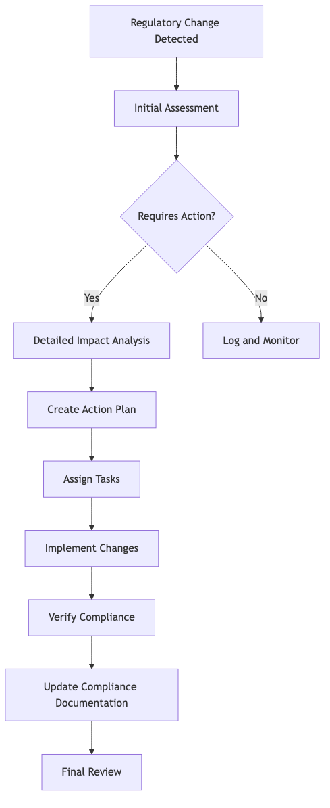

# DSOPS06-BP02 Manage regulatory changes

Regulatory changes directly impact cloud operations, security
controls, and compliance status. A structured change management
process helps you identify, assess, and implement regulatory
requirements efficiently. This practice assists in avoiding
compliance gaps and reducing risk exposure while maintaining
operational continuity in AWS environments.

**Desired outcome**: A systematic
process that proactively identifies, evaluates, and implements
regulatory changes while maintaining regulatory adherence across
each AWS environment.

**Common anti-patterns:**

- Technical or operational changes are not traced back to
  regulatory changes.
- Implementing regulatory changes without an effective change
  management process.
- Lacking integration between compliance processes and cloud
  operations.
- Using manual compliance checks that don't scale with cloud
  adoption.

**Benefits of establishing this best
practice:**

- Reduced risk through early identification of regulatory
  requirements.
- Lower costs by avoiding emergency remediation efforts.
- Increased business agility by incorporating regulatory adherence
  into development cycles.
- Improved audit readiness with documented evidence.
- Better decision-making for regional expansion and service
  adoption.

**Level of risk exposed if this best practice
is not established:** Medium

## Implementation guidance

Create a regulatory change management function with defined roles,
processes, and supporting technology. Establish regular review
cycles and maintain comprehensive documentation of compliance
activities. The following diagram shows an example change
management process.

Conducting a _detailed impact analysis_ is an
important part of this change management process. Consider asking
the following questions in this step:

- What is the expected impact of implementing or not
  implementing the change?
- When should the change be implemented?
- Is this change applicable to each workload, or just a subset?
- How will the change be implemented?
- Is this an operational change or a technical change, or both?
- Does the change require updates to existing security and
  compliance policies?
- What compliance controls need to be developed or enabled? Are
  there existing controls that need to be modified or replaced?
- Will this require building new infrastructure, or new systems
  integrations?
- Are there third-party dependencies to consider?
- How will the change be verified?
- How will compliance be monitored?

Consider using AWS resource tagging to identify and track which
resources are affected by specific regulatory requirements. Tags
can help you scope the impact and automate compliance checks for
affected resources.

Evaluate if the regulatory change mandates specific technical or
operational measures for applications hosted on AWS
infrastructure. For example, a healthcare regulator may mandate
that the cloud service provider employs residents or citizens of a
specific country or jurisdiction only
[for
providing operational support](https://www.aboutamazon.eu/news/aws/aws-european-sovereign-cloud-to-be-operated-by-eu-citizens "https://www.aboutamazon.eu/news/aws/aws-european-sovereign-cloud-to-be-operated-by-eu-citizens").

## Resources

**Related best practices:**

- [OPS01-BP03
  Evaluate governance requirements](../operational-excellence-pillar/ops_priorities_governance_reqs.md "../operational-excellence-pillar/ops_priorities_governance_reqs.md")
- [OPS01-BP04
  Evaluate compliance requirements](../operational-excellence-pillar/ops_priorities_compliance_reqs.md "../operational-excellence-pillar/ops_priorities_compliance_reqs.md")
- [SEC02-BP04
  Keep up to date with security recommendations](../security-pillar/sec_securely_operate_security_recommendations.md "../security-pillar/sec_securely_operate_security_recommendations.md")
- [SEC10-BP01
  Identify compliance requirements](../security-pillar/sec_compliance_requirements.md "../security-pillar/sec_compliance_requirements.md")

**Related Services:**

- [AWS CloudFormation](https://aws.amazon.com/cloudformation/ "https://aws.amazon.com/cloudformation/")
- [AWS Config](https://aws.amazon.com/config/ "https://aws.amazon.com/config/")
- [AWS Control Tower](https://aws.amazon.com/controltower/ "https://aws.amazon.com/controltower/")
- [AWS Security Hub](https://aws.amazon.com/security-hub/ "https://aws.amazon.com/security-hub/")
- [AWS Well-Architected Tool](https://aws.amazon.com/well-architected-tool/ "https://aws.amazon.com/well-architected-tool/")
