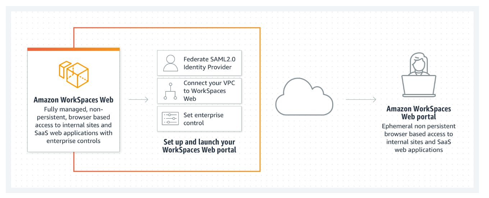
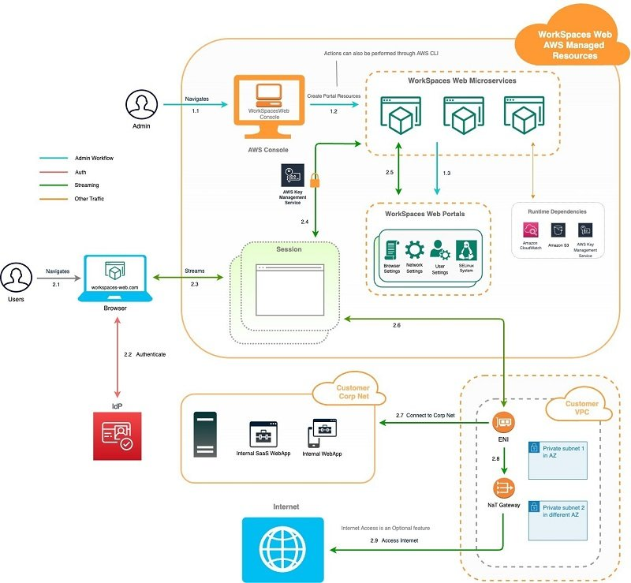

# Amazon delivering browser-based applications

An increasing number of applications are being delivered to users
using a web browser. What was once an exceptional use case for an
infrequently used application is now a mainstream delivery
mechanism for a vast array of applications being used within AWS
customer organizations.

It can be challenging to deliver web-based applications securely,
efficiently, and at a low cost. Amazon WorkSpaces Secure Browser
provides this capability in the form of a low cost, fully managed,
Linux-based service designed to facilitate secure browser access
to customers' internal websites and software as a service (SaaS)
applications from existing web browsers. This is achieved without
the administrative burden of appliances, managing infrastructure,
specialized client software, or VPN connections.

Amazon WorkSpaces Secure Browser is underpinned by a
non-persistent system delivering a Chromium-based browser to users
each time they authenticate and access the service. This verifies
that each user is using an updated browser that is secure and has
access to the resources that the user needs to fulfill their role.
At the end of a user's session, they disconnect from the browser,
and their browser session is terminated, avoiding sharing of data
that may be cached within their browser.

The service automatically scales to satisfy the demand from users
across a working day and week, and it is a cost-efficient service
for delivering secure web applications to users. This is due to
both the use of resources only when required by users and the
managed service, which removes the need for organizations to
operate and maintain a system that delivers a browser to users.

WorkSpaces Secure Browser provides compatibility with a broad
range of web sites due to the use of a standard web browser. This
compatibility verifies that web sites do not need to be
re-developed to support WorkSpaces Secure Browser.

While WorkSpaces Secure Browser uses Chromium web browsers running
on AWS resources with connectivity to customer VPCs, you should
also provide connectivity to the web sites that require user
access permissions. To do so, use the AWS networking service
portfolio to provide connectivity to an organization's required
intranet or internet web sites.

Users access WorkSpaces Secure Browser by authenticating against a
SAML 2.0-compatible identity provider of the customer's choosing.
Once authenticated, the user launches a WorkSpaces Secure Browser
session and initiates the streaming of pixels to the user's
endpoint device. The user's endpoint device must be a supported
device running a browser and could be either BYOD or device owned
and supplied by the user's employer. 

## Common WorkSpaces Secure Browser deployment scenarios

Several example problem solutions are presented here that our
typical customers encounter with providing access to web
applications. You can benefit by understanding how other
customers implement WorkSpaces Secure Browser workloads to solve
browser-based issues.

### Scenario 1: Isolate access to specific browse applications

**User scenario:** We need to
isolate the client component of a browser-based application so
that users can access it from anywhere, remove possibilities
of data leakage, and avoid the need and cost of delivering
this on a full desktop.

WorkSpaces Secure Browser is a fully managed service that
provides a resilient and scalable system to access web-based
services. AWS manages the browser instances, Chrome policies
can be used to secure the browser, and network controls, such
as security groups, can be used to limit traffic flow. You can
also configure WorkSpaces Secure Browser to obfuscate
sensitive data such as credit card or social security numbers
to assist with accommodating compliance initiatives such as
PCI.

### Scenario 2: Provide simplified access to web applications

**User scenario:** We have
several workers who need a simple process to access their time
sheets and other scheduling tools. These tools are all
web-based, and the users will have no access to a computer due
to the challenging nature of their work environment.

WorkSpaces Secure Browser can be accessed from a thin client
device and provides a kiosk mode experience which only
provides them with access to a limited application set. The
thin client device can quickly be deployed, secured, and
installed in areas where it may be challenging to install
traditional computers.

### Scenario 3: Provide safe access to external websites

**User scenario:** We would
like to provide some users with the ability to access a wider
range of external web sites from some devices but are
concerned about the propagation of viruses or malware inside
of our organization.

WorkSpaces Secure Browser is hosted by AWS in a secure
environment, and each user's browsing instance is destroyed at
the end of their session. Standard Chrome policies can be used
to lock down each browser instance, and you can fully isolate
the browsing environment and optionally have network traffic
pass through a web proxy to further limit access to untrusted
external sites. This solution significantly reduces the
possibility of external browsing activities from compromising
your production networks.
