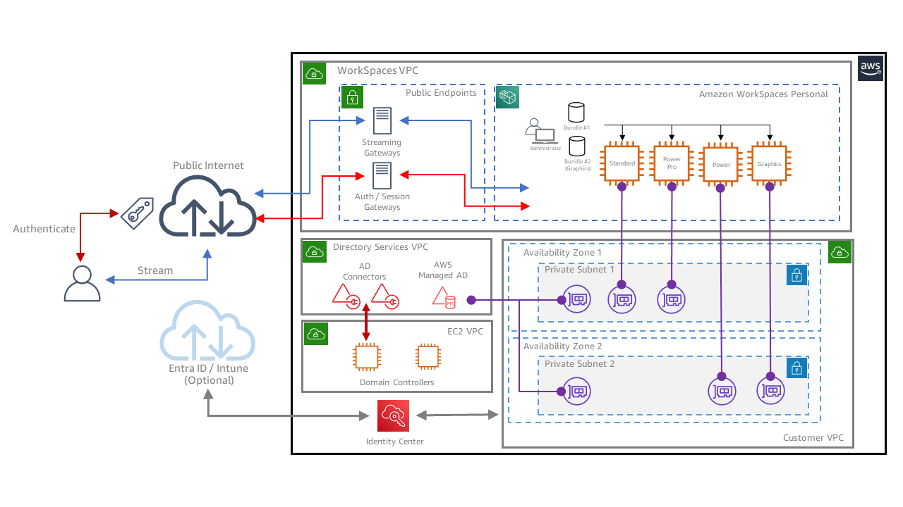
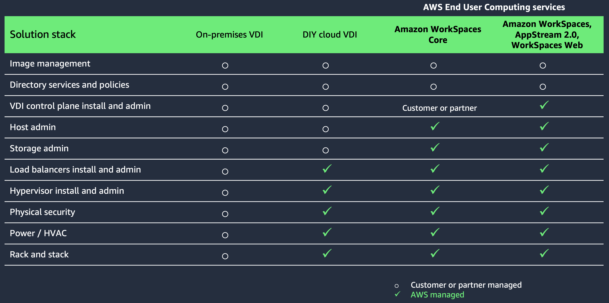

# Delivering desktops as a service

Delivering desktops as a service (DaaS) is a common approach to
simplifying desktop delivery, reducing administrative overheads,
and enabling flexible work models. DaaS offers flexibility when
choosing an OS and underlying hardware specifications, enabling a
wide variety of use cases with a pay-as-you-go pricing model and
the freedom to alter the hardware specifications, if required.
DaaS can also help improve your security posture by storing
sensitive data on the virtual desktop instead of user devices or
by simplifying access to network resources on-premises, in the
cloud, or on the public Internet. In a corporate environment, DaaS
can enable free seating by providing access to your personal
virtual desktop from a desk using an inexpensive access device,
like a thin client. Contrary to an application delivery scenario,
a DaaS user can be given permission to install their own software
and tooling on their personal virtual desktop.

With DaaS, applications can be pre-installed in your golden image
or pushed to the virtual desktop using a desktop management suite.
Users may also have access to a software center to install
pre-packed applications in a self-service fashion. Application
layering and application containerization can alternatively be
used to run applications without the need for installation (for
example, from a simple network share). DaaS can be combined with
application virtualization to decouple applications with special
hardware requirements from a virtual desktop with more common
hardware specifications.

## Common Amazon WorkSpaces Service deployment scenarios

The DaaS delivery model addresses many of the problems
associated with providing desktops and applications to corporate
users, customers and business partners. The following scenarios
outline some key areas where a service-oriented approach to
desktop delivery provides many advantages.

### Scenario 1: Reducing costs and realizing the CapEx to OpEx shift

**User scenario:** We need to
move away from upgrading, maintaining and periodically
replacing the hardware required to our own EUC infrastructure.
The costs of maintaining an on-premises data center, resilient
infrastructure, and disaster recovery capabilities are
growing, and we need to keep deploying more hardware to stay
ahead of current technology trends.

With pay-as-you-go pricing, you can use services like Amazon WorkSpaces to move from a CapEx oriented model to a more OpEx
oriented model, compared to an on-premises VDI environment.
Planning demand can be difficult, and the ability to provision
and decommission desktops when you choose means you can avoid
sourcing new hardware and software licenses. It also helps
reduce idle capacity that you might be forced to build out
only for specific projects or seasonal business. You can save
cost with VDI backend infrastructure, but you may also benefit
from reduced cost or an extended lifecycle of your users'
devices, since this model may require less powerful hardware
at the user's desk when all it does is access a desktop as a
service.

### Scenario 2: Protecting and using the value of existing investments

**User scenario:** I have an
existing on-premises EUC infrastructure which is still
licensed and needs to remain in place for some time. How can I
reduce my desktop delivery overheads while embracing new
cloud-based desktop delivery services?

If you have an existing desktop virtualization infrastructure
on-premises and are looking to extend this into the cloud for
peak usage or migrate part or all of this into the cloud,
Amazon WorkSpaces Core can help you with this effort. Using
APIs to the Amazon WorkSpaces services, Amazon WorkSpaces Core
allows third-party desktop virtualization software such as
VMware Horizon, Citrix DaaS, Workspot, and Leostream to be
integrated with Amazon WorkSpaces.

### Scenario 3: Reducing complexity

**User scenario:** The
day-to-day overheads of managing, administering and supporting
my on-premises EUC estate are considerable. How can we avoid
some of the more challenging aspects of maintaining a complex
desktop delivery infrastructure?

Standing up and maintaining an on-premises desktop
virtualization environment can be challenging and requires
knowledge and skilled staff in several different areas. A
fully managed service like Amazon WorkSpaces takes a lot of
this complexity away, leaving you with a significantly reduced
number of tasks your IT staff has to deal with. The freed-up
resources can be assigned to other projects where they can
contribute more directly to your business goals.

### Scenario 4: Increased availability

**User scenario:** Adding and
maintaining resilience for our desktop delivery infrastructure
requires additional hardware and investment in expert staffing
to maintain. How can we improve service delivery and
reliability without significant additional capital investment?

The complexity of traditional self-managed desktop
virtualization environments can impact the reliability and
availability of the service you are providing to your users.
Service interruptions and downtime may result in reduced user
and customer satisfaction, productivity losses, and eventually
financial losses. The Amazon WorkSpaces service comes with a
[service-level
agreement (SLA)](https://aws.amazon.com/workspaces/sla/ "https://aws.amazon.com/workspaces/sla/") that commits to a monthly uptime
percentage of at least 99.9%. In the event Amazon WorkSpaces
does not meet the uptime commitment, you can receive a service
credit.

### Scenario 5: Cost optimization for business continuity

**User scenario:** The
overheads of deploying and managing a secondary site for
disaster recovery is prohibitive. How can we provide the level
of continuity our business requires without adding cost and
complexity?

Maintaining a standby deployment for your desktop
virtualization environment can be a costly and labor-intensive
effort. Amazon WorkSpaces comes with built-in features such as
multi-Region replication that keep your users online and
productive during disruptive events, all while optimizing the
cost of building a redundant, cloud-based virtual desktop
environment across multiple Regions and reducing the
administrative burden of maintaining such an environment.

### Scenario 6: Improved security

**User scenario:** Our data and
intellectual property are difficult to control, and it is hard
to meet our industry compliance requirements. However, our
users need the flexibility to access their data while on the
move, using laptops, desktops, and mobile devices.

Using a service like Amazon WorkSpaces can give you better
control over where your users process and store their data.
For example, you may decide to allow access to certain backend
services (like file servers or databases) from your Amazon WorkSpaces only. Or you may block users from copying data to
their local devices. You might also consider placing an Amazon WorkSpaces Thin Client at the user's desk, which does not even
have any local storage to store data. With Amazon WorkSpaces,
both the execution of applications and the storage of data
your users need can be centralized, regardless of employee
location or the devices used for access.

### Scenario 7: Enhanced flexibility to support the modern workforce

**User scenario:** It's costly
and time-consuming to manage the replacement of old hardware,
accommodating new devices, or providing compute capacity and
the tools required to allow seasonal workers to staff key
events.

With a service like Amazon WorkSpaces, you can change the
compute type (bundle) and storage size as required throughout
its lifecycle with minimal effort, helping you avoid the
physical hardware upgrades and administrative and management
overheads associated with a legacy laptop and PC estate.

When your business has to deal with seasonal peaks, the
ability to provision and decommission new desktops with a
service like Amazon WorkSpaces avoids the need to purchase new
hardware and licenses that would otherwise sit unused in the
cabinet during off-peak periods.

### Scenario 8: Supporting mergers, acquisitions, and divestitures

**User scenario:** Our business
is thriving and regularly acquires new businesses or divests
legacy business units as our portfolio evolves. Onboarding
employees from new companies and enabling them to quickly
become productive by providing them with our applications and
services takes significant time. Can we simplify this process?

If you are acquiring a new business or divesting a part of
your business, you can often face the challenge of diverse and
incoherent IT environments while having to provide access to
certain applications and data across the merged businesses or
retaining access to certain applications and data for
employees of a divested business. A service like Amazon WorkSpaces can be used temporarily or permanently to provide
granular access to the specific required applications and data
in an isolated environment.

### Scenario 9: Simplification of the desktop refresh cycle

**User scenario:** We are
planning a desktop refresh to roll out a new OS, and we need
to replace a significant proportion of our laptops and
desktops to meet the device requirements of this upgrade. Is
there a better approach that avoids the need for hardware
refreshes or upgrades when the devices are out of support or
when operating system and applications demand more resources?

During a desktop refresh with a new OS, for example when
moving from Microsoft Windows 10 to Microsoft Windows 11, you
can use services like Amazon WorkSpaces to temporarily set up
additional WorkSpaces for evaluation and testing of the new
environment until you're ready to roll out the new version.

### Scenario 10: Supporting a bring-your-own-device (BYOD) strategy

**User scenario:** How can we
offer employees, contractors, or business partners the option
of using their own devices to access our applications and
data? This would simplify our access model and reduce the
complexity of issuing, managing and replacing company owned
hardware.

If you would like to offer your users the option to bring
their own device, the Amazon WorkSpaces services can support
this model. The WorkSpaces compute instance is hosted in the
cloud, your data can remain in the cloud, and users can use a
native client or browser to access these resources remotely,
using a secure, high performance remoting protocol.

### Scenario 11: Supporting compute-intensive workloads

**User scenario:** We have a
number of contractors who occasionally need access to high
performance, graphics-enabled machines to complete development
work on our behalf. How can we avoid purchasing costly,
high-end hardware to enable this sporadic use case?

Some of your workloads may have above-normal hardware requirements.
Running CPU, RAM, or GPU-intensive workloads on the end-point can be extremely expensive and inefficient due to the cost of the device itself, as the device may sit under-utilized most of the time. Amazon WorkSpaces can provision these resources on demand, if and when they are required.

### Scenario 12: Supporting cloud migrations and data center exit

**User scenario:** We have
migrated several of our on-premises services to the cloud and
are finding that some of our desktop applications are
performing more slowly than they were before the migration. We
believe that the latency between the desktops and the new
cloud environment is causing these problems.

When migrating data and backend applications to the cloud,
think about proximity requirements. For example, consider
where the client applications are located that process this
data or interact with the backend applications, both pre- and
post-migration. The new location of data and backend
applications may introduce increased network latency or
reduced network throughput, which in turn may require bringing
your client applications closer to the data and backend. When
migrating to the AWS Cloud, services like Amazon WorkSpaces
can bring your client applications closer to the data and
backend applications now residing in the AWS Cloud.
