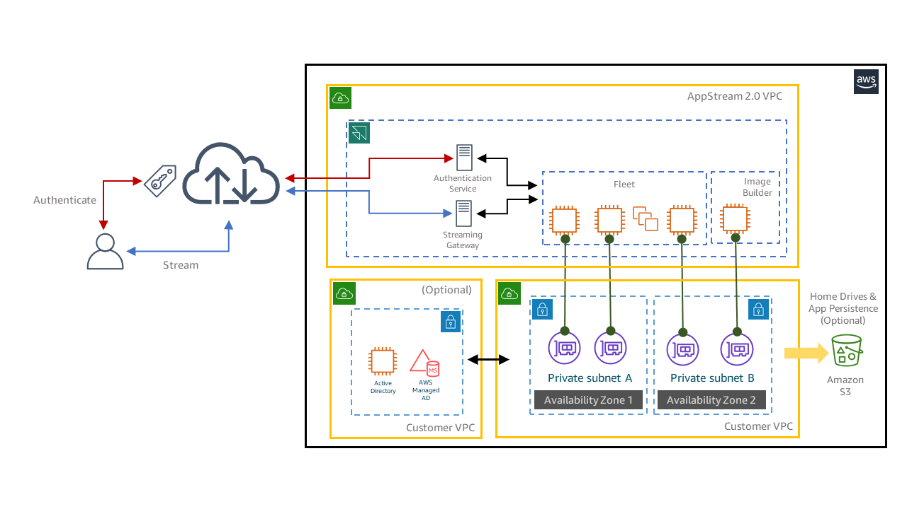

# Delivering native Windows and Linux applications

**Application virtualization for Windows and
Linux**

Applications are at the core of employee productivity, providing
the tools to create and manipulate the data that are critical to
every business, enabling essential interaction with customers and
business partners, and providing a solution that facilitates
seamless communication and collaboration across an organization.

Maintaining an application estate, including upgrading, patching,
and testing to maintain security and deliver value, can be a
time-consuming and costly process to manage. The traditional tools
used to perform this essential application maintenance are
increasingly challenged to meet the agile needs of the modern
enterprise.

For example, legacy application delivery techniques that push
applications to every endpoint can be cumbersome and difficult to
manage, increasing the time taken to realize the value of your
investment in key business applications. At even moderate scale,
to deliver an increasing number of unique user personas, the
number of application combinations increases, and the test
matrices required to verify application compatibility, and the
reliability of your application set can become complex. If the
application lifecycle management process subsequently becomes
unpredictable, an increase in support overheads can occur, and
users can become frustrated and less productive.

Simplifying and accelerating the lifecycle management of what can
be a complex application estate promotes business agility and can
be a key differentiator, verifying that employees have access to
the most effective tools to maintain their productivity.

## Key advantages of application virtualization

Application virtualization decouples the delivery and execution
of each application from the endpoint device, whether this is a
PC or laptop, a thin client device, a mobile device, or a
virtual desktop. The endpoint device can receive applications
which were developed for the same or a totally different OS
system, a Windows application for example, can be delivered
discretely to a macOS or Linux machine or a mobile OS system
such as iOS or Android. As the applications are executed in, and
delivered from a centralized location, such as the AWS Cloud,
the data they create or consume can also be secured centrally,
with policy-based controls which help prevent data leakage onto
the endpoint device or into the wider internet landscape.

Virtual application delivery is achieved by installing the
applications required by each user persona onto one or more
centralized Windows or Linux images, hosted in your data center
or Cloud of choice.  These applications are then assigned and
delivered individually, or in groups, to specific users using a
remoting protocol which sends a pixel-based video stream over an
encrypted data channel between the centralized server and the
endpoint device.

Application images are created, updated and version controlled
centrally. Each image can contain multiple applications or be
configured to deliver a unique application with specific
performance requirements such as high CPU, memory, or complex
graphical applications requiring a GPU. Each discrete
application image can be individually updated and re-versioned
and the updates made available to users of that image
immediately, they just need to logout and back in to receive the
updated applications. Should a problem with the new image occur,
the old image version can be immediately redeployed and accessed
with a similar logoff/logon process.

Application virtualization has become one of the de facto
methods of reducing the complexity of delivering and maintaining
a complex application estate and can significantly accelerate
the deployment of a variety of simple or complex application
delivery scenarios. The flexibility of being able to access
virtual applications from a location of your choice with a
reliable network connection opens up a number of new delivery
scenarios which allow employees to be more productive wherever
they are located.

Amazon AppStream 2.0 delivers a service which accommodates the
application delivery models and the associated advantages which
are mentioned in the preceding section. The following diagram
illustrates a typical deployment of the AppStream 2.0 service.

Prior to subscribing to the AppStream 2.0 service, the customer
must create their own AWS landing zone and VPC, which will
typically deploy subnets across multiple resilient Availability
Zones. It is from these subnets that the application machine
instances will communicate with external services.

Streaming and authentication traffic between the user and the
application machine instance flows through a private network
interface managed by the service. Each application machine
instance also has a customer-facing network interface allowing
connectivity to corporate resources on-premises through a Direct
Connect or VPN connection or hosted locally in the cloud.

Authentication can be configured using local pooled users, which
are managed by the AppStream service, or through a SAML 2.0 IdP
and connectivity to the customers' existing active directory
infrastructure.

An administrator connects to the Image Builder to manually
configure a new or existing server instance (Windows Server 2022
or earlier supported versions) with the desired application set
and desktop customizations. This process can also be automated
using a variety of tools. From this image, hundreds or even
thousands of users can be quickly provided with application
services.

Once the image is created using the image builder, a fleet of
application machine instances is defined that determine the
hardware profile, active directory membership, timeout settings
for users of the fleet, how many instances will be made
available, and how the fleet will scale up and down.

The final step in providing visibility of the service to your
end users is to create an application stack. This construct
defines the naming convention for the application set, which
applications will be visible to various users and groups, home
drive and application persistence settings, and policy controls
to limit access to clipboard, file transfer, and printing.
Amazon AppStream 2.0 offers built-in storage for home drives and
application settings in an Amazon S3 storage location, but other
file sharing and profile management solutions such as Google
Drive, OneDrive, WorkDocs, or using the AWS Windows FSx file
service and FSLogix for profile management are possible.

## Common Amazon AppStream 2.0 deployment scenarios

Several example problem-solutions are presented here that our
typical customers encounter with their desktops. You can benefit
by understanding how other customers implement Amazon AppStream
2.0 workloads to solve their VDI issues.

### Scenario 1: Improve application delivery reliability

User scenario: A customer was struggling to maintain a fleet
of 250 laptop devices using legacy application delivery
technologies. They were experiencing configuration drift as
many push installations failed or took several attempts to
complete. The service desk became overwhelmed by new support
calls when a new OS or application update was deployed, and
users are becoming frustrated.

Amazon AppStream 2.0 provides a system to deliver a common set
of applications to thousands of users from a single image. By
maintaining a single image and using robust version control, a
single set of applications can be delivered, updated, rolled
out, and quickly rolled back if required. This customer
installed the Amazon AppStream 2.0 client and delivered the
required applications virtually to every laptop without
needing to install local copies on every device. The
applications delivered from Amazon AppStream 2.0 appeared as
natively integrated into the Windows user interface, making
the change almost seamless to the end users.

### Scenario 2: Accelerate delivery of application updates

**User scenario:** We have an
application that requires daily updates to deliver up to the
minute features and capabilities. Our current deployment tools
are struggling to reliably deliver these updates to thousands
of computers in the required timescales. We sometimes
encounter issues with the new updates which can take hours to
remediate.

Amazon AppStream 2.0 was selected here, as it facilitates the
automated update of a centralized application image, allowing
new application updates to be quickly installed and pushed out
to thousands of users in a short time frame. Rollback is also
quick and seamless, by reverting to a known good image if
problems are detected in an application release.

### Scenario 3: Simplify collaboration with business partners

**User scenario:** My customer
would like to use application virtualization to make an
internally developed application available to their key
business partners, but we have no control over the management
of the endpoint devices used by these external companies. 

Amazon AppStream 2.0 can deliver applications into a standard
HTML5 browser interface, removing the need to install client
software on unmanaged devices. In this case, the customer was
able to maintain complete control over the application set
being delivered, allowing their business partners to securely
access their services from a simple browser interface.

### Scenario 4: Accelerate application delivery during acquisitions

**User scenario:** Customer has
recently acquired a new business and needs to deliver some key
business applications to the new employees. There is currently
no infrastructure in place between the two organizations to
allow authentication or corporate access to the parent company
resources.

The customer can fast-track access to parent company assets
from their new acquisition using Amazon AppStream 2.0, which
provides remote access to the required applications over the
internet while also being able to mandate the strict
authentication requirements of the parent company.

### Scenario 5: Deliver installable applications through SaaS

**User scenario:** Customer is
an ISV who has developed a unique application to design
products in a niche technology area. They would like to adopt
a cost-effective way to deliver their application to thousands
of customers without the costs of maintaining their own
infrastructure or redeveloping their application as a SaaS
offering. 

As an ISV, being able to minimize the cost of delivering their
applications using the service-oriented approach of Amazon
AppStream 2.0 allowed this customer to maintain their
competitive advantage and to maximize their own revenues. As
Amazon AppStream 2.0 application machine instances are charged
at an hourly rate (or by the second for Elastic instances), it
is simple to calculate the delivery costs for different
service levels based on increasing hardware capabilities.

### Scenario 6: Efficiently deliver applications during seasonal events

**User scenario:** My business
needs to provide application access to several thousand
customers during a seasonal event that we run couple of times
every year. We currently stand-up dedicated hardware for these
events, but this is costly, and the infrastructure is
underutilized for the remainder of the year.

Amazon AppStream 2.0 fleets can be configured to scale up or
down based on several criteria, such as the number of required
instances or on a time schedule. The ability to scale and only
pay for what you use was a compelling factor in this
customer's adoption of the service.

### Scenario 7: Provide remote application delivery to enable remote working

**User scenario:** It would
improve our hiring process, employee engagement, and retention
if we could offer the ability to work from home on a periodic
basis and provide access to key productivity apps to users
wherever they are geographically located. However, we don't
issue laptops or mobile devices to many employees.

Amazon AppStream 2.0 provides secure remote internet access by
default. All that is required to access your application set
is a supported endpoint device such as a desktop, laptop, or
mobile device. If the user cannot install a local Amazon
AppStream 2.0 client, access is possible using an HTML5
browser. Following the adoption of Amazon AppStream 2.0, this
customer can now offer remote working to their key staff,
allowing them to be productive if travel to the office is
disrupted or if personal circumstances mean that office
attendance is difficult.

### Scenario 8: Cross system application delivery by pixel streaming

**User scenario:** We would
like to be able to deliver a new Windows application to all
our users, but they are running a mixture of Windows, Linux,
and macOS devices.

Amazon AppStream 2.0 can deliver Windows or Linux
applications, virtually, to a diverse endpoint OS system
combination such as macOS, Linux, Windows, or mobile devices
while maintaining the native user experience of the
application. This customer was able to standardize the
delivery of a key Windows application to their supported OS
systems.

### Scenario 9: Test new applications rapidly and safely

**User scenario:** I need to
test and upgrade my Windows application estate to the latest
OS version, but the upgrade process is always time-consuming
and support intensive. 

Amazon AppStream 2.0 offers access to several OS systems
versions in the Windows server and Amazon Linux line-up. You
can select a later operating system version and perform
exhaustive testing of your application set before migrating to
this new version in a methodical fashion. No additional
infrastructure needs to be deployed, and the test environment
can be quickly decommissioned after testing is complete.

### Scenario 10: Deliver new applications to older user devices

**User scenario:** My
organization has an aggressive policy to meet regional
environmental targets, but we are running a significant number
of older application servers and endpoint devices that have
green credentials which are difficult to incorporate into our
plans.

Amazon AppStream 2.0 is delivered as a service using the AWS Cloud, which invests heavily in environmentally friendly data
centers, providing businesses with a cost-effective way of
realizing regional environmental targets with minimal effort.
Thin or zero client devices can be deployed to access
AppStream services, removing the power, heat, and recycling
overheads of traditional endpoint devices.

### Scenario 11: Help prevent data leakage when using remote applications

**User scenario:** As a
financial, insurance, development, or design business, we need
to deliver some key business applications to users across the
globe but are concerned about leakage of our critical business
intellectual property.

Accessing applications using Amazon AppStream 2.0 moves the
execution of applications into a centralized and secure AWS Cloud environment which can be more tightly controlled than a
distributed application delivery approach. Amazon Appstream
2.0 virtual channels which control clipboard, local file
access, and printing can also be disabled, significantly
reducing the likelihood of data leakage to uncontrolled
endpoint devices and locations. As the applications are
streamed to remote users, only delta changes in the
application display are streamed over an encrypted virtual
channel, securing information exchanged between client and
server.

### Scenario 12: Reduce latency for client-side applications

**User scenario:** We are an
existing AWS customer with significant investment in AWS
services, and we are looking for a way to localize access to
strategic data lakes and AI/ML systems. How do we optimize the
performance of the client-side applications that use these
services?

Amazon AppStream 2.0 runs as an AWS service in many Regions
across the globe. Accessing client applications using Amazon
AppStream 2.0 verifies that they run near your other AWS
services, maximizing network performance between the client
and the data being manipulated.

### Scenario 13: Deliver applications to users efficiently when training

**User scenario:** We are a
training company who needs to increase our reach and reduce
our service costs by offering training courses that can be
attended remotely.

Amazon AppStream 2.0 runs in 15 AWS Regions, which means that
deploying a training application with global reach is simply a
matter of deploying Amazon AppStream 2.0 from multiple
Regions. As Amazon AppStream 2.0 instance charges are based on
hourly usage and scale across a wide range of instance types,
you can deliver a range of different training courses with a
predictable baseline cost.

### Scenario 14: Deliver graphics applications efficiently

**User scenario:** We are an
engineering company with significant requirements in terms of
graphics processing for our development applications. How can
Amazon AppStream 2.0 deliver the performance we need to take
advantage of application virtualization?

Amazon AppStream 2.0 offers several graphics instance types
offering NVidia T4 GPUs with up to 64Gb memory, which is
adequate for a wide range of engineering application needs.
Furthermore, the Amazon DCV protocol used by Amazon AppStream
2.0 to deliver remote access to your applications is highly
optimized to deliver the best performance for highly graphical
applications over a wide range of network conditions.
