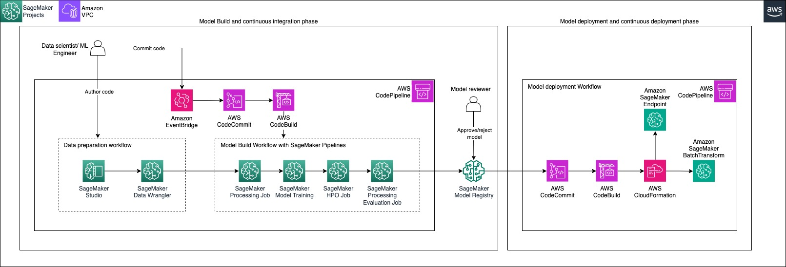

# Artificial intelligence and machine learning

Financial institutions have used artificial intelligence and machine
learning (AI/ML) technologies for years. Today, financial services
organizations are harnessing the power of AI/ML to improve
surveillance, reduce fraud, mitigate risk and improve compliance,
enhance customer interactions, and improve operational efficiency.

**Characteristics of AI/ML applications in the financial services domain**

Integration of AI/ ML technologies into day-to-day operations has advanced slowly due to a lack of in-house data science and machine learning operations (MLOps) expertise and insufficient tools and services orchestrating these complex workflows. AWS provides a set of tools that make AI/ML readily accessible to any organization. Financial institutions have the following common design requirements in order to make AI/ML workloads successful in their organizations:

- **Secure ML environment:**
  Financial institutions have stringent security requirements for
  several reasons, including data protection, regulatory
  compliance, prevention of adversarial exploits, and to maintain
  trust and responsible use of AI.
- **Self-service ML capabilities:**
  Customers using these AWS services can enable both technical and
  non-technical domain experts to employ Machine Learning to
  foster a culture of data-driven decision-making throughout the
  organization.
- **Continuous integration and delivery
  (CI/CD):** Automate the deployment process to make it
  easier to roll out models into production environments and
  provide version control models and code artifacts.
- **Monitor ML models:** CI/CD
  pipelines enable continuous monitoring of deployed models,
  allowing teams to gather feedback, verify auditability, track
  performance, and make necessary adjustments.

**Reference architecture**

_Figure 2: Reference architecture for an AI/ML pipeline_

**AI/ML architecture description**

**Business requirements phase:**
Define the functional requirements of the workload identifying the
business problem and the desired outcomes of the AI system. Then
frame the business problem by analyzing what the AI/ML application
solves, what behaviors are observed, and what information should
be predicted.

**ML infrastructure phase:**
Integrate Amazon SageMaker AI with AWS networking and security services
including
[Amazon Virtual Private Cloud](https://aws.amazon.com/vpc/ "https://aws.amazon.com/vpc/") (Amazon VPC),
[Identity
and access management](https://aws.amazon.com/iam/ "https://aws.amazon.com/iam/") (IAM),
[AWS Key Management Service (KMS)](https://aws.amazon.com/kms/ "https://aws.amazon.com/kms/") to provide a secure
environment for end-to-end machine learning workloads.

**Continuous Integration Phase:**
SageMaker AI facilitates CI/CD by providing features like SageMaker AI
Pipelines and SageMaker AI Studio. SageMaker AI Projects allows the MLOps
teams to create a standardized ML experimentation environment,
leverage libraries, source control repositories, and CI/CD
pipelines. Data scientists can take advantage of AWS services like
CodeBuild and CodeDeploy to automate the following
workflows:

1. **Data preparation workflow:**
   Data is collected and cleaned, removing inconsistencies or
   errors. Then, features are selected or engineered, and the
   data is split into training and testing sets, to provide
   quality and suitability of the data for the machine learning
   model.

1. **Model Build Workflow:** The
   model build and evaluation workflow in machine learning involves
   two main steps. First, a model is built using a training
   dataset, using SageMaker AI Training, where the algorithm learns
   patterns and relationships from the data. Then, the model's
   performance is evaluated using a separate testing dataset to
   assess its predictive capabilities and generalization to new and
   unseen data. Customers can use SageMaker AI HPO for hyper-parameter
   tuning in complex machine learning systems, such as deep
   learning neural networks, enhancing productivity by
   systematically exploring various combinations of hyperparameter
   values within specified ranges to automatically identify the
   best model.

**Continuous delivery phase:**
SageMaker AI MLOps capability automates deploying and delivering
machine learning models into production in a consistent manner. ML
operations teams can leverage AWS continuous integration
capabilities using CloudFormation, CodeBuild, and
CodeDeploy to automate model deployment workflows. Amazon SageMaker AI
model monitoring allows customers to monitor ML applications for
potential data drifts, model drifts, and bias drifts.

**Model performance evaluation** -
evaluate the performance and accuracy of the machine learning model.
Feed model drift and errors back into the model to correct it and
generate more precise inferences.

**Resources**

**Documentation**

- [Automate Machine Learning Workflows Tutorial](https://aws.amazon.com/getting-started/hands-on/machine-learning-tutorial-mlops-automate-ml-workflows/ "https://aws.amazon.com/getting-started/hands-on/machine-learning-tutorial-mlops-automate-ml-workflows/")

**Blogs**

- [Building, automating, managing, and scaling ML workflows using Amazon SageMaker AI Pipelines](https://aws.amazon.com/blogs/machine-learning/building-automating-managing-and-scaling-ml-workflows-using-amazon-sagemaker-pipelines/ "https://aws.amazon.com/blogs/machine-learning/building-automating-managing-and-scaling-ml-workflows-using-amazon-sagemaker-pipelines/")
- [Detect NLP data drift using custom Amazon SageMaker AI Model Monitor](https://aws.amazon.com/blogs/machine-learning/detect-nlp-data-drift-using-custom-amazon-sagemaker-model-monitor/ "https://aws.amazon.com/blogs/machine-learning/detect-nlp-data-drift-using-custom-amazon-sagemaker-model-monitor/")

**Workshops**

- [Amazon SageMaker AI MLOps Workshop](https://catalog.us-east-1.prod.workshops.aws/workshops/1bb7ba03-e533-464f-8726-91a74513b1a1 "https://catalog.us-east-1.prod.workshops.aws/workshops/1bb7ba03-e533-464f-8726-91a74513b1a1")
- [Amazon SageMaker AI MLOps: from idea to production in six steps](https://catalog.us-east-1.prod.workshops.aws/workshops/741835d3-a2bf-4cb6-81f0-d0bb4a62edca "https://catalog.us-east-1.prod.workshops.aws/workshops/741835d3-a2bf-4cb6-81f0-d0bb4a62edca")
