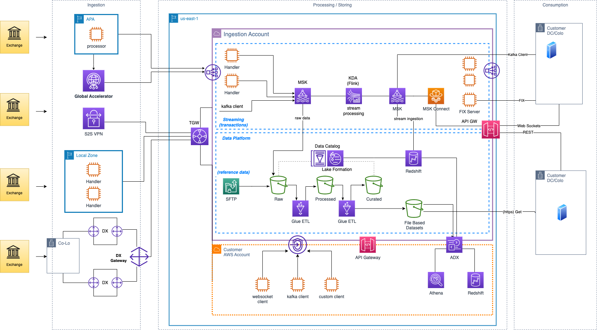

# Capital markets: Market data ingestion and distribution

Capital Markets customers need access to data from a variety of
sources including: market data, reference data, earnings data,
alternative data, and other financial data sources. Financial data
is used for making trading decisions, shaping investment strategies,
providing information to regulators, and managing risk. AWS helps
capital markets customers better manage and understand their data
with scalable and agile cloud-based technologies. Using cloud-based
solutions, customers can achieve good data governance, adhere to
regulatory compliance standards, and drive profitability with
financial data insights.

**Reference architecture**

_Figure 7. Market data ingest and distribution_

**Architecture description**

The preceding architecture describes the extraction of market data from
real-time and historical sources and provides a data ingestion,
cataloging, and packaging workflow to provide access to market data
based on customers' requests and preferences.

To begin, customers and partners can use AWS Outposts in a Co-Lo
facility to connect to an exchange for real time market data and AWS Direct Connect for physical connectivity to AWS infrastructure or
S2S VPNs as an alternative. They can also use AWS Local Zones for
hosting workloads that require proximity to trading venues. Another
example of data acquisition includes using Approved Publication
Arrangement (APA) utilities for pre-trade and post-trade data.

If data is published real-time into Amazon MSK, customers have the
ability to use the stream processing capabilities of Amazon Managed
Service for Apache Flink (MSF) and publish the processed data to
internal or external customers through MSK, WebSockets, or API Gateway depending on the use case.

Real-time data published to MSK can be ingested near-real time by
Amazon Redshift which makes the data available in seconds for
querying and joining with existing tables in the data warehouse.
Data from MSK can also be stored in an S3 data lake.

Both batch and streaming data are added to the raw layer in the
S3 data lake, where it can be cleansed, validated, and processed
using AWS Glue and moved into the processed layer. Data from the
processed layer can then be enriched by joining with other datasets,
including reference data, and dataset ready for consumption by
business users is moved to the curated layer.

Data in the data lake is governed by AWS Lake Formation, which can
provide granular access controls to data, including column and row
level permissions and tag-based access control. Data governed by
Lake Formation can be queried by other services such as Redshift,
Athena, EMR, QuickSight, etc.

Through services like AWS Data Exchange and Amazon API Gateway, the
data in the data lake can be made available to other AWS accounts,
whether they are part of the same organization or to external
parties.

Non-AWS customers can retrieve data through API Gateway or S3 via
HTTPS, depending on requirements and configuration by the customer.

For more information please refer to:
[Solutions
for Capital Markets](https://aws.amazon.com/solutions/financial-services/#Capital_Markets "https://aws.amazon.com/solutions/financial-services/#Capital_Markets").
