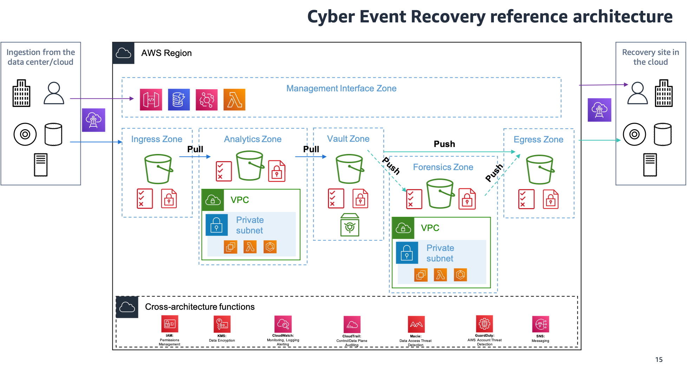

# Cyber event recovery in financial services

Cyber threats are a growing risk to financial services organizations
worldwide, and the trend is only ever increasing. These
organizations are now investing increasingly on cybersecurity
measures to improve their risk posture and to implement better
security practices to protect their most critical data and
applications from external threats, such as ransomware and malware,
and also to meet any regulatory requirements where they operate. FSI
organizations are investing in building out modern cyber event
recovery platforms on AWS using native AWS services as shown in the
following reference architecture.

**Reference architecture**

_Figure 3. Cyber event recovery_

**Architecture description**

The following components are built out as part of the cyber event
data vault on AWS.

- **Ingress zone:** The raw data
  from the input source is first copied and stored in this zone.
  This zone contains different ways of sourcing data and storing
  it in an encrypted S3 bucket with the right security controls
  using IAM. It is ephemeral in nature to provide a digital air
  gap to the vault architecture.
- **Analytics zone:** The raw data
  needs to be analyzed to help prevent the transmission of corrupt data to
  the cyber vault. You can use services such as Amazon Macie to
  identify corrupt data, or write your own custom logic using AWS Lambda functions.
- **Vault zone:** Once analyzed for
  corruption, data is then stored in a write once, read many
  (WORM) compliant storage, where the data cannot be modified by
  anyone upon being written. This data is safe to be consumed in
  the event of a ransomware incident.
- **Forensics zone:** In the event
  of a ransomware incident, data from the vault zone can be
  further analyzed for anomalies before being used for recovery
  purposes. This is an optional step for organizations that are
  looking to perform more due diligence prior to the recovery
  process.
- **Egress zone:** The recovery
  process can recover the data from the vault through the egress
  zone. By having a separate ingress and egress zone, the vault
  can be secured from outside access, only providing access to
  the services that need it. This zone, similar to the ingress
  zone, is ephemeral in nature to provide a digital air gap to the
  vault architecture.
- **Management interface zone:**
  The main interface layer with the data vault, which is used to
  authenticate access requests, management actions, and provide
  the relevant status and reporting information.

For more detail, see
[Banking
Trends 2022: Cyber vault and Ransomware](https://aws.amazon.com/blogs/industries/banking-trends-2022-cyber-vault-and-ransomware/ "https://aws.amazon.com/blogs/industries/banking-trends-2022-cyber-vault-and-ransomware/").
