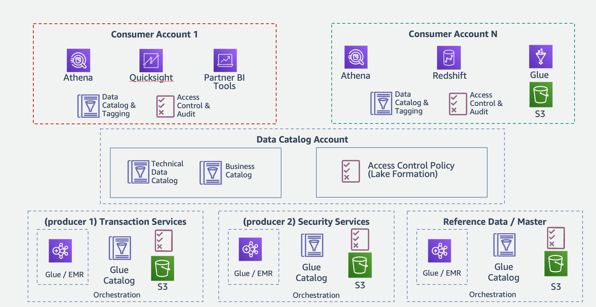

# Financial data mesh

A commonly sought-after goal of financial services organizations is to provide access to data and to extract additional value from data that
is generated or acquired across their multiple business units. For example, historical market
data, alternative investment data, transaction and business process data, and third-party data
sets can be combined to provide for analytics and training machine learning models.

The term _data mesh_ refers to any architectural framework that enables access to a diverse set of data across the enterprise through a distributed and decentralized ownership model. A data mesh architecture effectively unites disparate data sources through centrally managed data sharing and governance guidelines. A data mesh can be used to improve data access while providing enhanced security and scalability for an enterprise.

The following data mesh reference architecture is built around the following architectural principles:

- Distributed domain-driven architecture: Data management
  responsibility that is organized around a set of business
  functions or domains which are responsible for managing the
  lifecycle of their datasets.
- Data as a product: Each domain team manages their
  datasets as a product, meaning that the data is organized in a way that matches the way users consume the data. Each dataset is trustworthy, describes itself, and is fit for purpose.
- Federated data governance: Security is implemented as a shared
  responsibility within the organization; global standards and
  policies apply across domains, while each domain has its own
  degree of autonomy on standards and policies within the domain.
- Common access and self-serve data: Data must be quickly
  discoverable and consumable by subject matter experts (SMEs).

**Reference architecture**

_Figure 1. Financial data mesh_

**Architecture description**

- **Producer accounts:** Business
  domains manage the lifecycle of their datasets in their own AWS accounts, including ETL, security, retention, and backup.
- **Catalog account:**
  - Business domains provide access to prepared datasets to a
    centralized catalog and access management account where
    Lake Formation is used to access business domain datasets.
  - The centralized catalog account manages access to business
    domain datasets by defining access policies to datasets
    from consumer accounts through Lake Formation
    cross-account data sharing.

- **Consumer accounts:** Data lake
  administrators in the consumer accounts use Lake Formation to
  manage granular access policies within their own account.
