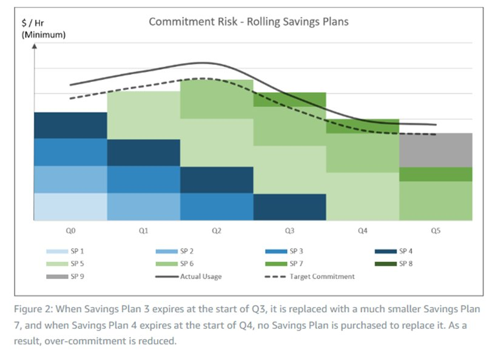

# FSICOST08: Are you monitoring usage of Savings Plans regularly?

Capacity planning and usage forecasting is important for managing your commitment plans. Gain better control of the flexibility of Savings Plan usage and manage costs with regular monitoring on a regular cadence over quarterly basis, or reviews at regular time intervals.

## FSICOST08-BP01 Sign up for a compute savings plan for

discounts on compute versus on-demand pricing

Financial systems usually have a predicted usage pattern. Sign up for a compute
savings plan, as they offer discounts on compute of up to 72% compared to on-demand
pricing. The most flexible type of Savings Plan applies across the core compute services
(Amazon EC2, AWS Fargate, and AWS Lambda) and across Amazon EC2 instance size, operating system,
tenancy, Availability Zone, and Region. This flexibility accommodates continuously
evolving workloads and avoids unused commitment. Instead of a single monolithic savings
plan, opt for smaller concurrent active Savings Plans, which are additive to reduce commitment
risk, increase discount coverage, and relieve the burden of long-range usage
predictions. Gain better control of the flexibility of Savings Plan usage and manage
costs with regular monitoring on a regular cadence over quarterly basis, or reviews at
regular time intervals.

[Understand how](../../../savingsplans/latest/userguide/sp-applying.md "../../../savingsplans/latest/userguide/sp-applying.md") Savings Plans can also be shared across all accounts within an AWS
Organization or consolidated billing family.

