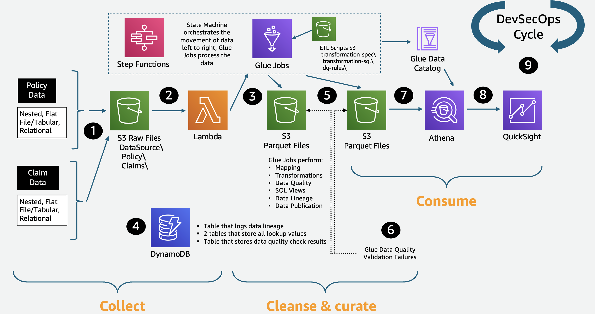

# Insurance lake

The insurance data lake provides a method for aggregating end user customer data from a large number of diverse sources, including core systems and third parties, and consolidating it within a single, secure location. The four Cs provide a best practice data lake pattern for creation of your insurance data lake:

1. **Collect:** Store all of your
   data in Amazon S3.
2. **Cleanse and curate:** Validate,
   map, transform, and log the actions performed on your data.
3. **Consume:** Derive insights from
   your data.
4. **Comply and secure:** Automate
   your audit and regulatory compliance requirements and secure
   your data.

**Reference architecture**

_Figure 6: Insurance data lake reference architecture_

**Architecture description**

1. Source data file is dropped into the Collect S3 bucket. Mapping file, transform file, and data quality file are present in the ETL-Scripts S3 bucket .
2. Put Event automatically initiates a Lambda function that reads metadata from the incoming source data, logs all actions, handles any errors, and starts the AWS Step Functions workflow.
3. Step Functions calls PySpark AWS Glue jobs that map the data to your pre-defined data dictionary and perform the transformations and data quality checks for both the Cleanse and Consume layers.
4. Amazon DynamoDB contains lookup values for each source data file as needed by the `lookup` and `multilookup` transforms. ETL metadata, such as job audit logs, data lineage output logs, and data quality results, are written here.
5. Cleansed and curated data is then written to compressed, partitioned Apache Parquet files in the PySpark code. The PySpark code also creates and updates AWS Glue Data Catalog databases and tables defined by your data dictionary.
6. Source data file validation failures are sent to an S3 Quarantine folder and Data Catalog table, which can populate an exception queue dashboard where a human can review and take appropriate action.
7. SQL queries can be written using the AWS Glue databases and
   tables.
8. Quick Suite dashboards and reports can pull data from the
   insurance lake on a real-time or scheduled basis.
9. Full DevSecOps (everything as code and everything as automated
   as possible) can be managed using AWS CodePipeline and related services.
