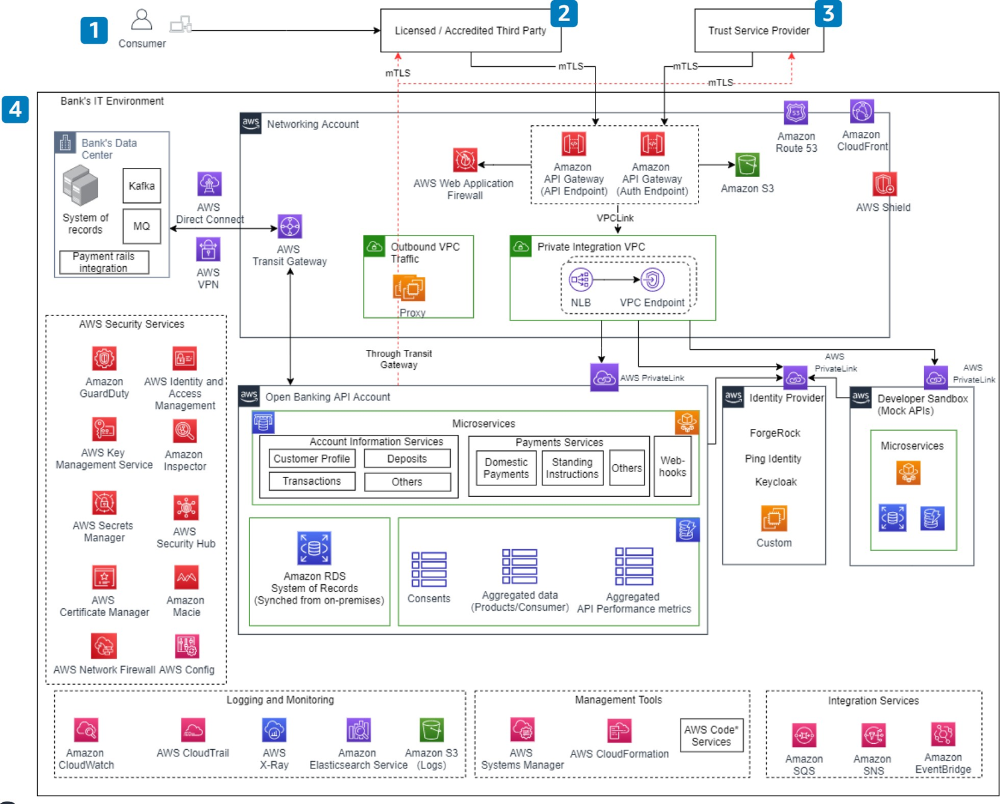

# Open banking

In open banking, banks use an API messaging framework to securely share their customer data (with consent from customers) to third-party developers and service providers, which allows for automated and secure access to the data in their core banking environment. While open banking initially started as a regulatory requirement in the United Kingdom (UK) and other regions around the world, it has now transformed into a new revenue stream for banks, as they look to monetize their data and core functionality by exposing their core environment through APIs and building new business models such as Banking as a Service (BaaS) and embedded finance on top of the APIs. Banks often choose AWS to build their open banking environment because of its inherent scalability, cost effectiveness, and the speed at which they can build.

Open banking architectures supporting these use cases share the following characteristics:

- Data is shared to third parties only after consent from the
  customer using OAuth 2.0.
- Secure and limited third party access (with mutual Transport
  Layer Security (mTLS)).
- API-driven infrastructure and an elastic and scalable
  environment.
- Instant or near-instant access to customer account data.
- Tamper-resistant logging and audit capabilities.

**Reference architecture**

_Figure 4. Reference architecture for data holder_

**Architecture description**

1. A consumer accesses the licensed or accredited third-party
   application and provides consent to the third party to access
   consumer data or make a payment submission request.
2. Third parties in open banking can be defined as authorized
   institutions that provide value-added services in addition to
   the consumer's regular banking needs, such as accounts
   information (balance check, recent transactions, and statements)
   and payments (payment to merchants, people, and registered
   payees). This approach creates use cases such as spend analysis,
   credit decisioning, and payments for e-commerce transactions.
3. A trust service provider (TSP) is a trusted entity authorized by
   a supervisory government body to verify the authenticity of
   banks and third parties and issue digital certificates to third
   parties.
4. A bank's IT environment, consisting of its AWS environment and
   data centers, is depicted in this section. Note the breadth of
   AWS services that are available for banking customers.

For more information on open banking, see
[Open
Banking on AWS](https://d1.awsstatic.com/architecture-diagrams/ArchitectureDiagrams/open-banking-on-aws.pdf "https://d1.awsstatic.com/architecture-diagrams/ArchitectureDiagrams/open-banking-on-aws.pdf").
