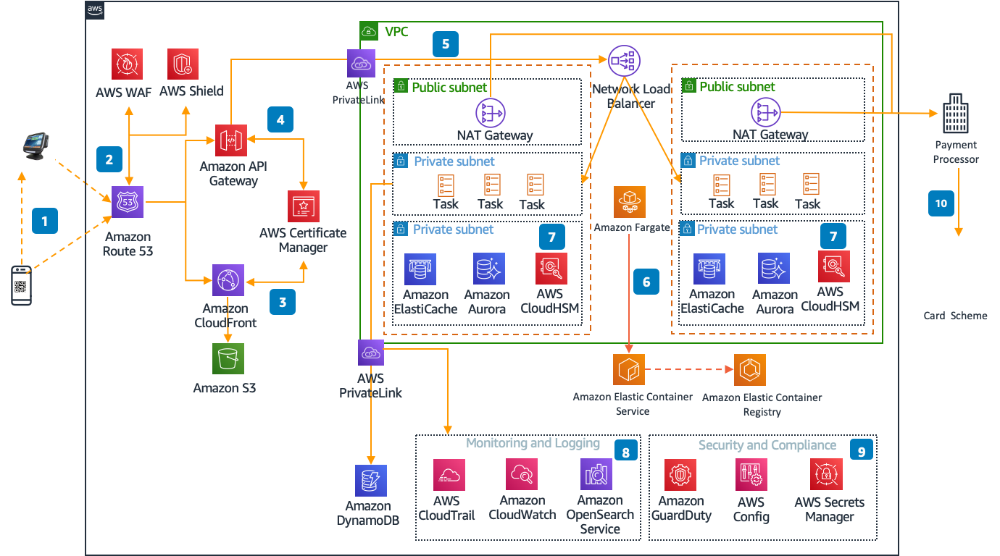

# Payments

Payment gateways facilitate financial services to make online
transactions between customers and merchants. To secure these
transactions, payment gateways rely on secure cloud technology. AWS
provides a secure and reliable environment for payment processing and
storage of payment card information, as well as a number of
encryption options for sensitive data, including encryption at rest
and in transit.

Encryption at rest protects stored data against unauthorized access
or theft, while encryption in transit protects data as it is being
transmitted between systems. AWS is certified as a PCI DSS Level
Service Provider, the highest level of assessment available, which
means that businesses are meeting the highest standards of security
with compliance when it comes to handling credit card data.

Payment gateways can use tokenization to protect customer data by replacing the customer card data with a unique token. This token can be used for future transactions without the need to store the actual card details, making it a more secure option for customer data. Payment gateways also help merchants detect and prevent fraudulent transactions using artificial intelligence and machine learning. Payment gateway also provide analytics, flexible pricing, multi-currency support, and reconciliation reports to merchants in day-to-day business operations.

Payment gateways supporting these use cases share the following characteristics:

- They provide a secure and highly available API that supports TLS
  1.2 protocol for encryption.
- They have to comply with industry regulations and standards,
  including PCI DSS and PSD2, to protect customer data.
- They should be highly secure by following industry card
  standards, including features like tokenization, encryption, and
  fraud detection.
- They can support multiple payment methods, including debit
  cards, credit cards, mobile wallets, and bank transfers.
- They can help merchants with detailed analytics and reporting
  tools to track transactions, volumes, and key metrics.

**Reference architecture**

_Figure 5: Architecture for QR Payments on AWS_

**Architecture description**

1. To start, customers scan the business QR code displayed at the
   checkout page on a website or at the point of sale (POS)
   terminal.
2. Amazon Route 53 routes traffic to an Amazon API Gateway
   endpoint, where Amazon CloudFront distributes dynamic and static
   content. AWS security services, such as AWS WAF and AWS Shield,
   protect the web applications from common application-layer
   exploits and against distributed denial-of-service (DDoS)
   attacks.
3. CloudFront content delivery network (CDN) is used to return
   resources found in its cache and static resources from Amazon Simple Storage Service (Amazon S3).
4. Amazon API Gateway and Amazon CloudFront can be seamlessly
   integrated with AWS Certificate Manager. These services manage
   the complexity of creating, storing, and renewing public and
   private SSL/TLS X.509 certificates and keys that protect your
   applications.
5. The request is routed through a Network Load Balancer to
   distribute incoming traffic across its healthy registered
   targets.
6. Payment request is processed at application layer using Amazon Elastic Container Service (Amazon ECS) that deploys tasks on AWS Fargate.
7. Payment transaction information is stored in Amazon Aurora or
   Amazon DynamoDB. Amazon ElastiCache is used as a session store
   to manage session information in payment processing. AWS CloudHSM is a cryptographic service for creating and maintaining
   hardware security modules (HSMs).
8. Service logs are collected in Amazon S3 and analyzed and
   monitored using Amazon OpenSearch Service.
9. At the security and compliance layer, AWS Config evaluates,
   assesses, and audits configurations of resources. Amazon GuardDuty monitors for malicious activity and unauthorized
   behavior, protecting AWS accounts and workloads. AWS Secrets Manager helps protect secrets needed to access applications,
   services, and IT resources.
10. Payment request outbound traffic is sent to the payment
    processor through a NAT Gateway that is connected to card
    schemes for verification.
