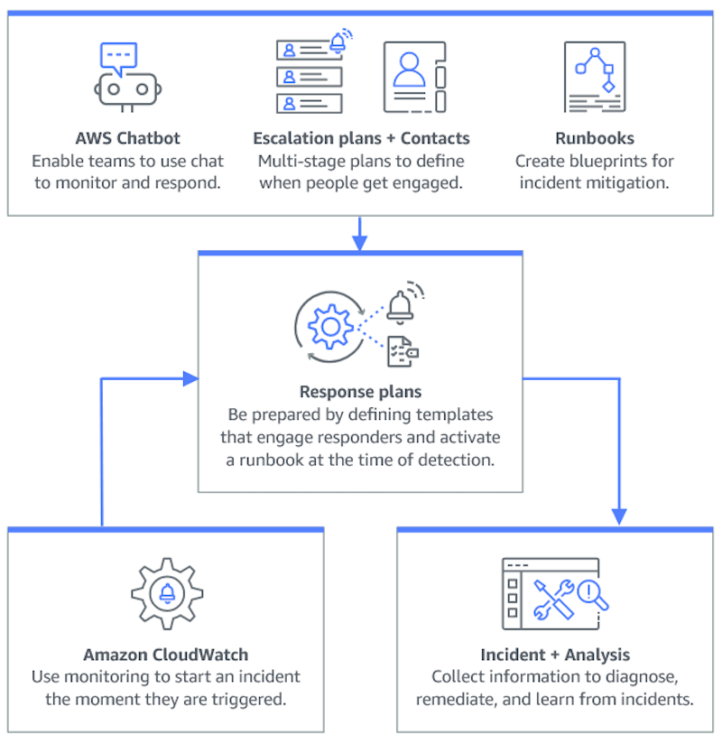

# OPS10-BP02 Have a process per alert

Establishing a clear and defined process for each alert in your system is essential for effective and efficient incident management. This practice ensures that every alert leads to a specific, actionable response, improving the reliability and responsiveness of your operations.

**Desired outcome:** Every alert initiates a specific, well-defined response plan. Where possible, responses are automated, with clear ownership and a defined escalation path. Alerts are linked to an up-to-date knowledge base so that any operator can respond consistently and effectively. Responses are quick and uniform across the board, enhancing operational efficiency and reliability.

**Common anti-patterns:**

- Alerts have no predefined response process, leading to makeshift and delayed resolutions.
- Alert overload causes important alerts to be overlooked.
- Alerts are inconsistently handled due to lack of clear ownership and responsibility.

**Benefits of establishing this best
practice:**

- Reduced alert fatigue by only raising actionable alerts.
- Decreased mean time to resolution (MTTR) for operational issues.
- Decreased mean time to investigate (MTTI), which helps reduce MTTR.
- Enhanced ability to scale operational responses.
- Improved consistency and reliability in handling operational events.

For example, you have a defined process for AWS Health events for critical accounts, including application alarms, operational issues, and planned lifecycle events (like updating Amazon EKS versions before clusters are auto-updated), and you provide the capability for your teams to actively monitor, communicate, and respond to these events. These actions help you prevent service disruptions caused by AWS-side changes or mitigate them faster when unexpected issues occur.

**Level of risk exposed if this best practice
is not established:** High

## Implementation guidance

Having a process per alert involves establishing a clear response plan for each alert, automating responses where possible, and continually refining these processes based on operational feedback and evolving requirements.

### Implementation steps

The following diagram illustrates the incident management workflow within [AWS Systems Manager Incident Manager](https://aws.amazon.com/systems-manager/features/incident-manager/ "https://aws.amazon.com/systems-manager/features/incident-manager/"). It is designed to respond swiftly to operational issues by automatically creating incidents in response to specific events from [Amazon CloudWatch](https://aws.amazon.com/cloudwatch/ "https://aws.amazon.com/cloudwatch/") or [Amazon EventBridge](https://aws.amazon.com/eventbridge/ "https://aws.amazon.com/eventbridge/"). When an incident is created, either automatically or manually, Incident Manager centralizes the management of the incident, organizes relevant AWS resource information, and initiates predefined response plans. This includes running Systems Manager Automation runbooks for immediate action, as well as creating a parent operational work item in OpsCenter to track related tasks and analyses. This streamlined process speeds up and coordinates incident response across your AWS environment.

1. **Use composite alarms:** Create [composite alarms](../../../AmazonCloudWatch/latest/monitoring/Create_Composite_Alarm.md "../../../AmazonCloudWatch/latest/monitoring/Create_Composite_Alarm.md") in CloudWatch to group related alarms, reducing noise and allowing for more meaningful responses.
2. **Stay informed with [AWS Health](../../../health/latest/ug/what-is-aws-health.md "../../../health/latest/ug/what-is-aws-health.md"):** AWS Health is the authoritative source of information about the health of your AWS Cloud resources. Use AWS Health to visualize and get notified of any current service events and upcoming changes, such as planned lifecycle events, so you can take steps to mitigate impacts.
   1. [Create purpose-fit AWS Health event notifications](../../../health/latest/ug/user-notifications.md "../../../health/latest/ug/user-notifications.md") to e-mail and chat channels through [AWS User Notifications](../../../notifications/latest/userguide/what-is-service.md "../../../notifications/latest/userguide/what-is-service.md"), and integrate programatically with [your monitoring and alerting tools through Amazon EventBridge](../../../health/latest/ug/cloudwatch-events-health.md "../../../health/latest/ug/cloudwatch-events-health.md") or the [AWS Health API](../../../health/latest/APIReference/Welcome.md "../../../health/latest/APIReference/Welcome.md").
   2. Plan and track progress on health events that require action by integrating with change management or ITSM tools (like [Jira](../../../smc/latest/ag/cloud-sys-health.md "../../../smc/latest/ag/cloud-sys-health.md") or [ServiceNow](../../../smc/latest/ag/sn-aws-health.md "../../../smc/latest/ag/sn-aws-health.md")) that you may already use through Amazon EventBridge or the AWS Health API.
   3. If you use AWS Organizations, enable
      [organization view for
      AWS Health](../../../health/latest/ug/aggregate-events.md "../../../health/latest/ug/aggregate-events.md") to aggregate AWS Health events across accounts.

3. **Integrate Amazon CloudWatch alarms with Incident Manager:** Configure CloudWatch alarms to automatically create incidents in [AWS Systems Manager Incident Manager](../../../incident-manager/latest/userguide/response-plans.md "../../../incident-manager/latest/userguide/response-plans.md").
4. **Integrate Amazon EventBridge with Incident Manager:** Create [EventBridge rules](../../../eventbridge/latest/userguide/eb-create-rule.md "../../../eventbridge/latest/userguide/eb-create-rule.md") to react to events and create incidents using defined response plans.
5. **Prepare for incidents in Incident Manager:**
   - Establish detailed [response plans](../../../incident-manager/latest/userguide/response-plans.md "../../../incident-manager/latest/userguide/response-plans.md") in Incident Manager for each type of alert.
   - Establish chat channels through [Amazon Q Developer in chat applications](../../../incident-manager/latest/userguide/chat.md "../../../incident-manager/latest/userguide/chat.md") connected to response plans in Incident Manager, facilitating real-time communication during incidents across platforms like Slack, Microsoft Teams, and Amazon Chime.
   - Incorporate [Systems Manager Automation runbooks](../../../incident-manager/latest/userguide/runbooks.md "../../../incident-manager/latest/userguide/runbooks.md") within Incident Manager to drive automated responses to incidents.

## Resources

**Related best practices:**

- [OPS04-BP01 Identify key performance indicators](ops_observability_identify_kpis.md "ops_observability_identify_kpis.md")
- [OPS08-BP04 Create actionable alerts](ops_workload_observability_create_alerts.md "ops_workload_observability_create_alerts.md")

**Related documents:**

- [AWS Cloud Adoption Framework: Operations Perspective - Incident and problem management](../../../whitepapers/latest/aws-caf-operations-perspective/incident-and-problem-management.md "../../../whitepapers/latest/aws-caf-operations-perspective/incident-and-problem-management.md")
- [Using Amazon CloudWatch alarms](../../../AmazonCloudWatch/latest/monitoring/AlarmThatSendsEmail.md "../../../AmazonCloudWatch/latest/monitoring/AlarmThatSendsEmail.md")
- [Setting up AWS Systems Manager Incident Manager](../../../incident-manager/latest/userguide/setting-up.md "../../../incident-manager/latest/userguide/setting-up.md")
- [Preparing for incidents in Incident Manager](../../../incident-manager/latest/userguide/incident-response.md "../../../incident-manager/latest/userguide/incident-response.md")

**Related videos:**

- [Top incident response tips from AWS](https://www.youtube.com/watch?v=Cu20aOvnHwA "https://www.youtube.com/watch?v=Cu20aOvnHwA")
- [re:Invent 2023 | Manage resource lifecycle events at scale with AWS Health](https://www.youtube.com/watch?v=VoLLNL5j9NA "https://www.youtube.com/watch?v=VoLLNL5j9NA")

**Related examples:**

- [AWS Workshops - AWS Systems Manager Incident Manager - Automate incident response to security events](https://catalog.workshops.aws/automate-incident-response/en-US/settingupim/onboarding "https://catalog.workshops.aws/automate-incident-response/en-US/settingupim/onboarding")
